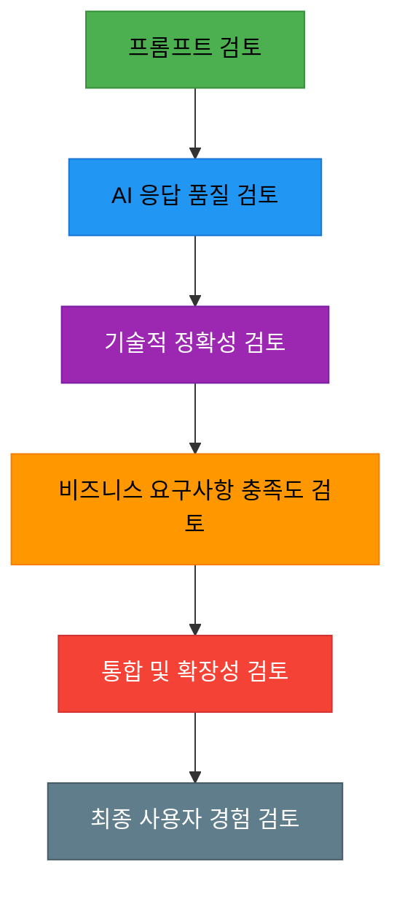
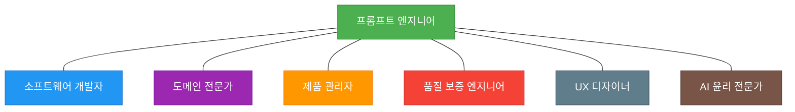
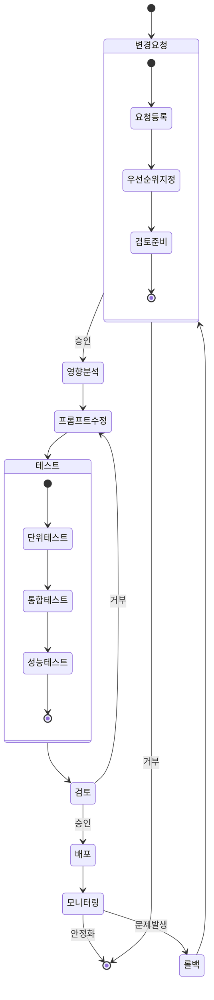

# 프롬프트 기반 개발방법론(PDD) - 검토 및 피드백

**문서 번호**: MTD-010  
**버전**: 1.0.0  
**작성일**: 2025-05-26  
**작성자**: 방법론 팀  
**상태**: 승인됨

## 목차

1. [체계적 검토 프로세스](#체계적-검토-프로세스)
   1. [다층적 검토 구조](#1-다층적-검토-구조)
   2. [프롬프트 검토 체크리스트](#2-프롬프트-검토-체크리스트)
   3. [AI 응답 검토 프레임워크](#3-ai-응답-검토-프레임워크)
   4. [자동화된 검토 도구와 통합](#4-자동화된-검토-도구와-통합)
2. [다양한 관점 통합](#다양한-관점-통합)
   1. [관점별 검토 포커스](#1-관점별-검토-포커스)
   2. [다학제 검토팀 구성](#2-다학제-검토팀-구성)
   3. [검토 워크숍 활용](#3-검토-워크숍-활용)
3. [변경 관리 프로세스](#변경-관리-프로세스)
   1. [프롬프트 버전 관리 체계](#1-프롬프트-버전-관리-체계)
   2. [프롬프트 변경 추적 메타데이터](#2-프롬프트-변경-추적-메타데이터)
   3. [프롬프트 변경 워크플로우](#3-프롬프트-변경-워크플로우)
   4. [피드백 통합 프레임워크](#4-피드백-통합-프레임워크)
4. [검토 및 피드백 베스트 프랙티스](#검토-및-피드백-베스트-프랙티스)
   1. [검토 효율성 향상을 위한 팁](#1-검토-효율성-향상을-위한-팁)
   2. [피드백 수집 최적화](#2-피드백-수집-최적화)
   3. [효과적인 피드백 반영 전략](#3-효과적인-피드백-반영-전략)
5. [결론](#결론)

---

## 체계적 검토 프로세스

프롬프트 기반 개발방법론(PDD)에서의 검토 프로세스는 전통적인 소프트웨어 개발의 검토 방식과는 다른 특성을 갖습니다. 이는 AI 모델과의 협업과 프롬프트 품질이 결과물에 직접적인 영향을 미친다는 PDD의 특수성을 반영합니다.

### 1. 다층적 검토 구조

PDD에서는 다음과 같은 다층적 검토 구조를 권장합니다:

### 2. 프롬프트 검토 체크리스트

효과적인 프롬프트 검토를 위한 체크리스트:

| 검토 영역 | 체크 항목 | 중요도 |
|---------|----------|------|
| 명확성 | 프롬프트가 의도를 명확하게 전달하는가? | 상 |
| 구체성 | 필요한 세부 정보를 충분히 포함하고 있는가? | 상 |
| 구조 | 정보가 논리적으로 구조화되어 있는가? | 중 |
| 제약조건 | 기술적/비즈니스적 제약조건이 명시되어 있는가? | 상 |
| 예시 | 기대 결과에 대한 예시가 포함되어 있는가? | 중 |
| 오류 처리 | 예상 가능한 오류 상황에 대한 지침이 있는가? | 중 |
| 변수화 | 재사용 가능한 부분이 변수화되어 있는가? | 하 |
| 확장성 | 유사한 상황에 확장 적용 가능한가? | 중 |
| 윤리적 고려 | 편향이나 윤리적 문제가 없는가? | 상 |

### 3. AI 응답 검토 프레임워크

AI가 생성한 결과물의 품질을 평가하기 위한 프레임워크:

1. **정확성 평가**: 생성된 코드나 문서의 기술적 정확성
2. **일관성 평가**: 내부적 일관성 및 기존 시스템과의 일관성
3. **완전성 평가**: 요구사항 충족의 완전성
4. **효율성 평가**: 리소스 사용 및 성능 최적화
5. **유지보수성 평가**: 코드 가독성 및 문서화 수준
6. **보안성 평가**: 보안 모범 사례 준수 여부
7. **확장성 평가**: 미래 요구사항 수용 가능성

### 4. 자동화된 검토 도구와 통합

PDD에서는 다음과 같은 자동화된 검토 도구 통합을 권장합니다:

- **정적 코드 분석 도구**: GitHub Copilot 또는 Amazon CodeGuru와 같은 AI 기반 코드 리뷰 도구
- **프롬프트 품질 평가 도구**: Microsoft의 Prompt Flow와 같은 프롬프트 테스트 및 평가 도구
- **CI/CD 파이프라인 통합**: 자동화된 검토 프로세스를 CI/CD 파이프라인에 통합

## 다양한 관점 통합

PDD에서는 다양한 이해관계자의 관점을 통합하는 것이 중요합니다. 이는 생성된 결과물이 다양한 요구사항을 균형있게 충족시키도록 보장합니다.

### 1. 관점별 검토 포커스

| 관점 | 주요 검토 포인트 | 권장 검토 방법 |
|-----|---------------|-------------|
| 기술적 관점 | 코드 품질, 아키텍처 적합성, 기술 표준 준수 | 코드 리뷰, 아키텍처 검토 세션 |
| 비즈니스 관점 | 비즈니스 요구사항 충족, ROI, 시장 경쟁력 | 비즈니스 가치 검증, 경쟁 분석 |
| 사용자 관점 | 사용성, 접근성, 사용자 경험 | 사용자 테스트, 피드백 세션 |
| 운영 관점 | 배포 용이성, 모니터링, 유지보수성 | 운영 리뷰, 성능 테스트 |
| 보안/규정 관점 | 보안 위험, 규제 준수, 데이터 보호 | 보안 검토, 컴플라이언스 체크 |
| AI 윤리 관점 | 편향성, 투명성, 모델 신뢰성 | 윤리적 검토, 편향성 감사 |

### 2. 다학제 검토팀 구성

효과적인 PDD 검토를 위한 다학제팀 구성:

### 3. 검토 워크숍 활용

PDD에서 효과적인 다관점 검토를 위한 워크숍 포맷:

1. **프롬프트 설명 세션**: 프롬프트 엔지니어가 의도와 구조 설명
2. **AI 응답 데모**: 생성된 결과물 시연
3. **다관점 피드백 수집**: 각 관점별 강점과 개선점 수집
4. **우선순위화 세션**: 피드백 우선순위 결정
5. **개선 계획 수립**: 프롬프트 및 결과물 개선 계획 정의

## 변경 관리 프로세스

PDD에서는 프롬프트와 AI 모델의 진화에 따른 체계적인 변경 관리가 필수적입니다.

### 1. 프롬프트 버전 관리 체계

### 2. 프롬프트 변경 추적 메타데이터

각 프롬프트 변경에 포함시켜야 할 메타데이터:

| 메타데이터 | 설명 | 예시 |
|----------|------|------|
| 버전 ID | 고유 식별자 | PDD-PROMPT-V1.2.5 |
| 변경 날짜 | 변경이 이루어진 날짜 | 2025-05-15 |
| 변경 작성자 | 변경을 수행한 담당자 | 홍길동 |
| 변경 유형 | 주요/부 변경 등 변경 유형 | minor-enhancement |
| 변경 사유 | 변경 이유 설명 | 성능 최적화를 위한 제약조건 추가 |
| 영향받는 출력물 | 변경의 영향 범위 | 코드생성모듈, 테스트스크립트 |
| 검증 상태 | 변경 검증 여부 | validated |
| 승인자 | 변경 승인자 | 김철수 |
| 롤백 계획 | 문제 발생 시 롤백 방안 | V1.2.4로 즉시 롤백 가능 |

### 3. 프롬프트 변경 워크플로우

PDD 환경에서의 프롬프트 변경 워크플로우:

### 4. 피드백 통합 프레임워크

수집된 피드백을 효과적으로 통합하기 위한 프레임워크:

1. **피드백 분류**: 기술적/비즈니스적/사용자 경험 등으로 분류
2. **영향 평가**: 각 피드백의 잠재적 영향 평가
3. **우선순위화**: 중요도와 시급성에 따른 우선순위 부여
4. **액션 계획**: 구체적 개선 계획 수립
5. **검증 계획**: 개선 효과 검증 방법 정의
6. **지식 관리**: 피드백과 개선 내용의 지식베이스화

## 검토 및 피드백 베스트 프랙티스

### 1. 검토 효율성 향상을 위한 팁

- **프롬프트 템플릿 활용**: 표준화된 프롬프트 템플릿으로 검토 일관성 확보
- **검토 세션 시각화**: 검토 세션에서 결과물 시각화로 이해도 향상
- **단계적 검토**: 핵심 요소부터 세부 사항으로 이어지는 단계적 검토
- **검토 자동화**: 반복적인 검토 요소의 자동화
- **비교 기반 검토**: 이전 버전과의 차이점 중심의 검토

### 2. 피드백 수집 최적화

- **구조화된 피드백 템플릿**: 일관된 피드백 수집을 위한 템플릿 활용
- **익명 피드백 채널**: 솔직한 피드백을 위한 익명 채널 제공
- **실시간 피드백 도구**: 협업 도구를 활용한 실시간 피드백
- **피드백 시각화**: 수집된 피드백의 패턴과 트렌드 시각화
- **피드백 루프 단축**: 피드백에서 개선까지의 시간 최소화

### 3. 효과적인 피드백 반영 전략

- **개선 영역 명확화**: 피드백에 따른 구체적 개선 영역 정의
- **테스트 주도 개선**: 피드백 반영 효과 검증을 위한 테스트 수립
- **점진적 개선**: 대규모 변경보다 점진적 개선 접근 방식
- **A/B 테스트**: 중요 변경사항에 대한 A/B 테스트 진행
- **개선 효과 측정**: 객관적 지표를 통한 개선 효과 측정

## 결론

PDD에서의 검토 및 피드백 프로세스는 전통적인 개발방법론의 그것과는 차별화된 특성을 가집니다. 프롬프트의 품질, AI 모델의 응답, 그리고 이를 통합한 최종 결과물에 대한 다각적 검토가 필요합니다. 효과적인 검토 및 피드백 체계는 PDD의 성공적인 적용과 지속적인 개선을 위한 핵심 요소입니다.

조직은 각자의 상황과 요구사항에 맞게 이 문서에서 제시한 프레임워크와 프로세스를 조정하여 적용할 수 있습니다. 중요한 것은 체계적이고 일관된 검토 프로세스를 통해 PDD의 잠재력을 최대한 활용하는 것입니다.
