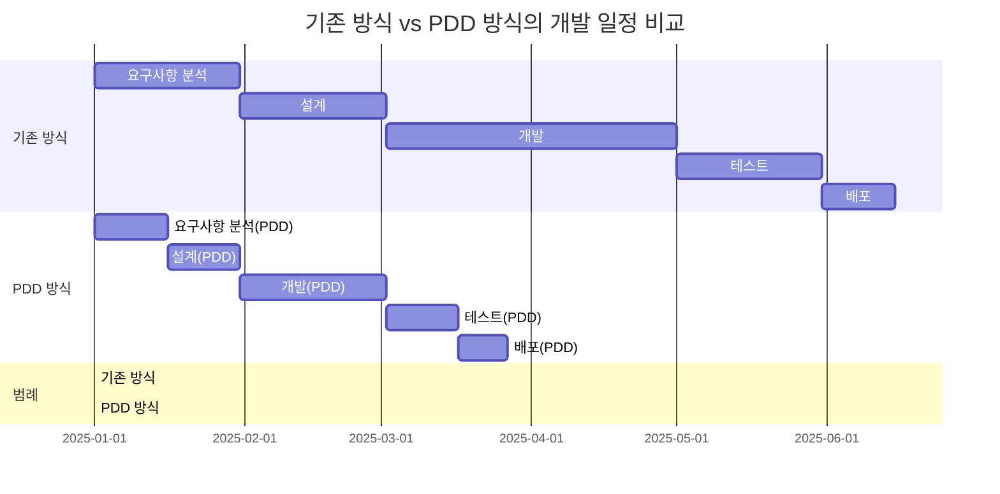
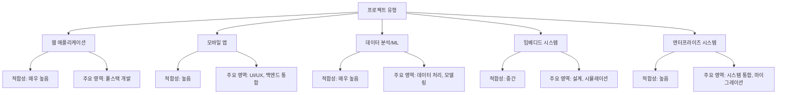
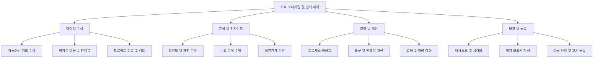

# 프롬프트 기반 개발방법론(PDD) - 개요 및 목표 정의

## 목차

1. [PDD의 정의와 필요성](#pdd의-정의와-필요성)
   1. [정의](#정의)
   2. [필요성](#필요성)
2. [비즈니스 목표 연계](#비즈니스-목표-연계)
   1. [시장 출시 시간(Time-to-Market) 단축](#1-시장-출시-시간time-to-market-단축)
   2. [비용 효율성 향상](#2-비용-효율성-향상)
   3. [제품 품질 향상](#3-제품-품질-향상)
   4. [혁신 가속화](#4-혁신-가속화)
3. [적용 범위 설정](#적용-범위-설정)
   1. [개발 단계별 적용 범위](#개발-단계별-적용-범위)
   2. [프로젝트 유형별 적용 적합성](#프로젝트-유형별-적용-적합성)
   3. [조직 준비도에 따른 적용 단계](#조직-준비도에-따른-적용-단계)
4. [성공 지표 설정](#성공-지표-설정)
   1. [정량적 지표](#정량적-지표)
   2. [정성적 지표](#정성적-지표)
   3. [지표 모니터링 및 평가 체계](#지표-모니터링-및-평가-체계)

---

## PDD의 정의와 필요성

### 정의

프롬프트 기반 개발방법론(Prompt-driven Development, PDD)은 대형 언어 모델(LLM)과 인공지능(AI)을 소프트웨어 개발 생명주기(SDLC) 전반에 체계적으로 통합하는 개발 방법론입니다. 이 방법론은 자연어 프롬프트를 통해 AI와 효과적으로 상호작용하여 요구사항 분석, 설계, 코딩, 테스트, 문서화 등 소프트웨어 개발의 각 단계를 가속화하고 품질을 향상시키는 접근 방식입니다.

PDD는 다음과 같은 주요 특성을 가집니다:

1. **자연어 기반 상호작용**: 개발자와 AI 간의 상호작용이 자연어 프롬프트를 통해 이루어짐
2. **반복적 개선 프로세스**: 프롬프트 결과를 지속적으로 평가하고 개선하는 순환적 접근 방식
3. **도구 및 워크플로우 통합**: 기존 개발 도구와 워크플로우에 AI를 통합
4. **협업적 접근**: AI와 개발자 간의 협업을 통한 시너지 효과 창출

### 필요성

현대 소프트웨어 개발 환경에서 PDD의 필요성은 다음과 같은 요인에서 기인합니다:

1. **개발 복잡성 증가**: 소프트웨어 시스템의 복잡성이 지속적으로 증가하면서, 개발자가 모든 세부 사항을 파악하고 처리하기 어려워짐
2. **개발 속도 요구 증가**: 시장 경쟁이 치열해지면서 더 빠른 개발 및 배포 속도 요구
3. **전문 지식의 확장 필요**: 다양한 기술 스택과 도메인 지식을 요구하는 프로젝트가 증가
4. **유지보수 및 문서화 부담**: 코드베이스가 커질수록 일관된 문서화와 유지보수 어려움 증가
5. **개발자 부족**: 전 세계적인 숙련된 개발자 부족 현상 심화

PDD는 이러한 도전과제를 해결하기 위해 AI의 능력을 활용하여 개발자 생산성을 높이고, 코드 품질을 향상시키며, 개발 과정을 가속화합니다.

## 비즈니스 목표 연계

PDD는 다음과 같은 비즈니스 목표와 직접적으로 연계됩니다:

### 1. 시장 출시 시간(Time-to-Market) 단축

- **개발 주기 단축**: AI 지원을 통해 코드 작성, 검토, 테스트 시간 감소
- **병렬 작업 증가**: AI가 반복적인 작업을 처리하는 동안 개발자는 복잡한 문제에 집중
- **의사결정 가속화**: AI 기반 분석과 추천을 통한 설계 및 구현 의사결정 시간 단축

### 2. 비용 효율성 향상

| 비용 항목 | 기존 방식 | PDD 방식 | 절감률 |
|---------|---------|---------|-------|
| 개발 인력 비용 | 100% | 70-80% | 20-30% |
| 품질 보증 비용 | 100% | 60-70% | 30-40% |
| 유지보수 비용 | 100% | 75-85% | 15-25% |
| 교육 및 도구 비용 | 100% | 110-120% | -10-20% |
| **총 비용** | **100%** | **75-85%** | **15-25%** |

- **개발자 생산성 향상**: 동일한 인력으로 더 많은 기능 개발 가능
- **오류 감소**: 초기 설계 및 코딩 단계에서 오류 감소로 인한 수정 비용 절감
- **지식 공유 향상**: AI를 통한 지식 전파로 교육 및 온보딩 비용 절감

### 3. 제품 품질 향상

- **코드 일관성 개선**: AI가 코딩 표준을 일관되게 적용하여 코드 품질 향상
- **광범위한 테스트 커버리지**: AI 지원 테스트 생성으로 더 많은 시나리오 테스트 가능
- **최신 기술 및 보안 사례 적용**: AI를 통해 최신 기술과 보안 사례를 코드에 지속적으로 반영

### 4. 혁신 가속화

- **창의적 솔루션 탐색**: AI의 대안 제시를 통한 더 넓은 솔루션 공간 탐색
- **실험 및 프로토타이핑 가속화**: 빠른 프로토타입 생성으로 아이디어 검증 시간 단축
- **레거시 시스템 현대화**: 레거시 코드 이해 및 현대화 작업 지원

## 적용 범위 설정

PDD는 소프트웨어 개발 생명주기의 모든 단계에 적용할 수 있으며, 프로젝트의 특성과 조직의 준비도에 따라 선택적으로 적용할 수 있습니다.

### 개발 단계별 적용 범위

| 개발 단계 | PDD 적용 사례 | 적용 난이도 | 기대 효과 |
|---------|------------|-----------|---------|
| **요구사항 정의** | - 요구사항 명세서 자동 생성 - 사용자 스토리 구체화 - 요구사항 불일치 탐지 | ★★☆☆☆ | 높음 |
| **설계** | - 아키텍처 패턴 추천 - 인터페이스 설계 지원 - 데이터 모델 생성 | ★★★☆☆ | 높음 |
| **개발** | - 코드 자동 생성 - 리팩토링 제안 - 코드 최적화 | ★★★★☆ | 매우 높음 |
| **테스트** | - 테스트 케이스 생성 - 커버리지 분석 - 버그 예측 | ★★★☆☆ | 높음 |
| **배포** | - 배포 스크립트 생성 - 인프라 구성 자동화 - 롤백 계획 수립 | ★★☆☆☆ | 중간 |
| **유지보수** | - 코드 문서화 - 레거시 코드 분석 - 업그레이드 경로 추천 | ★★★★★ | 높음 |

### 프로젝트 유형별 적용 적합성

### 조직 준비도에 따른 적용 단계

1. **탐색 단계**
   - 소규모 파일럿 프로젝트 진행
   - 개발자 교육 및 인식 제고
   - AI 도구 및 인프라 검토

2. **부분 적용 단계**
   - 특정 개발 단계에 PDD 적용 (예: 코드 생성, 테스트)
   - 성공 지표 모니터링 및 피드백 수집
   - 프로세스 최적화

3. **통합 단계**
   - 개발 워크플로우 전반에 PDD 통합
   - 개발 방법론 및 거버넌스 조정
   - 조직 전체로 모범 사례 확산

4. **혁신 단계**
   - AI와 개발자 간 시너지 극대화
   - 고유한 PDD 패턴 및 사례 개발
   - 지속적 개선 및 적응

## 성공 지표 설정

PDD 적용의 성공을 측정하기 위한 핵심 지표는 다음과 같습니다:

### 정량적 지표

| 카테고리 | 지표 | 측정 방법 | 목표 개선 |
|---------|-----|----------|----------|
| **생산성** | 기능 개발 속도 | 기능당 개발 시간 | 30-50% 향상 |
|  | 코드 생성 효율성 | 동일 시간 내 생성된 코드 라인 수 | 100-200% 향상 |
|  | 반복 작업 감소 | 자동화된 작업 비율 | 40-60% 증가 |
| **품질** | 초기 버그 발견 | 개발 중 발견된 버그 수 | 30-50% 증가 |
|  | 프로덕션 버그 | 프로덕션 환경 버그 발생률 | 20-40% 감소 |
|  | 테스트 커버리지 | 코드 테스트 커버리지 비율 | 20-30% 증가 |
| **비용** | 개발 비용 | 기능당 총 개발 비용 | 15-25% 감소 |
|  | 유지보수 비용 | 연간 유지보수 비용 | 10-20% 감소 |
| **시간** | 출시 주기 | 아이디어에서 출시까지 시간 | 30-50% 단축 |
|  | 반응 시간 | 변경 요청에 대한 대응 시간 | 40-60% 단축 |

### 정성적 지표

1. **개발자 경험**
   - 개발자 만족도 및 참여도
   - AI 도구 사용 숙련도 및 효율성
   - 프롬프트 엔지니어링 역량 향상

2. **코드 품질**
   - 코드 가독성 및 유지보수성
   - 아키텍처 일관성 및 모듈성
   - 보안 및 성능 최적화 수준

3. **지식 공유**
   - 팀 간 기술 및 도메인 지식 전파
   - 암묵적 지식의 명시적 문서화 정도
   - 온보딩 효율성 및 효과

4. **혁신 및 창의성**
   - 새로운 접근 방식 및 솔루션 탐색
   - 기술적 제약 극복 사례
   - 비즈니스 가치 창출 사례

### 지표 모니터링 및 평가 체계

PDD 적용의 성공은 단순한 개발 효율성 향상을 넘어, 비즈니스 가치 창출과 조직 역량 강화의 관점에서 종합적으로 평가되어야 합니다. 지표는 조직의 특성과 목표에 맞게 조정되어야 하며, 지속적인 모니터링과 개선을 통해 PDD의 효과를 극대화할 수 있습니다.
