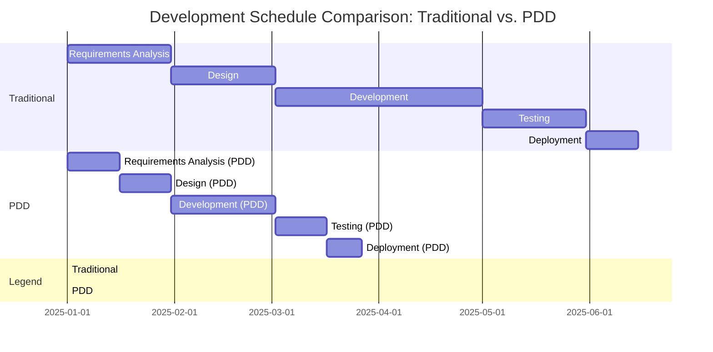
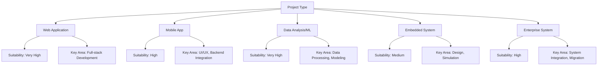
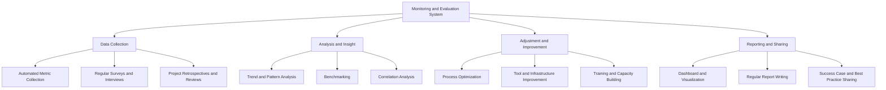

# Prompt-driven Development (PDD) - Overview and Objectives

## Table of Contents

1. [Definition and Necessity of PDD](#definition-and-necessity-of-pdd)
   1. [Definition](#definition)
   2. [Necessity](#necessity)
2. [Alignment with Business Goals](#alignment-with-business-goals)
   1. [Reduced Time-to-Market](#1-reduced-time-to-market)
   2. [Improved Cost Efficiency](#2-improved-cost-efficiency)
   3. [Enhanced Product Quality](#3-enhanced-product-quality)
   4. [Accelerated Innovation](#4-accelerated-innovation)
3. [Scope of Application](#scope-of-application)
   1. [Scope by Development Phase](#scope-by-development-phase)
   2. [Suitability by Project Type](#suitability-by-project-type)
   3. [Adoption Stages by Organizational Readiness](#adoption-stages-by-organizational-readiness)
4. [Setting Success Metrics](#setting-success-metrics)
   1. [Quantitative Metrics](#quantitative-metrics)
   2. [Qualitative Metrics](#qualitative-metrics)
   3. [Monitoring and Evaluation System](#monitoring-and-evaluation-system)

---

## Definition and Necessity of PDD

### Definition

Prompt-driven Development (PDD) is a methodology that systematically integrates Large Language Models (LLMs) and Artificial Intelligence (AI) throughout the Software Development Life Cycle (SDLC). This approach accelerates and enhances each stage of software development—including requirements analysis, design, coding, testing, and documentation—by enabling effective interaction with AI through natural language prompts.

Key characteristics of PDD include:

1. **Natural Language Interaction**: Developers interact with AI using natural language prompts.
2. **Iterative Improvement Process**: Continuous evaluation and refinement of prompt results in a cyclical manner.
3. **Tool and Workflow Integration**: Seamless integration of AI into existing development tools and workflows.
4. **Collaborative Approach**: Synergy through collaboration between AI and developers.

### Necessity

The need for PDD in modern software development arises from several factors:

1. **Increasing Complexity**: Software systems are becoming more complex, making it difficult for developers to manage all details.
2. **Demand for Faster Development**: Fierce market competition requires faster development and deployment cycles.
3. **Expanding Knowledge Requirements**: Projects increasingly demand expertise in diverse tech stacks and domains.
4. **Maintenance and Documentation Burden**: As codebases grow, maintaining consistent documentation and code becomes more challenging.
5. **Developer Shortage**: There is a global shortage of skilled developers.

PDD leverages AI to address these challenges by boosting developer productivity, improving code quality, and accelerating the development process.

## Alignment with Business Goals

PDD is directly aligned with the following business objectives:

### 1. Reduced Time-to-Market

- **Shorter Development Cycles**: AI support reduces time spent on coding, review, and testing.
- **Increased Parallel Work**: Developers can focus on complex problems while AI handles repetitive tasks.
- **Faster Decision-Making**: AI-driven analysis and recommendations speed up design and implementation decisions.

### 2. Improved Cost Efficiency

| Cost Item            | Traditional | PDD      | Savings Rate |
|----------------------|-------------|----------|--------------|
| Developer Labor Cost | 100%        | 70-80%   | 20-30%       |
| QA Cost              | 100%        | 60-70%   | 30-40%       |
| Maintenance Cost     | 100%        | 75-85%   | 15-25%       |
| Training & Tools     | 100%        | 110-120% | -10-20%      |
| **Total Cost**       | **100%**    | **75-85%**| **15-25%**   |

- **Higher Developer Productivity**: More features can be developed with the same workforce.
- **Error Reduction**: Fewer errors in early design and coding stages reduce rework costs.
- **Improved Knowledge Sharing**: AI-driven knowledge transfer lowers training and onboarding costs.

### 3. Enhanced Product Quality

- **Consistent Coding Standards**: AI enforces coding standards, improving code quality.
- **Broader Test Coverage**: AI-generated tests increase scenario coverage.
- **Continuous Adoption of Latest Technologies and Security**: AI helps keep code up-to-date with the latest tech and security practices.

### 4. Accelerated Innovation

- **Creative Solution Exploration**: AI enables broader exploration of solution spaces.
- **Rapid Prototyping and Experimentation**: Faster prototyping allows for quicker validation of ideas.
- **Modernization of Legacy Systems**: AI assists in understanding and modernizing legacy code.

## Scope of Application

PDD can be applied to all phases of the software development lifecycle and can be selectively adopted based on project characteristics and organizational readiness.

### Scope by Development Phase

| Phase | PDD Application Example | Difficulty | Expected Effect |
|-------|------------------------|------------|----------------|
| **Requirements Definition** | - Automated generation of detailed requirements - User story structuring - Detection of conflicting requirements | ★★☆☆☆ | High |
| **Design** | - Architecture pattern recommendations - Interface design support - Data model generation | ★★★☆☆ | High |
| **Development** | - Automated code generation - Refactoring suggestions - Code optimization | ★★★★☆ | Very High |
| **Testing** | - Test case generation - Coverage analysis - Bug prediction | ★★★☆☆ | High |
| **Deployment** | - Deployment script generation - Automated infrastructure setup - Rollback planning | ★★☆☆☆ | Medium |
| **Maintenance** | - Code documentation - Legacy code analysis - Upgrade path recommendations | ★★★★★ | High |

### Suitability by Project Type

### Adoption Stages by Organizational Readiness

1. **Exploratory Phase**
   - Small-scale pilot projects
   - Developer training and awareness
   - AI tool and infrastructure evaluation

2. **Partial Adoption Phase**
   - Apply PDD to specific development phases (e.g., code generation, testing)
   - Collect success metrics and feedback
   - Optimize processes

3. **Full Integration Phase**
   - Integrate PDD throughout the development workflow
   - Adjust methodologies and governance
   - Expand best practices organization-wide

4. **Innovation Phase**
   - Radical synergy between AI and developers
   - Develop proprietary PDD patterns and use cases
   - Continuous improvement and adaptation

## Setting Success Metrics

Key metrics for evaluating PDD adoption:

### Quantitative Metrics

| Category | Metric | Measurement Method | Target Improvement |
|----------|--------|-------------------|-------------------|
| **Productivity** | Feature development speed | Time per feature | 30-50% improvement |
|  | Code generation efficiency | Number of lines generated per hour | 100-200% improvement |
|  | Reduction in repetitive tasks | Automation rate | 40-60% increase |
| **Quality** | Early bug detection | Number of bugs found during development | 30-50% increase |
|  | Production bug rate | Bug occurrence rate in production | 20-40% reduction |
|  | Test coverage | Automated test coverage rate | 20-30% increase |
| **Cost** | Development cost | Total development cost per feature | 15-25% reduction |
|  | Maintenance cost | Maintenance cost over time | 10-20% reduction |
| **Time** | Time to release | Time from idea to release | 30-50% reduction |
|  | Response time | Time to respond to change requests | 40-60% reduction |

### Qualitative Metrics

1. **Developer Experience**
   - Developer satisfaction and engagement
   - AI tool adoption and effectiveness
   - Growth in prompt engineering skills

2. **Code Quality**
   - Code maintainability and readability
   - Adherence to architecture patterns and modularity
   - Security and performance optimization

3. **Knowledge Sharing**
   - Team knowledge transfer and domain expertise
   - Clarity and documentation of implicit knowledge
   - Effectiveness of onboarding and training

4. **Innovation and Creativity**
   - Adoption of new approaches and solution exploration
   - Overcoming technical limitations
   - Creation of business value use cases

### Monitoring and Evaluation System

PDD success should be evaluated not only in terms of development efficiency, but also from the perspective of business value creation and organizational capability enhancement. Metrics should be tailored to organizational characteristics and goals, and continuous monitoring and improvement should be used to maximize the impact of PDD.
