# 프롬프트 기반 개발방법론(PDD) - 핵심 개념

## 목차

1. [용어 정의](#용어-정의)
   1. [핵심 용어](#핵심-용어)
   2. [PDD 관련 개념 설명](#pdd-관련-개념-설명)
      1. [프롬프트 설계 원칙](#프롬프트-설계-원칙)
      2. [프롬프트 개발 생명주기(PDLC)](#프롬프트-개발-생명주기pdlc)
      3. [AI 개발 보조 유형](#ai-개발-보조-유형)
2. [기존 방법론과의 차별점](#기존-방법론과의-차별점)
   1. [주요 개발 방법론 비교](#주요-개발-방법론-비교)
   2. [PDD의 혁신적 차별점](#pdd의-혁신적-차별점)
3. [적용 이점과 한계](#적용-이점과-한계)
   1. [적용 이점](#적용-이점)
   2. [적용 한계 및 도전과제](#적용-한계-및-도전과제)
   3. [이점 vs 한계 분석 매트릭스](#이점-vs-한계-분석-매트릭스)

---

## 용어 정의

프롬프트 기반 개발방법론(PDD)을 이해하고 적용하기 위해 필요한 핵심 용어와 개념들을 정의합니다. 이러한 용어들은 PDD를 실행하고 논의하는 과정에서 일관된 언어를 사용할 수 있게 합니다.

### 핵심 용어

| 용어 | 정의 | 예시 |
|-----|------|------|
| **프롬프트(Prompt)** | AI 모델에 제공되는 지시, 질문, 또는 맥락을 포함한 텍스트 입력 | "사용자 인증 기능을 위한 Spring Boot 컨트롤러를 작성해주세요." |
| **프롬프트 엔지니어링(Prompt Engineering)** | AI 모델로부터 원하는 결과를 얻기 위해 효과적인 프롬프트를 설계, 최적화, 개선하는 과정 | 맥락 추가, 지시 명확화, 예시 제공 등을 통한 프롬프트 개선 |
| **대형 언어 모델(LLM)** | 대규모 텍스트 데이터로 학습된, 자연어를 이해하고 생성할 수 있는 AI 모델 | GPT-4, Claude, Gemini, PaLM 등 |
| **프롬프트 템플릿(Prompt Template)** | 특정 유형의 작업에 대해 일관된 결과를 얻기 위한 표준화된 프롬프트 구조 | 코드 생성, 리팩토링, 버그 수정 등을 위한 정형화된 프롬프트 |
| **프롬프트 체인(Prompt Chain)** | 복잡한 작업을 수행하기 위해 여러 프롬프트를 순차적으로 연결한 프로세스 | 요구사항 분석 → 아키텍처 설계 → 코드 생성 → 테스트 생성의 연속 |
| **AI 증강 개발(AI-Augmented Development)** | AI를 개발자의 보조 도구로 활용하여 개발 과정을 강화하는 접근 방식 | GitHub Copilot을 사용한 코드 자동 완성 |
| **인간-AI 협업(Human-AI Collaboration)** | 개발자와 AI가 각자의 강점을 활용하여 상호 보완적으로 작업하는 과정 | 개발자가 문제 정의, AI가 솔루션 제안, 개발자가 검토 및 수정 |
| **프롬프트 버전 관리(Prompt Versioning)** | 프롬프트의 변경 사항을 추적하고 관리하는 체계적인 접근 방식 | 프롬프트의 이력, 변경 사유, 효과 등을 기록하는 시스템 |
| **AI 피드백 루프(AI Feedback Loop)** | AI 출력에 대한 평가와 피드백을 바탕으로 프롬프트를 지속적으로 개선하는 순환 과정 | 생성된 코드 평가 → 프롬프트 개선 → 새로운 코드 생성 → 재평가 |
| **프롬프트 지향 아키텍처(Prompt-Oriented Architecture)** | 시스템 설계 및 개발이 프롬프트 기반 상호작용을 중심으로 이루어지는 아키텍처 패턴 | 프롬프트 처리기, 컨텍스트 관리자, 결과 평가기 등의 컴포넌트로 구성 |

### PDD 관련 개념 설명

#### 프롬프트 설계 원칙

효과적인 프롬프트 설계를 위한 기본 원칙:

1. **명확성(Clarity)**: 모호하지 않고 구체적인 지시 제공
2. **맥락성(Context)**: 관련 배경 정보와 제약 조건 포함
3. **구조화(Structure)**: 논리적으로 구조화된 형식 사용
4. **반복가능성(Reproducibility)**: 일관된 결과를 얻을 수 있는 설계
5. **적응성(Adaptability)**: 다양한 상황에 유연하게 적용 가능한 설계

#### 프롬프트 개발 생명주기(PDLC)

```mermaid
graph TD
    A[프롬프트 개발 생명주기] --> B[계획 및 요구사항 정의]
    A --> C[프롬프트 설계 및 작성]
    A --> D[테스트 및 평가]
    A --> E[최적화 및 개선]
    A --> F[배포 및 관리]
    A --> G[모니터링 및 피드백]
    
    B --> B1[목표 및 성공 기준 설정]
    B --> B2[사용 사례 및 제약조건 식별]
    
    C --> C1[구조 결정 및 템플릿 선택]
    C --> C2[핵심 요소 및 지시 작성]
    C --> C3[예시 및 맥락 추가]
    
    D --> D1[샘플 출력 생성 및 분석]
    D --> D2[성공 기준 대비 결과 평가]
    D --> D3[변형 테스트 수행]
    
    E --> E1[피드백 기반 프롬프트 수정]
    E --> E2[성능 향상을 위한 미세 조정]
    E --> E3[엣지 케이스 및 예외 처리]
    
    F --> F1[프롬프트 라이브러리에 추가]
    F --> F2[문서화 및 사용 가이드라인 작성]
    F --> F3[접근 권한 및 버전 관리 설정]
    
    G --> G1[사용 패턴 및 성과 모니터링]
    G --> G2[사용자 피드백 수집 및 분석]
    G --> G3[지속적 개선 및 업데이트]
    
    style A fill:#d6e0ff,stroke:#6680e6,color:#000000
    style B fill:#d6e0ff,stroke:#6680e6,color:#000000
    style C fill:#d6e0ff,stroke:#6680e6,color:#000000
    style D fill:#d6e0ff,stroke:#6680e6,color:#000000
    style E fill:#d6e0ff,stroke:#6680e6,color:#000000
    style F fill:#d6e0ff,stroke:#6680e6,color:#000000
    style G fill:#d6e0ff,stroke:#6680e6,color:#000000
    
    style B1 fill:#e6f0ff,stroke:#6680e6,color:#000000
    style B2 fill:#e6f0ff,stroke:#6680e6,color:#000000
    style C1 fill:#e6f0ff,stroke:#6680e6,color:#000000
    style C2 fill:#e6f0ff,stroke:#6680e6,color:#000000
    style C3 fill:#e6f0ff,stroke:#6680e6,color:#000000
    style D1 fill:#e6f0ff,stroke:#6680e6,color:#000000
    style D2 fill:#e6f0ff,stroke:#6680e6,color:#000000
    style D3 fill:#e6f0ff,stroke:#6680e6,color:#000000
    style E1 fill:#e6f0ff,stroke:#6680e6,color:#000000
    style E2 fill:#e6f0ff,stroke:#6680e6,color:#000000
    style E3 fill:#e6f0ff,stroke:#6680e6,color:#000000
    style F1 fill:#e6f0ff,stroke:#6680e6,color:#000000
    style F2 fill:#e6f0ff,stroke:#6680e6,color:#000000
    style F3 fill:#e6f0ff,stroke:#6680e6,color:#000000
    style G1 fill:#e6f0ff,stroke:#6680e6,color:#000000
    style G2 fill:#e6f0ff,stroke:#6680e6,color:#000000
    style G3 fill:#e6f0ff,stroke:#6680e6,color:#000000

    F --> F2[문서화 및 사용 가이드라인 작성]
    F --> F3[접근 권한 및 버전 관리 설정]
    
    G --> G1[사용 패턴 및 성과 모니터링]
    G --> G2[사용자 피드백 수집 및 분석]
    G --> G3[지속적 개선 및 업데이트]
```

#### AI 개발 보조 유형

개발 과정에서 AI가 지원할 수 있는 다양한 역할:

1. **정보 제공자(Information Provider)**: 기술 문서, 모범 사례, 일반적인 오류 등에 대한 정보 제공
2. **아이디어 생성기(Idea Generator)**: 문제 해결을 위한 다양한 접근 방식과 아이디어 제안
3. **코드 생성기(Code Generator)**: 요구사항에 따른 코드 자동 생성
4. **코드 분석기(Code Analyzer)**: 기존 코드의 품질, 성능, 보안 등을 분석하고 개선 제안
5. **디버거(Debugger)**: 오류 원인 분석 및 해결책 제시
6. **문서 작성자(Documentarian)**: 코드 설명, API 문서, 사용자 가이드 등 작성 지원
7. **학습 도우미(Learning Assistant)**: 새로운 기술이나 개념 학습 지원

## 기존 방법론과의 차별점

PDD는 기존의 소프트웨어 개발 방법론과 비교하여 여러 차별점을 가지고 있으며, 이를 통해 개발 프로세스를 혁신적으로 변화시킵니다.

### 주요 개발 방법론 비교

| 특성 | 워터폴 모델 | 애자일(Agile) | DevOps | 프롬프트 기반 개발(PDD) |
|-----|------------|------------|--------|------------------------|
| **개발 철학** | 순차적, 단계별 접근 | 반복적, 점진적 접근 | 개발과 운영의 통합 | AI 증강 개발, 인간-AI 협업 |
| **주기 길이** | 몇 개월~몇 년 | 2-4주 스프린트 | 지속적인 흐름 | 즉각적~단기 반복 |
| **요구사항 처리** | 초기에 상세 정의 | 변화 수용, 점진적 정의 | 운영 피드백 기반 조정 | 자연어 기반, 대화형 정의 |
| **변경 수용성** | 낮음 | 높음 | 매우 높음 | 매우 높음 (실시간 조정) |
| **품질 관리** | 단계별 전용 테스트 | 지속적 테스트, TDD | 자동화된 테스트 및 모니터링 | AI 지원 테스트, 자동 코드 리뷰 |
| **의사소통 중심** | 문서 | 사람 | 도구와 자동화 | 자연어 프롬프트와 AI |
| **핵심 강점** | 명확한 구조 및 예측 가능성 | 적응성 및 고객 만족 | 빠른 배포 및 안정성 | 개발 가속화 및 지식 확장 |
| **도구 의존성** | 낮음 | 중간 | 높음 | 매우 높음 (AI 모델 및 도구) |

### PDD의 혁신적 차별점

#### 1. 자연어 기반 개발

PDD는 자연어를 통한 소프트웨어 개발을 가능하게 하여, 코드 작성에서 문서화까지 모든 과정을 자연스러운 대화 형태로 진행할 수 있게 합니다.

- **기존 방식**: 형식적인 언어와 구문으로 정의된 코드 작성
- **PDD 방식**: 자연어 지시와 대화형 상호작용을 통한 코드 생성 및 수정

#### 2. 지식 증폭 효과

PDD는 AI의 방대한 지식 기반을 활용하여 개발자의 전문 영역을 확장합니다.

- **기존 방식**: 개발자의 개인적 지식과 경험에 의존
- **PDD 방식**: AI를 통한 다양한 도메인 지식, 라이브러리, 패턴의 즉각적 접근

#### 3. 프로토타이핑 가속화

PDD는 아이디어에서 실행 가능한 코드로의 전환을 극적으로 가속화합니다.

- **기존 방식**: 아이디어 구현을 위한 상세 설계 및 코딩 필요
- **PDD 방식**: 자연어 설명만으로 빠른 프로토타입 생성 가능

#### 4. 코드 생성과 검증의 통합

PDD는 코드 생성과 검증을 하나의 흐름으로 통합합니다.

- **기존 방식**: 코드 작성과 테스트가 분리된 단계로 진행
- **PDD 방식**: 코드 생성과 동시에 검증 로직 및 테스트 케이스 제안

#### 5. 학습 지향적 개발

PDD는 개발 과정 자체가 학습 과정이 되도록 합니다.

- **기존 방식**: 개발과 학습이 별개의 활동으로 진행
- **PDD 방식**: AI와의 상호작용을 통한 지속적 학습 및 역량 강화

## PDD의 정의와 필요성

### PDD의 정의

프롬프트 기반 개발방법론(Prompt-driven Development, PDD)은 대형 언어 모델(LLM)과 인공지능(AI)을 소프트웨어 개발 생명주기(SDLC) 전반에 체계적으로 통합하는 개발 방법론입니다. 이 방법론은 자연어 프롬프트를 통해 AI와 효과적으로 상호작용하여 요구사항 분석, 설계, 코딩, 테스트, 문서화 등 소프트웨어 개발의 각 단계를 가속화하고 품질을 향상시키는 접근 방식입니다.

PDD는 다음과 같은 주요 특성을 가집니다:

1. **자연어 기반 상호작용**: 개발자와 AI 간의 상호작용이 자연어 프롬프트를 통해 이루어짐
2. **반복적 개선 프로세스**: 프롬프트 결과를 지속적으로 평가하고 개선하는 순환적 접근 방식
3. **도구 및 워크플로우 통합**: 기존 개발 도구와 워크플로우에 AI를 통합
4. **협업적 접근**: AI와 개발자 간의 협업을 통한 시너지 효과 창출

### PDD의 필요성

현대 소프트웨어 개발 환경에서 PDD의 필요성은 다음과 같은 요인에서 기인합니다:

1. **개발 복잡성 증가**: 소프트웨어 시스템의 복잡성이 지속적으로 증가하면서, 개발자가 모든 세부 사항을 파악하고 처리하기 어려워짐
2. **개발 속도 요구 증가**: 시장 경쟁이 치열해지면서 더 빠른 개발 및 배포 속도 요구
3. **전문 지식의 확장 필요**: 다양한 기술 스택과 도메인 지식을 요구하는 프로젝트가 증가
4. **유지보수 및 문서화 부담**: 코드베이스가 커질수록 일관된 문서화와 유지보수 어려움 증가
5. **개발자 부족**: 전 세계적인 숙련된 개발자 부족 현상 심화

PDD는 이러한 도전과제를 해결하기 위해 AI의 능력을 활용하여 개발자 생산성을 높이고, 코드 품질을 향상시키며, 개발 과정을 가속화합니다.

## 적용 이점과 한계

PDD의 도입과 적용은 다양한 이점을 제공하지만, 동시에 여러 한계와 도전과제도 존재합니다. 이를 객관적으로 이해하는 것이 성공적인 PDD 적용의 핵심입니다.

### 적용 이점

#### 1. 개발 속도 및 생산성 향상

PDD는 코드 작성, 디버깅, 테스트 등 여러 개발 작업을 가속화하여 전체 개발 주기를 단축합니다.

- **코드 생성 자동화**: 반복적인 코드 패턴의 자동 생성으로 시간 절약
- **문서화 효율성**: 코드와 함께 문서를 자동으로 생성하여 문서화 부담 감소
- **빠른 문제 해결**: AI의 제안을 통한 오류 및 버그 신속 해결

#### 2. 지식 장벽 감소

PDD는 특정 기술이나 도메인에 대한 전문 지식 없이도 효과적인 개발을 가능하게 합니다.

- **기술 스택 확장**: 익숙하지 않은 언어나 프레임워크 사용 지원
- **도메인 지식 보완**: 특정 비즈니스 도메인에 대한 이해 지원
- **모범 사례 적용**: 산업 표준 및 모범 사례 자동 통합

#### 3. 코드 품질 향상

PDD는 일관된 코딩 표준과 모범 사례를 적용하여 코드 품질을 향상시킵니다.

- **일관성 유지**: 전체 코드베이스에 걸쳐 일관된 스타일 및 패턴 적용
- **보안 강화**: 알려진 취약점 및 보안 문제 사전 식별 및 수정
- **성능 최적화**: 효율적인 알고리즘 및 자원 사용 제안

#### 4. 협업 및 지식 공유 강화

PDD는 팀 내 지식 공유와 협업을 촉진합니다.

- **코드 이해도 향상**: AI의 코드 설명을 통한 팀원 간 이해도 증진
- **온보딩 가속화**: 새로운 팀원의 코드베이스 학습 지원
- **통합된 개발 언어**: 기술적/비기술적 이해관계자 간 의사소통 개선

### 적용 한계 및 도전과제

#### 1. 기술적 한계

현재 AI 기술의 한계로 인한 제약사항이 존재합니다.

- **복잡한 맥락 이해 제한**: 대규모 시스템의 전체 맥락 파악 어려움
- **특수 도메인 지식 부족**: 매우 전문적이거나 최신 영역의 지식 한계
- **코드 정확성 보장 문제**: 생성된 코드의 100% 정확성 보장 불가

#### 2. 프로세스 통합 도전과제

기존 개발 프로세스와 PDD의 통합 과정에서 발생하는 도전과제가 있습니다.

- **워크플로우 변경**: 기존 개발 워크플로우와의 조화 필요
- **품질 보증 조정**: AI 생성 코드에 대한 새로운 QA 접근법 필요
- **책임 모델 재정의**: 오류 발생 시 책임 소재 명확화

#### 3. 역량 및 조직 문화 측면

PDD 도입에 필요한 새로운 역량과 문화적 변화가 도전과제가 될 수 있습니다.

- **프롬프트 엔지니어링 역량**: 효과적인 프롬프트 작성 능력 필요
- **AI 출력 평가 능력**: AI 생성 결과를 비판적으로 평가할 수 있는 판단력 필요
- **과도한 의존성 위험**: AI에 대한 과도한 의존으로 기본 역량 약화 가능성

#### 4. 데이터 및 보안 우려사항

PDD 적용 과정에서 발생할 수 있는 데이터 및 보안 관련 우려사항이 있습니다.

- **코드 기밀성**: 민감한 코드나 비즈니스 로직의 외부 AI 모델 노출 우려
- **지적 재산권 문제**: 생성된 코드의 저작권 및 라이선스 문제
- **규제 준수**: 데이터 보호 및 규제 준수 요구사항과의 충돌 가능성

### 이점 vs 한계 분석 매트릭스

다음 표는 PDD의 주요 이점과 한계를 다양한 측면에서 비교한 것입니다:

| 측면 | 이점 | 한계 및 도전과제 | 해결 전략 |
|-----|-----|----------------|----------|
| **개발 속도** | 코드 생성 및 반복 작업 가속화 | 복잡한 문제에 대한 초기 프롬프트 설계에 시간 소요 | 재사용 가능한 프롬프트 템플릿 구축 |
| **코드 품질** | 일관된 패턴 및 모범 사례 적용 | 전체 시스템 맥락에서의 최적화 부족 | 인간 전문가의 검토 및 피드백 통합 |
| **학습 곡선** | 새로운 기술/도메인에 빠른 적응 | 효과적인 프롬프트 작성 학습 필요 | 체계적인 프롬프트 엔지니어링 교육 제공 |
| **유지보수성** | 자동 문서화 및 일관된 코드 | AI 생성 코드의 장기적 유지보수 도전 | 명확한 코드 소유권 및 리뷰 정책 수립 |
| **협업** | 공통 언어를 통한 소통 향상 | 과도한 AI 의존으로 인한 직접 협업 감소 | 균형 있는 인간-AI 협업 모델 정의 |
| **비용 효율성** | 개발 비용 및 시간 절감 | AI 도구 및 인프라 초기 투자 비용 | 단계적 도입 및 ROI 지속 측정 |
| **보안 및 규정 준수** | 보안 취약점 자동 감지 | 민감 정보 노출 및 규제 위험 | 내부 AI 모델 활용 및 데이터 정책 강화 |

PDD를 성공적으로 적용하기 위해서는 이러한 이점과 한계를 균형 있게 고려하고, 조직의 특성과 목표에 맞게 접근 방식을 조정하는 것이 중요합니다. 특히, 인간 개발자의 창의성, 비판적 사고, 판단력과 AI의 효율성, 일관성, 지식 기반을 결합하는 최적의 협업 모델을 개발하는 것이 핵심 성공 요소입니다.
