# Prompt-driven Development (PDD) - Core Concepts

**Document Number**: MTD-003  
**Version**: 1.0.0  
**Date**: 2025-05-26  
**Author**: Methodology Team  
**Status**: Approved

## Table of Contents

1. [Terminology](#terminology)
   1. [Key Terms](#key-terms)
   2. [PDD-Related Concepts](#pdd-related-concepts)
      1. [Prompt Design Principles](#prompt-design-principles)
      2. [Prompt Development Life Cycle (PDLC)](#prompt-development-life-cycle-pdlc)
      3. [Types of AI Development Assistance](#types-of-ai-development-assistance)
2. [Differences from Traditional Methodologies](#differences-from-traditional-methodologies)
   1. [Comparison of Major Development Methodologies](#comparison-of-major-development-methodologies)
   2. [Innovative Differentiators of PDD](#innovative-differentiators-of-pdd)
3. [Benefits and Limitations](#benefits-and-limitations)
   1. [Benefits](#benefits)
   2. [Limitations and Challenges](#limitations-and-challenges)
   3. [Benefits vs. Limitations Matrix](#benefits-vs-limitations-matrix)

---

## Terminology

This section defines the key terms and concepts necessary to understand and apply Prompt-driven Development (PDD). Consistent use of these terms ensures clarity in discussion and implementation.

### Key Terms

| Term | Definition | Example |
|------|------------|---------|
| **Prompt** | Text input provided to an AI model, including instructions, questions, or context | "Write a Spring Boot controller for user authentication." |
| **Prompt Engineering** | The process of designing, optimizing, and refining prompts to achieve desired results from an AI model | Improving prompts by adding context, clarifying instructions, or providing examples |
| **Large Language Model (LLM)** | AI models trained on large-scale text data capable of understanding and generating natural language | GPT-4, Claude, Gemini, PaLM, etc. |
| **Prompt Template** | A standardized prompt structure for consistent results in specific tasks | Templates for code generation, refactoring, bug fixing, etc. |
| **Prompt Chain** | A sequential process connecting multiple prompts to accomplish complex tasks | Requirement analysis → architecture design → code generation → test creation |
| **AI-Augmented Development** | Using AI as an assistive tool to enhance the development process | Code autocompletion with GitHub Copilot |
| **Human-AI Collaboration** | Developers and AI working together, leveraging each other's strengths | Developer defines the problem, AI suggests solutions, developer reviews and refines |
| **Prompt Versioning** | Systematic management and tracking of prompt changes | Recording prompt history, reasons for changes, and their effects |
| **AI Feedback Loop** | Continuous improvement of prompts based on evaluation and feedback of AI outputs | Evaluate generated code → improve prompt → generate new code → re-evaluate |
| **Prompt-Oriented Architecture** | An architectural pattern centered on prompt-based interactions | Components like prompt processors, context managers, and result evaluators |

### PDD-Related Concepts

#### Prompt Design Principles

Basic principles for effective prompt design:

1. **Clarity**: Provide clear and specific instructions
2. **Context**: Include relevant background information and constraints
3. **Structure**: Use a logically structured format
4. **Reproducibility**: Design for consistent results
5. **Adaptability**: Ensure flexibility for various situations

#### Prompt Development Life Cycle (PDLC)

```mermaid
graph TD
    A[Prompt Development Life Cycle] --> B[Planning & Requirements Definition]
    A --> C[Prompt Design & Authoring]
    A --> D[Testing & Evaluation]
    A --> E[Optimization & Improvement]
    A --> F[Deployment & Management]
    A --> G[Monitoring & Feedback]

    B --> B1[Set Goals & Success Criteria]
    B --> B2[Identify Use Cases & Constraints]

    C --> C1[Decide Structure & Select Templates]
    C --> C2[Write Key Elements & Instructions]
    C --> C3[Add Examples & Context]

    D --> D1[Generate & Analyze Sample Outputs]
    D --> D2[Evaluate Results Against Criteria]
    D --> D3[Perform Variation Testing]

    E --> E1[Revise Prompts Based on Feedback]
    E --> E2[Fine-tune for Performance]
    E --> E3[Handle Edge Cases & Exceptions]

    F --> F1[Add to Prompt Library]
    F --> F2[Document & Write Usage Guidelines]
    F --> F3[Set Access & Version Control]

    G --> G1[Monitor Usage Patterns & Performance]
    G --> G2[Collect & Analyze User Feedback]
    G --> G3[Continuous Improvement & Updates]

    style A fill:#d6e0ff,stroke:#222,color:#000
    style B fill:#d6e0ff,stroke:#222,color:#000
    style C fill:#d6e0ff,stroke:#222,color:#000
    style D fill:#d6e0ff,stroke:#222,color:#000
    style E fill:#d6e0ff,stroke:#222,color:#000
    style F fill:#d6e0ff,stroke:#222,color:#000
    style G fill:#d6e0ff,stroke:#222,color:#000
    style B1 fill:#e6f0ff,stroke:#222,color:#000
    style B2 fill:#e6f0ff,stroke:#222,color:#000
    style C1 fill:#e6f0ff,stroke:#222,color:#000
    style C2 fill:#e6f0ff,stroke:#222,color:#000
    style C3 fill:#e6f0ff,stroke:#222,color:#000
    style D1 fill:#e6f0ff,stroke:#222,color:#000
    style D2 fill:#e6f0ff,stroke:#222,color:#000
    style D3 fill:#e6f0ff,stroke:#222,color:#000
    style E1 fill:#e6f0ff,stroke:#222,color:#000
    style E2 fill:#e6f0ff,stroke:#222,color:#000
    style E3 fill:#e6f0ff,stroke:#222,color:#000
    style F1 fill:#e6f0ff,stroke:#222,color:#000
    style F2 fill:#e6f0ff,stroke:#222,color:#000
    style F3 fill:#e6f0ff,stroke:#222,color:#000
    style G1 fill:#e6f0ff,stroke:#222,color:#000
    style G2 fill:#e6f0ff,stroke:#222,color:#000
    style G3 fill:#e6f0ff,stroke:#222,color:#000
```

#### Types of AI Development Assistance

AI can assist in various ways throughout the development process:

1. **Information Retrieval**: Providing technical documents, case studies, and troubleshooting information.
2. **Idea Generation**: Proposing different approaches and solutions to problems.
3. **Code Generation**: Automatically writing code based on given requirements.
4. **Code Analysis**: Reviewing code for quality, performance, and security, and suggesting improvements.
5. **Debugging**: Identifying errors and suggesting fixes.
6. **Documentation Assistance**: Helping to write code documentation, API docs, and user guides.
7. **Learning Support**: Assisting in the learning of new technologies and concepts.

## Differences from Traditional Methodologies

PDD offers several differentiators compared to traditional software development methodologies, transforming the development process.

### Comparison of Major Development Methodologies

| Feature | Waterfall | Agile | DevOps | Prompt-driven Development (PDD) |
|---------|-----------|-------|--------|-------------------------------|
| **Development Philosophy** | Sequential, phase-based | Iterative, incremental | Integration of development and operations | AI-augmented, human-AI collaboration |
| **Iteration Length** | Months to years | 2-4 week sprints | Continuous flow | Real-time to short cycles |
| **Requirements Handling** | Detailed upfront | Flexible, incremental | Feedback-driven adjustment | Natural language, dialog-based definition |
| **Change Adaptability** | Low | High | Very high | Very high (real-time adjustment) |
| **Quality Management** | Phase-based testing | Continuous testing, TDD | Automated testing and monitoring | AI-supported testing, automated code review |
| **Decision Focus** | Documentation | People | Tools and automation | Natural language prompts and AI |
| **Key Strengths** | Clear structure and predictability | Adaptability and customer satisfaction | Fast delivery and stability | Accelerated development and knowledge expansion |
| **Tool Dependence** | Low | Medium | High | Very high (AI models and tools) |

### Innovative Differentiators of PDD

#### 1. Natural Language-based Development

PDD enables software development through natural language, allowing all phases from code writing to documentation to proceed as a natural conversation.

- **Traditional**: Code is written in formal languages and syntax.
- **PDD**: Code is generated and refined through natural language instructions and dialog.

#### 2. Knowledge Amplification

PDD leverages AI's vast knowledge base to expand developers' expertise.

- **Traditional**: Relies on individual developer knowledge and experience.
- **PDD**: Instantly accesses diverse domain knowledge, libraries, and patterns via AI.

#### 3. Accelerated Prototyping

PDD enables rapid code transformation from ideas, speeding up prototyping.

- **Traditional**: Requires detailed design and coding for each idea.
- **PDD**: Quickly creates prototypes with natural language descriptions.

#### 4. Integrated Code Generation and Validation

PDD unifies code generation and validation into a single workflow.

- **Traditional**: Code writing and testing are separate phases.
- **PDD**: Code is generated and validated simultaneously, with test cases provided by AI.

#### 5. Learning-oriented Development

PDD turns the development process itself into a learning journey.

- **Traditional**: Development and learning are separate activities.
- **PDD**: Continuous learning and skill enhancement through AI collaboration.

## PDD Definition and Importance

### Definition of PDD

Prompt-driven Development (PDD) is a methodology that systematically integrates large language models (LLMs) and AI into the software development lifecycle (SDLC). It accelerates and enhances each phase of software development—requirements analysis, design, coding, testing, and documentation—through effective collaboration with AI using natural language prompts.

Key characteristics of PDD include:

1. **Natural Language Collaboration**: Developers and AI interact through natural language prompts.
2. **Iterative Improvement Process**: Continuous evaluation and refinement of prompt outcomes in a feedback loop.
3. **Tool and Workflow Integration**: AI is integrated into existing development tools and workflows.
4. **Collaborative Engagement**: Synergistic cooperation between developers and AI to maximize creativity and productivity.

### Importance of PDD

In modern software development, the importance of PDD is recognized for the following reasons:

1. **Increasing Development Complexity**: As systems grow more complex, it becomes harder for developers to manage all details manually.
2. **Demand for Faster Development**: Market competition requires faster development and deployment cycles.
3. **Need for Expanding Expertise**: Projects increasingly require diverse technical stacks and domain knowledge.
4. **Documentation and Knowledge Management**: As codebases grow, maintaining documentation and knowledge becomes more challenging.
5. **Developer Shortage**: There is a global shortage of skilled developers.

PDD leverages AI to address these challenges, enhancing developer productivity, improving code quality, and accelerating the development process.

## Benefits and Limitations

PDD offers various benefits but also presents certain limitations and challenges. Understanding both is essential for successful adoption.

### Benefits

#### 1. Increased Development Speed and Productivity

PDD accelerates development tasks such as code generation, debugging, and testing, significantly shortening overall development cycles.

- **Automated Code Generation**: Reduces time spent on repetitive code patterns.
- **Efficient Documentation**: Automates documentation creation, reducing maintenance burden.
- **Faster Problem Solving**: AI quickly suggests solutions for errors and bugs.

#### 2. Reduced Knowledge Barriers

PDD enables effective development even without deep expertise in specific technologies or domains.

- **Technical Stack Expansion**: Supports unfamiliar languages and frameworks.
- **Domain Knowledge Support**: Provides explanations for industry-specific requirements.
- **Case Study Integration**: Incorporates industry standards and best practices.

#### 3. Improved Code Quality

PDD applies consistent coding standards and best practices, improving code quality.

- **Consistency**: Maintains uniform style and patterns across the codebase.
- **Security Enhancement**: Identifies and addresses vulnerabilities early.
- **Performance Optimization**: Suggests efficient algorithms and resource usage.

#### 4. Enhanced Collaboration and Knowledge Sharing

PDD promotes team knowledge sharing and collaboration.

- **Improved Code Understanding**: AI-generated explanations enhance team understanding.
- **Accelerated Onboarding**: Supports new team members in learning the codebase.
- **Unified Development Language**: Bridges technical and non-technical communication.

### Limitations and Challenges

#### 1. Technical Limitations

Current AI technologies have inherent constraints.

- **Complex Prompt Understanding**: Difficulty in parsing highly complex prompts.
- **Insufficient Domain Knowledge**: Lacks deep expertise in some specialized or latest domains.
- **Code Accuracy Assurance**: Cannot guarantee 100% correctness of generated code.

#### 2. Process Integration Challenges

Integrating PDD with traditional development processes can be challenging.

- **Workflow Changes**: Requires adjustment of existing workflows.
- **Quality Assurance Adjustment**: New QA approaches needed for AI-generated code.
- **Responsibility Model Redefinition**: Clarifying accountability for errors.

#### 3. Role and Organizational Culture Changes

Adopting PDD may require new roles and cultural shifts.

- **Prompt Engineering Skills**: Need for effective prompt design skills.
- **AI Output Evaluation Skills**: Ability to critically assess AI-generated results.
- **Risk of Over-reliance on AI**: Ensuring human oversight and judgment.

#### 4. Data and Security Concerns

PDD may introduce data and security risks.

- **Code Confidentiality**: Risk of exposing sensitive code or business logic to external AI models.
- **Intellectual Property Issues**: Ownership and licensing of generated code.
- **Regulatory Compliance**: Ensuring data protection and regulatory adherence.

### Benefits vs. Limitations Matrix

The following table compares the main benefits and limitations of PDD across various aspects:

| Aspect | Benefit | Limitation/Challenge | Solution |
|--------|---------|---------------------|----------|
| **Development Speed** | Accelerated code generation and automation | Initial prompt design may require time | Build reusable prompt templates |
| **Code Quality** | Consistent patterns and best practices | Lack of optimization in some system-wide cases | Human review and feedback integration |
| **Learning Curve** | Rapid adaptation to new technologies/domains | Need for prompt engineering training | Provide structured prompt engineering education |
| **Maintainability** | Automated documentation and code consistency | Long-term maintainability of AI-generated code | Clear code ownership and review policies |
| **Collaboration** | Unified communication through prompts | Reduced direct human collaboration | Define hybrid human-AI collaboration models |
| **Cost Efficiency** | Reduced development time and cost | Initial investment in AI tools and infrastructure | Gradual phased adoption and ROI monitoring |
| **Security & Compliance** | Automated vulnerability detection and compliance checks | Risk of data exposure and regulatory issues | Strengthen internal AI model usage and data policies |

To successfully adopt PDD, it is important to balance these benefits and limitations, tailor approaches to organizational characteristics and goals, and continuously refine collaboration methods. In particular, fostering developer creativity, critical thinking, decision-making, and combining human expertise with AI efficiency is key to building optimal collaboration models.
