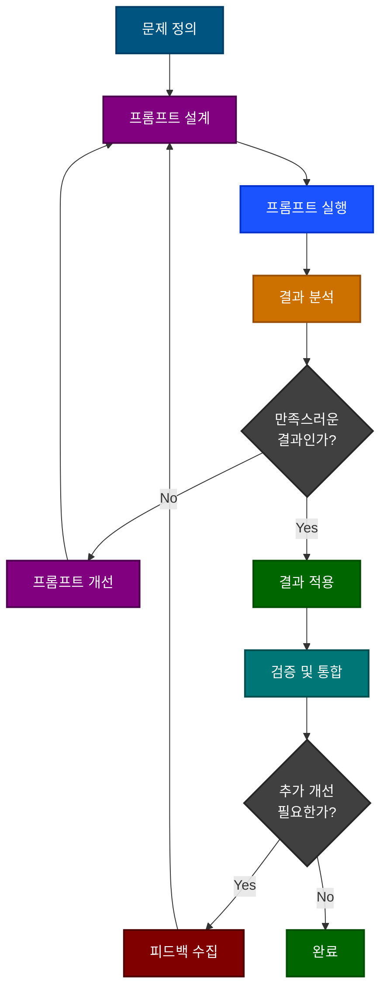
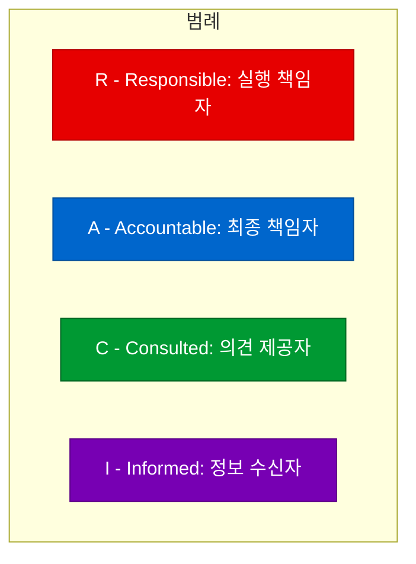
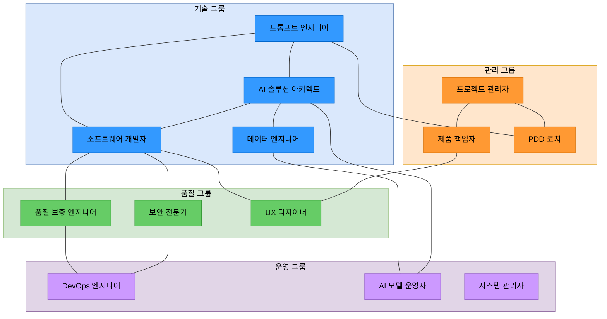

# 프롬프트 기반 개발방법론(PDD) - 절차 설계

## 목차

1. [작업 구성도](#작업-구성도)
2. [PDD의 비즈니스 목표 연계](#pdd의-비즈니스-목표-연계)
3. [주요산출물](#주요산출물)
   1. [Architecture (아키텍처)](#architecture-아키텍처)
   2. [Process (프로세스)](#process-프로세스)
   3. [Data (데이터)](#data-데이터)
   4. [Test (테스트)](#test-테스트)
4. [성공 지표 및 평가](#성공-지표-및-평가)
5. [역할과 책임](#역할과-책임)
   1. [관리 그룹](#관리-그룹)
   2. [기술 그룹](#기술-그룹)
   3. [품질 그룹](#품질-그룹)
   4. [운영 그룹](#운영-그룹)
   5. [책임 매트릭스 (RACI)](#책임-매트릭스-raci)
   6. [역할 간 상호작용](#역할-간-상호작용)
   7. [역량 요구사항](#역량-요구사항)

---

## 작업 구성도

PDD 방법론의 전체 프로세스는 다음과 같이 구성됩니다. 이 프로세스는 전통적인 소프트웨어 개발 생명주기(SDLC)와 유사하지만, 각 단계에서 AI와 프롬프트를 활용하는 방식으로 재구성되었습니다.

```mermaid
graph TD
    A[PDD 프로세스] --> B[1. 요구사항 정의]
    A --> C[2. 설계]
    A --> D[3. 개발]
    A --> E[4. 테스트]
    A --> F[5. 배포]
    A --> G[6. 유지보수]
    
    B --> B1[1.1 프롬프트 기반 요구사항 도출]
    B --> B2[1.2 AI 지원 요구사항 분석]
    B --> B3[1.3 요구사항 명세 생성]
    B --> B4[1.4 우선순위 설정 및 검증]
    
    C --> C1[2.1 시스템 아키텍처 설계]
    C --> C2[2.2 데이터 모델 설계]
    C --> C3[2.3 인터페이스 설계]
    C --> C4[2.4 보안 및 성능 설계]
    
    D --> D1[3.1 프롬프트 기반 코드 생성]
    D --> D2[3.2 코드 리뷰 및 개선]
    D --> D3[3.3 리팩토링 및 최적화]
    D --> D4[3.4 품질 관리]
    
    E --> E1[4.1 테스트 케이스 생성]
    E --> E2[4.2 자동화 테스트 구현]
    E --> E3[4.3 성능 및 부하 테스트]
    E --> E4[4.4 보안 테스트]
    
    F --> F1[5.1 배포 계획 수립]
    F --> F2[5.2 인프라 설정 자동화]
    F --> F3[5.3 배포 스크립트 생성]
    F --> F4[5.4 모니터링 설정]
    
    G --> G1[6.1 이슈 분석 및 해결]
    G --> G2[6.2 기능 개선 및 확장]
    G --> G3[6.3 문서화 유지보수]
    G --> G4[6.4 성능 모니터링 및 최적화]
    
    %% 주요 단계 스타일
    style A fill:#004d99,color:#ffffff,stroke:#002b80,stroke-width:2px
    style B fill:#4d94ff,color:#000000,stroke:#002b80,stroke-width:2px
    style C fill:#3385ff,color:#000000,stroke:#002b80,stroke-width:2px
    style D fill:#66a3ff,color:#000000,stroke:#002b80,stroke-width:2px
    style E fill:#80b3ff,color:#000000,stroke:#002b80,stroke-width:2px
    style F fill:#99c2ff,color:#000000,stroke:#002b80,stroke-width:2px
    style G fill:#b3d1ff,color:#000000,stroke:#002b80,stroke-width:2px
    
    %% 서브 스텝 스타일
    style B1 fill:#cce0ff,color:#000000,stroke:#002b80
    style B2 fill:#cce0ff,color:#000000,stroke:#002b80
    style B3 fill:#cce0ff,color:#000000,stroke:#002b80
    style B4 fill:#cce0ff,color:#000000,stroke:#002b80
    
    style C1 fill:#cce0ff,color:#000000,stroke:#002b80
    style C2 fill:#cce0ff,color:#000000,stroke:#002b80
    style C3 fill:#cce0ff,color:#000000,stroke:#002b80
    style C4 fill:#cce0ff,color:#000000,stroke:#002b80
    
    style D1 fill:#cce0ff,color:#000000,stroke:#002b80
    style D2 fill:#cce0ff,color:#000000,stroke:#002b80
    style D3 fill:#cce0ff,color:#000000,stroke:#002b80
    style D4 fill:#cce0ff,color:#000000,stroke:#002b80
    
    style E1 fill:#cce0ff,color:#000000,stroke:#002b80
    style E2 fill:#cce0ff,color:#000000,stroke:#002b80
    style E3 fill:#cce0ff,color:#000000,stroke:#002b80
    style E4 fill:#cce0ff,color:#000000,stroke:#002b80
    
    style F1 fill:#cce0ff,color:#000000,stroke:#002b80
    style F2 fill:#cce0ff,color:#000000,stroke:#002b80
    style F3 fill:#cce0ff,color:#000000,stroke:#002b80
    style F4 fill:#cce0ff,color:#000000,stroke:#002b80
    
    style G1 fill:#cce0ff,color:#000000,stroke:#002b80
    style G2 fill:#cce0ff,color:#000000,stroke:#002b80
    style G3 fill:#cce0ff,color:#000000,stroke:#002b80
    style G4 fill:#cce0ff,color:#000000,stroke:#002b80

    style F fill:#0066cc,color:#ffffff,stroke:#002b80,stroke-width:2px
    style G fill:#1a75ff,color:#ffffff,stroke:#002b80,stroke-width:2px
    
    %% 하위 단계 스타일
    style B1 fill:#66a3ff,color:#000000,stroke:#002b80,stroke-width:1px
    style B2 fill:#66a3ff,color:#000000,stroke:#002b80,stroke-width:1px
    style B3 fill:#66a3ff,color:#000000,stroke:#002b80,stroke-width:1px
    style B4 fill:#66a3ff,color:#000000,stroke:#002b80,stroke-width:1px
    
    style C1 fill:#4d94ff,color:#000000,stroke:#002b80,stroke-width:1px
    style C2 fill:#4d94ff,color:#000000,stroke:#002b80,stroke-width:1px
    style C3 fill:#4d94ff,color:#000000,stroke:#002b80,stroke-width:1px
    style C4 fill:#4d94ff,color:#000000,stroke:#002b80,stroke-width:1px
    
    style D1 fill:#66a3ff,color:#000000,stroke:#002b80,stroke-width:1px
    style D2 fill:#66a3ff,color:#000000,stroke:#002b80,stroke-width:1px
    style D3 fill:#66a3ff,color:#000000,stroke:#002b80,stroke-width:1px
    style D4 fill:#66a3ff,color:#000000,stroke:#002b80,stroke-width:1px
    
    style E1 fill:#4d94ff,color:#000000,stroke:#002b80,stroke-width:1px
    style E2 fill:#4d94ff,color:#000000,stroke:#002b80,stroke-width:1px
    style E3 fill:#4d94ff,color:#000000,stroke:#002b80,stroke-width:1px
    style E4 fill:#4d94ff,color:#000000,stroke:#002b80,stroke-width:1px
    
    style F1 fill:#66a3ff,color:#000000,stroke:#002b80,stroke-width:1px
    style F2 fill:#66a3ff,color:#000000,stroke:#002b80,stroke-width:1px
    style F3 fill:#66a3ff,color:#000000,stroke:#002b80,stroke-width:1px
    style F4 fill:#66a3ff,color:#000000,stroke:#002b80,stroke-width:1px
    
    style G1 fill:#4d94ff,color:#000000,stroke:#002b80,stroke-width:1px
    style G2 fill:#4d94ff,color:#000000,stroke:#002b80,stroke-width:1px
    style G3 fill:#4d94ff,color:#000000,stroke:#002b80,stroke-width:1px
    style G4 fill:#4d94ff,color:#000000,stroke:#002b80,stroke-width:1px
```

다음 다이어그램은 각 단계에서의 프롬프트 활용 흐름과 피드백 루프를 보여줍니다:

## PDD의 비즈니스 목표 연계

PDD는 다음과 같은 비즈니스 목표와 직접적으로 연계됩니다:

### 1. 시장 출시 시간(Time-to-Market) 단축

PDD는 프롬프트를 통한 AI 지원 개발 프로세스로 개발 주기를 크게 단축합니다:

- **개발 주기 단축**: AI 지원을 통해 코드 작성, 검토, 테스트 시간이 30-50% 감소
- **병렬 작업 증가**: AI가 반복적인 작업을 처리하는 동안 개발자는 복잡한 문제에 집중
- **의사결정 가속화**: AI 기반 분석과 추천을 통한 설계 및 구현 의사결정 시간 단축

### 2. 비용 효율성 향상

다음과 같은 방식으로 개발 비용이 감소됩니다:

| 비용 항목 | 기존 방식 | PDD 방식 | 절감률 |
|---------|---------|---------|-------|
| 개발 인력 비용 | 100% | 70-80% | 20-30% |
| 품질 보증 비용 | 100% | 60-70% | 30-40% |
| 유지보수 비용 | 100% | 75-85% | 15-25% |
| 교육 및 도구 비용 | 100% | 110-120% | -10-20% |
| **총 비용** | **100%** | **75-85%** | **15-25%** |

### 3. 제품 품질 향상

PDD는 다음과 같은 방식으로 소프트웨어 품질을 향상시킵니다:

- **코드 일관성 개선**: AI가 코딩 표준을 일관되게 적용하여 코드 품질 향상
- **광범위한 테스트 커버리지**: AI 지원 테스트 생성으로 20-30% 향상된 테스트 커버리지
- **최신 보안 사례 적용**: AI를 통해 최신 보안 사례를 코드에 지속적으로 반영

### 4. 혁신 가속화

PDD는 혁신을 가속화하는 데 기여합니다:

- **창의적 솔루션 탐색**: AI의 대안 제시를 통한 더 넓은 솔루션 공간 탐색
- **실험 및 프로토타이핑 가속화**: 빠른 프로토타입 생성으로 아이디어 검증 시간 단축
- **레거시 시스템 현대화**: 레거시 코드 이해 및 현대화 작업 지원

## 주요산출물

PDD 방법론의 각 단계에서 생성되는 주요 산출물은 다음과 같습니다. 각 산출물은 해당 영역(아키텍처, 프로세스, 데이터, 테스트)에 따라 분류되며, 활동, 태스크, 산출물 및 필수 여부를 정의합니다.

### Architecture (아키텍처)

| Activity | Task | 산출물 | 필수여부 |
|----------|------|-------|---------|
| **아키텍처 정의** | 시스템 경계 정의 | 시스템 컨텍스트 다이어그램 | 필수 |
|  | 기술 스택 결정 | 기술 스택 문서 | 필수 |
|  | 아키텍처 패턴 선택 | 아키텍처 결정 기록(ADR) | 필수 |
| **컴포넌트 설계** | 컴포넌트 식별 | 컴포넌트 다이어그램 | 필수 |
|  | 컴포넌트 책임 정의 | 컴포넌트 명세서 | 필수 |
|  | 컴포넌트 간 인터페이스 정의 | 인터페이스 계약 문서 | 필수 |
| **인프라 설계** | 배포 환경 설계 | 인프라 아키텍처 다이어그램 | 필수 |
|  | 확장성 계획 수립 | 확장성 전략 문서 | 선택 |
|  | 재해 복구 설계 | 재해 복구 계획 | 선택 |
| **보안 아키텍처** | 보안 요구사항 분석 | 보안 요구사항 문서 | 필수 |
|  | 인증/인가 설계 | 보안 아키텍처 문서 | 필수 |
|  | 데이터 보호 전략 | 데이터 보안 정책 | 필수 |

### Process (프로세스)

| Activity | Task | 산출물 | 필수여부 |
|----------|------|-------|---------|
| **요구사항 정의** | 사용자 요구사항 수집 | 사용자 스토리 목록 | 필수 |
|  | 기능 요구사항 도출 | 기능 요구사항 명세서 | 필수 |
|  | 비기능 요구사항 도출 | 비기능 요구사항 명세서 | 필수 |
| **프롬프트 설계** | 요구사항 기반 프롬프트 작성 | 프롬프트 템플릿 라이브러리 | 필수 |
|  | 프롬프트 구조화 및 최적화 | 프롬프트 설계 가이드 | 필수 |
|  | 프롬프트 결과 평가 기준 정의 | 프롬프트 평가 체크리스트 | 필수 |
| **개발 계획** | 개발 작업 분해 | 작업 분해 구조도(WBS) | 필수 |
|  | 일정 및 리소스 계획 | 프로젝트 일정표 | 필수 |
|  | 위험 관리 계획 | 위험 관리 계획서 | 선택 |
| **품질 관리** | 품질 기준 정의 | 품질 관리 계획서 | 필수 |
|  | 검토 및 승인 프로세스 정의 | 검토 프로세스 문서 | 필수 |
|  | 품질 측정 지표 설정 | 품질 메트릭 정의서 | 선택 |

### Data (데이터)

| Activity | Task | 산출물 | 필수여부 |
|----------|------|-------|---------|
| **데이터 모델링** | 엔티티 관계 정의 | ER 다이어그램 | 필수 |
|  | 데이터 스키마 설계 | 데이터베이스 스키마 문서 | 필수 |
|  | 데이터 정규화 | 정규화된 데이터 모델 | 선택 |
| **데이터 흐름 설계** | 데이터 흐름 분석 | 데이터 흐름 다이어그램 | 필수 |
|  | 데이터 접근 패턴 정의 | 데이터 접근 계층 설계 | 필수 |
|  | 캐싱 전략 설계 | 캐싱 전략 문서 | 선택 |
| **데이터 관리** | 데이터 마이그레이션 계획 | 마이그레이션 계획서 | 선택 |
|  | 데이터 백업 및 복구 계획 | 백업 및 복구 전략 | 필수 |
|  | 데이터 보존 정책 정의 | 데이터 보존 정책 | 필수 |
| **데이터 품질** | 데이터 검증 규칙 정의 | 데이터 검증 규칙 문서 | 필수 |
|  | 데이터 무결성 제약 조건 설계 | 무결성 제약 조건 목록 | 필수 |
|  | 데이터 품질 모니터링 계획 | 데이터 품질 관리 계획 | 선택 |

### Test (테스트)

| Activity | Task | 산출물 | 필수여부 |
|----------|------|-------|---------|
| **테스트 계획** | 테스트 범위 정의 | 테스트 계획서 | 필수 |
|  | 테스트 환경 설정 | 테스트 환경 문서 | 필수 |
|  | 테스트 일정 및 리소스 계획 | 테스트 일정표 | 필수 |
| **테스트 설계** | 테스트 케이스 작성 | 테스트 케이스 문서 | 필수 |
|  | 테스트 데이터 준비 | 테스트 데이터셋 | 필수 |
|  | 테스트 자동화 설계 | 테스트 자동화 스크립트 | 선택 |
| **테스트 실행** | 단위 테스트 수행 | 단위 테스트 결과 보고서 | 필수 |
|  | 통합 테스트 수행 | 통합 테스트 결과 보고서 | 필수 |
|  | 시스템 테스트 수행 | 시스템 테스트 결과 보고서 | 필수 |
| **성능 및 보안 테스트** | 성능 테스트 수행 | 성능 테스트 결과 보고서 | 선택 |
|  | 부하 및 스트레스 테스트 수행 | 부하 테스트 결과 보고서 | 선택 |
|  | 보안 취약점 테스트 수행 | 보안 테스트 결과 보고서 | 필수 |

## 성공 지표 및 평가

PDD 적용의 성공을 측정하기 위한 핵심 지표는 다음과 같습니다:

### 정량적 지표

| 카테고리 | 지표 | 측정 방법 | 목표 개선 |
|---------|-----|----------|----------|
| **생산성** | 기능 개발 속도 | 기능당 개발 시간 | 30-50% 향상 |
|  | 코드 생성 효율성 | 동일 시간 내 생성된 코드 라인 수 | 100-200% 향상 |
|  | 반복 작업 감소 | 자동화된 작업 비율 | 40-60% 증가 |
| **품질** | 초기 버그 발견 | 개발 중 발견된 버그 수 | 30-50% 증가 |
|  | 프로덕션 버그 | 프로덕션 환경 버그 발생률 | 20-40% 감소 |
|  | 테스트 커버리지 | 코드 테스트 커버리지 비율 | 20-30% 증가 |
| **비용** | 개발 비용 | 기능당 총 개발 비용 | 15-25% 감소 |
|  | 유지보수 비용 | 연간 유지보수 비용 | 10-20% 감소 |
| **시간** | 출시 주기 | 아이디어에서 출시까지 시간 | 30-50% 단축 |
|  | 반응 시간 | 변경 요청에 대한 대응 시간 | 40-60% 단축 |

### 정성적 지표

1. **개발자 경험**
   - 개발자 만족도 및 참여도
   - AI 도구 사용 숙련도 및 효율성
   - 프롬프트 엔지니어링 역량 향상

2. **제품 혁신**
   - 새로운 기능 및 접근법 도입 빈도
   - 혁신적 아이디어 구현 속도
   - 실험 및 프로토타이핑 빈도

3. **팀 협업**
   - 지식 공유 효율성
   - 의사결정 속도 및 품질
   - 크로스 펑셔널 협업 효과성

### 지표 모니터링 및 평가 체계

PDD 성과 지표를 지속적으로 모니터링하고 평가하기 위한 프레임워크:

1. **데이터 수집 메커니즘**
   - 자동화된 메트릭 수집 도구 통합
   - 개발자 피드백 수집 프로세스
   - 프로젝트 마일스톤 기반 평가

2. **성과 대시보드**
   - 주요 성과 지표(KPI) 실시간 시각화
   - 목표 대비 실제 성과 추적
   - 트렌드 분석 및 예측

3. **개선 주기**
   - 분기별 성과 검토 및 조정
   - 데이터 기반 프로세스 개선
   - 지속적인 방법론 최적화

## 역할과 책임

PDD 방법론에서는 기존 개발 방법론의 역할에 프롬프트 엔지니어링과 AI 관련 역할이 추가됩니다. 다음은 주요 역할 그룹, 역할명, 그리고 각 역할의 상세 책임입니다.

### 관리 그룹

| 역할명 | 역할 상세 |
|-------|----------|
| **프로젝트 관리자** | - PDD 프로젝트 전반적인 계획 수립 및 관리 - 일정, 리소스, 위험 관리 - 이해관계자 의사소통 조정 - PDD 적용 성과 측정 및 보고 |
| **제품 책임자** | - 제품 비전 및 로드맵 수립 - 요구사항 우선순위 결정 - 비즈니스 가치 평가 - AI 생성 결과물의 비즈니스 적합성 평가 |
| **PDD 코치** | - PDD 방법론 교육 및 지원 - 프롬프트 엔지니어링 모범 사례 전파 - PDD 프로세스 개선 촉진 - 팀 멤버 멘토링 |

### 기술 그룹

| 역할명 | 역할 상세 |
|-------|----------|
| **프롬프트 엔지니어** | - 효과적인 프롬프트 설계 및 최적화 - 프롬프트 템플릿 라이브러리 관리 - 프롬프트 품질 및 성능 평가 - 프롬프트 문제 해결 및 개선 |
| **AI 솔루션 아키텍트** | - AI 기반 아키텍처 설계 - AI 모델 선택 및 통합 전략 수립 - AI 성능 및 확장성 최적화 - AI 관련 기술적 위험 관리 |
| **소프트웨어 개발자** | - AI 생성 코드 검토 및 수정 - AI와 협업하여 코드 작성 - 단위 테스트 및 통합 테스트 구현 - 코드 품질 및 성능 관리 |
| **데이터 엔지니어** | - 데이터 모델 설계 및 구현 - 데이터 파이프라인 구축 - 데이터 품질 및 무결성 관리 - AI 모델용 데이터 준비 및 변환 |

### 품질 그룹

| 역할명 | 역할 상세 |
|-------|----------|
| **품질 보증 엔지니어** | - AI 생성 결과물 검증 프로세스 설계 - 테스트 계획 및 전략 수립 - 자동화 테스트 프레임워크 구축 - 품질 지표 모니터링 및 보고 |
| **보안 전문가** | - AI 사용 관련 보안 정책 수립 - 프롬프트 인젝션 등 AI 보안 위험 평가 - 데이터 프라이버시 보호 전략 수립 - 규제 준수 확인 |
| **UX 디자이너** | - AI 생성 UI 설계 검토 및 개선 - 사용자 중심 프롬프트 설계 지원 - AI 상호작용 패턴 최적화 - 사용자 테스트 및 피드백 수집 |

### 운영 그룹

| 역할명 | 역할 상세 |
|-------|----------|
| **DevOps 엔지니어** | - AI 통합 파이프라인 구축 - 배포 자동화 구현 - 운영 환경 모니터링 설정 - 성능 및 가용성 최적화 |
| **시스템 관리자** | - AI 인프라 설정 및 관리 - 리소스 확장성 관리 - 백업 및 복구 프로세스 구현 - 시스템 보안 설정 |
| **AI 모델 운영자** | - AI 모델 배포 및 관리 - 모델 성능 모니터링 - 모델 버전 관리 - 모델 드리프트 감지 및 대응 |

### 책임 매트릭스 (RACI)

다음은 PDD의 주요 활동에 대한 역할별 책임 매트릭스입니다:

| 활동 / 역할 | 프로젝트 관리자 | 제품 책임자 | PDD 코치 | 프롬프트 엔지니어 | AI 솔루션 아키텍트 | 소프트웨어 개발자 | 품질 보증 엔지니어 | 보안 전문가 |
|------------|--------------|-----------|---------|---------------|-----------------|--------------|-----------------|------------|
| **요구사항 정의** | A | R | C | C | C | I | I | C |
| **프롬프트 설계** | I | C | C | R | A | C | C | C |
| **아키텍처 설계** | I | C | I | C | A/R | C | C | C |
| **데이터 모델링** | I | C | I | C | A | C | C | C |
| **프롬프트 기반 코드 생성** | I | I | C | A | C | R | I | I |
| **코드 리뷰 및 개선** | I | I | C | C | C | A/R | C | C |
| **테스트 자동화** | I | I | I | C | C | C | A/R | C |
| **보안 테스트** | I | I | I | I | C | C | C | A/R |
| **배포 자동화** | A | I | I | I | C | C | C | C |
| **성능 모니터링** | I | I | I | I | C | C | A | C |
| **프롬프트 최적화** | I | C | A | R | C | C | C | I |

### 역할 간 상호작용

PDD 방법론에서 역할 간 상호작용은 다음과 같이 이루어집니다:

### 역량 요구사항

각 역할별로 요구되는 핵심 역량은 다음과 같습니다:

#### 프롬프트 엔지니어

1. 자연어 처리 및 LLM 이해
2. 효과적인 프롬프트 작성 기술
3. 문제 분해 및 구조화 능력
4. 프롬프트 결과 분석 및 평가 기술
5. 지속적 학습 및 적응 능력

#### AI 솔루션 아키텍트

1. 소프트웨어 아키텍처 설계 경험
2. AI/ML 시스템 구축 경험
3. 분산 시스템 및 확장성 이해
4. 클라우드 아키텍처 지식
5. 보안 및 성능 최적화 기술

#### 소프트웨어 개발자 (PDD 환경)

1. AI 생성 코드 이해 및 수정 능력
2. 프롬프트 엔지니어링 기본 지식
3. 코드 리뷰 및 품질 평가 기술
4. 테스트 주도 개발 경험
5. 협업 및 지속적 통합 경험

PDD 방법론은 이러한 다양한 역할들이 효과적으로 협업하여 AI와 인간의 강점을 결합한 소프트웨어 개발 프로세스를 구현하도록 설계되었습니다. 각 역할은 명확한 책임을 가지며, 상호 보완적으로 작업하여 프로젝트의 성공을 이끕니다.
