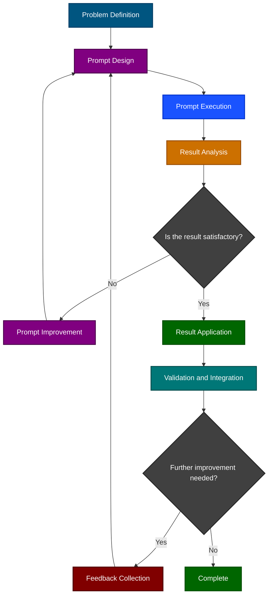
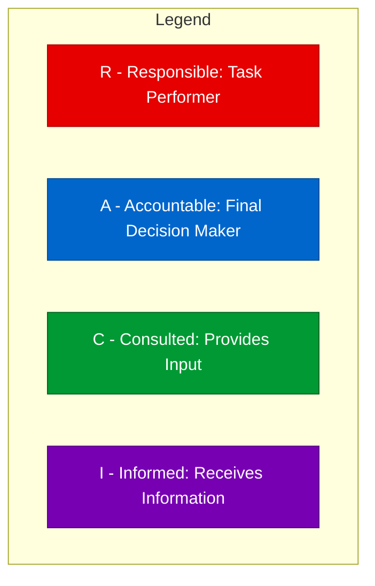
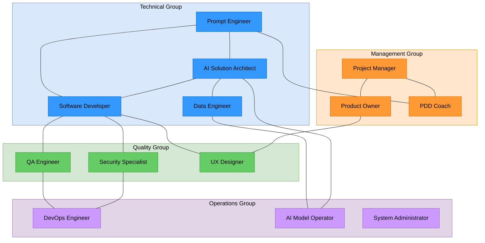

# Prompt-driven Development (PDD) - Process Design

## Table of Contents

1. [Process Structure Diagram](#process-structure-diagram)
2. [Alignment with Business Goals](#alignment-with-business-goals)
3. [Key Deliverables](#key-deliverables)
   1. [Architecture](#architecture)
   2. [Process](#process)
   3. [Data](#data)
   4. [Test](#test)
4. [Success Metrics and Evaluation](#success-metrics-and-evaluation)
5. [Roles and Responsibilities](#roles-and-responsibilities)
   1. [Management Group](#management-group)
   2. [Technical Group](#technical-group)
   3. [Quality Group](#quality-group)
   4. [Operations Group](#operations-group)
   5. [Responsibility Matrix (RACI)](#responsibility-matrix-raci)
   6. [Role Interactions](#role-interactions)
   7. [Competency Requirements](#competency-requirements)

---

## Process Structure Diagram

The overall process of the PDD methodology is structured as follows. While similar to the traditional Software Development Life Cycle (SDLC), each phase is restructured to leverage AI and prompts at every step.

```mermaid
graph TD
    A[PDD Process] --> B[1. Requirements Definition]
    A --> C[2. Design]
    A --> D[3. Development]
    A --> E[4. Testing]
    A --> F[5. Deployment]
    A --> G[6. Maintenance]

    B --> B1[1.1 Prompt-based Requirements Elicitation]
    B --> B2[1.2 AI-assisted Requirements Analysis]
    B --> B3[1.3 Requirements Specification]
    B --> B4[1.4 Prioritization and Validation]

    C --> C1[2.1 System Architecture Design]
    C --> C2[2.2 Data Model Design]
    C --> C3[2.3 Interface Design]
    C --> C4[2.4 Security and Performance Design]

    D --> D1[3.1 Prompt-based Code Generation]
    D --> D2[3.2 Code Review and Improvement]
    D --> D3[3.3 Refactoring and Optimization]
    D --> D4[3.4 Quality Management]

    E --> E1[4.1 Test Case Generation]
    E --> E2[4.2 Automated Test Implementation]
    E --> E3[4.3 Performance and Load Testing]
    E --> E4[4.4 Security Testing]

    F --> F1[5.1 Deployment Planning]
    F --> F2[5.2 Infrastructure Automation]
    F --> F3[5.3 Deployment Script Generation]
    F --> F4[5.4 Monitoring Setup]

    G --> G1[6.1 Issue Analysis and Resolution]
    G --> G2[6.2 Feature Enhancement and Expansion]
    G --> G3[6.3 Documentation Maintenance]
    G --> G4[6.4 Performance Monitoring and Optimization]

    %% Main step styles
    style A fill:#004d99,color:#fff,stroke:#222,stroke-width:2px
    style B fill:#4d94ff,color:#000,stroke:#222,stroke-width:2px
    style C fill:#3385ff,color:#000,stroke:#222,stroke-width:2px
    style D fill:#66a3ff,color:#000,stroke:#222,stroke-width:2px
    style E fill:#80b3ff,color:#000,stroke:#222,stroke-width:2px
    style F fill:#99c2ff,color:#000,stroke:#222,stroke-width:2px
    style G fill:#b3d1ff,color:#000,stroke:#222,stroke-width:2px

    %% Sub-step styles
    style B1 fill:#cce0ff,color:#000,stroke:#222
    style B2 fill:#cce0ff,color:#000,stroke:#222
    style B3 fill:#cce0ff,color:#000,stroke:#222
    style B4 fill:#cce0ff,color:#000,stroke:#222

    style C1 fill:#cce0ff,color:#000,stroke:#222
    style C2 fill:#cce0ff,color:#000,stroke:#222
    style C3 fill:#cce0ff,color:#000,stroke:#222
    style C4 fill:#cce0ff,color:#000,stroke:#222

    style D1 fill:#cce0ff,color:#000,stroke:#222
    style D2 fill:#cce0ff,color:#000,stroke:#222
    style D3 fill:#cce0ff,color:#000,stroke:#222
    style D4 fill:#cce0ff,color:#000,stroke:#222

    style E1 fill:#cce0ff,color:#000,stroke:#222
    style E2 fill:#cce0ff,color:#000,stroke:#222
    style E3 fill:#cce0ff,color:#000,stroke:#222
    style E4 fill:#cce0ff,color:#000,stroke:#222

    style F1 fill:#cce0ff,color:#000,stroke:#222
    style F2 fill:#cce0ff,color:#000,stroke:#222
    style F3 fill:#cce0ff,color:#000,stroke:#222
    style F4 fill:#cce0ff,color:#000,stroke:#222

    style G1 fill:#cce0ff,color:#000,stroke:#222
    style G2 fill:#cce0ff,color:#000,stroke:#222
    style G3 fill:#cce0ff,color:#000,stroke:#222
    style G4 fill:#cce0ff,color:#000,stroke:#222

    style F fill:#0066cc,color:#ffffff,stroke:#002b80,stroke-width:2px
    style G fill:#1a75ff,color:#ffffff,stroke:#002b80,stroke-width:2px

    %% Sub-step styles (cont.)
    style B1 fill:#66a3ff,color:#000,stroke:#222,stroke-width:1px
    style B2 fill:#66a3ff,color:#000,stroke:#222,stroke-width:1px
    style B3 fill:#66a3ff,color:#000,stroke:#222,stroke-width:1px
    style B4 fill:#66a3ff,color:#000,stroke:#222,stroke-width:1px

    style C1 fill:#4d94ff,color:#000,stroke:#222,stroke-width:1px
    style C2 fill:#4d94ff,color:#000,stroke:#222,stroke-width:1px
    style C3 fill:#4d94ff,color:#000,stroke:#222,stroke-width:1px
    style C4 fill:#4d94ff,color:#000,stroke:#222,stroke-width:1px

    style D1 fill:#66a3ff,color:#000,stroke:#222,stroke-width:1px
    style D2 fill:#66a3ff,color:#000,stroke:#222,stroke-width:1px
    style D3 fill:#66a3ff,color:#000,stroke:#222,stroke-width:1px
    style D4 fill:#66a3ff,color:#000,stroke:#222,stroke-width:1px

    style E1 fill:#4d94ff,color:#000,stroke:#222,stroke-width:1px
    style E2 fill:#4d94ff,color:#000,stroke:#222,stroke-width:1px
    style E3 fill:#4d94ff,color:#000,stroke:#222,stroke-width:1px
    style E4 fill:#4d94ff,color:#000,stroke:#222,stroke-width:1px

    style F1 fill:#66a3ff,color:#000,stroke:#222,stroke-width:1px
    style F2 fill:#66a3ff,color:#000,stroke:#222,stroke-width:1px
    style F3 fill:#66a3ff,color:#000,stroke:#222,stroke-width:1px
    style F4 fill:#66a3ff,color:#000,stroke:#222,stroke-width:1px

    style G1 fill:#4d94ff,color:#000,stroke:#222,stroke-width:1px
    style G2 fill:#4d94ff,color:#000,stroke:#222,stroke-width:1px
    style G3 fill:#4d94ff,color:#000,stroke:#222,stroke-width:1px
    style G4 fill:#4d94ff,color:#000,stroke:#222,stroke-width:1px
```

The following diagram shows the prompt utilization and feedback loop at each stage:

## Alignment with Business Goals

PDD is directly linked to the following business objectives:

### 1. Shortening Time-to-Market

PDD shortens development cycles by leveraging AI-supported prompt-based development processes:

- **Shorter Development Cycles**: AI support reduces time for coding, review, and testing by 30-50%.
- **Increased Parallel Work**: Developers can focus on complex issues while AI handles repetitive tasks.
- **Faster Decision-Making**: AI-driven analysis and recommendations speed up design and implementation decisions.

### 2. Cost Efficiency

PDD reduces development costs through the following approaches:

| Cost Item | Traditional | PDD | Reduction Rate |
|-----------|-------------|-----|---------------|
| Developer Labor Cost | 100% | 70-80% | 20-30% |
| Quality Assurance Cost | 100% | 60-70% | 30-40% |
| Maintenance Cost | 100% | 75-85% | 15-25% |
| Training & Tools Cost | 100% | 110-120% | -10-20% |
| **Total Cost** | **100%** | **75-85%** | **15-25%** |

### 3. Product Quality Improvement

PDD improves software quality through the following approaches:

- **Consistent Coding Standards**: AI enforces coding standards, improving code quality.
- **Broader Test Coverage**: AI-generated tests increase scenario coverage by 20-30%.
- **Continuous Adoption of Latest Technologies and Security**: AI helps keep code up-to-date with the latest tech and security practices.

### 4. Accelerating Innovation

PDD accelerates innovation by:

- **Creative Solution Exploration**: AI enables broader exploration of solution spaces.
- **Rapid Prototyping and Experimentation**: Faster prototyping allows for quicker validation of ideas.
- **Modernization of Legacy Systems**: AI assists in understanding and modernizing legacy code.

## Key Deliverables

The main deliverables produced at each stage of the PDD methodology are as follows. Each deliverable is categorized by area (architecture, process, data, test), and includes activity, task, deliverable, and necessity.

### Architecture

| Activity | Task | Deliverable | Required |
|----------|------|------------|----------|
| **Architecture Definition** | System context definition | System context diagram | Required |
|  | Technology stack selection | Technology stack documentation | Required |
|  | Architecture pattern selection | Architecture decision record (ADR) | Required |
| **Component Design** | Component classification | Component diagram | Required |
|  | Component responsibility definition | Component specification | Required |
|  | Interface definition between components | Interface contract documentation | Required |
| **Infra Design** | Deployment environment design | Infra architecture diagram | Required |
|  | Scalability planning | Scalability strategy documentation | Optional |
|  | Disaster recovery design | Disaster recovery plan | Optional |
| **Security Architecture** | Security requirements analysis | Security requirements documentation | Required |
|  | Authentication/Authorization design | Security architecture documentation | Required |
|  | Data protection strategy | Data security policy | Required |

### Process

| Activity | Task | Deliverable | Required |
|----------|------|------------|----------|
| **Requirements Definition** | User requirements collection | User story list | Required |
|  | Functional requirements elicitation | Functional requirements specification | Required |
|  | Non-functional requirements elicitation | Non-functional requirements specification | Required |
| **Prompt Design** | Prompt template creation | Prompt template library | Required |
|  | Prompt structuring and optimization | Prompt design guide | Required |
|  | Prompt evaluation criteria definition | Prompt evaluation checklist | Required |
| **Development Planning** | Task breakdown | Work breakdown structure (WBS) | Required |
|  | Schedule and resource planning | Project schedule | Required |
|  | Risk management planning | Risk management plan | Optional |
| **Quality Management** | Quality criteria definition | Quality management plan | Required |
|  | Review and approval process definition | Review process documentation | Required |
|  | Quality metric setting | Quality metric definition | Optional |

### Data

| Activity | Task | Deliverable | Required |
|----------|------|------------|----------|
| **Data Modeling** | Entity relationship definition | ER diagram | Required |
|  | Data schema design | Database schema documentation | Required |
|  | Data normalization | Normalized data model | Optional |
| **Data Flow Design** | Data flow analysis | Data flow diagram | Required |
|  | Data interface pattern definition | Data interface contract documentation | Required |
|  | Caching strategy design | Caching strategy documentation | Optional |
| **Data Management** | Data migration planning | Migration plan | Optional |
|  | Data backup and recovery planning | Backup and recovery strategy | Required |
|  | Data retention policy definition | Data retention policy | Required |
| **Data Quality** | Data validation rule definition | Data validation rule documentation | Required |
|  | Data integrity constraint definition | Data integrity constraint list | Required |
|  | Data quality monitoring plan | Data quality management plan | Optional |

### Test

| Activity | Task | Deliverable | Required |
|----------|------|------------|----------|
| **Test Planning** | Test scope definition | Test plan | Required |
|  | Test environment setup | Test environment documentation | Required |
|  | Test schedule and resource planning | Test schedule | Required |
| **Test Design** | Test case creation | Test case documentation | Required |
|  | Test data preparation | Test dataset | Required |
|  | Test automation design | Test automation script | Optional |
| **Test Execution** | Unit test execution | Unit test result report | Required |
|  | Integration test execution | Integration test result report | Required |
|  | System test execution | System test result report | Required |
| **Performance and Security Test** | Performance test execution | Performance test result report | Optional |
|  | Stress and load test execution | Stress test result report | Optional |
|  | Security vulnerability test execution | Security test result report | Required |

## Success Metrics and Evaluation

Key metrics for evaluating PDD adoption:

### Quantitative Metrics

| Category | Metric | Measurement Method | Target Improvement |
|----------|--------|-------------------|-------------------|
| **Productivity** | Feature development speed | Time per feature | 30-50% improvement |
|  | Code generation efficiency | Number of lines generated per hour | 100-200% improvement |
|  | Reduction in repetitive tasks | Automation rate | 40-60% increase |
| **Quality** | Early bug detection | Number of bugs found during development | 30-50% increase |
|  | Production bug rate | Bug occurrence rate in production | 20-40% reduction |
|  | Test coverage | Automated test coverage rate | 20-30% increase |
| **Cost** | Development cost | Total development cost per feature | 15-25% reduction |
|  | Maintenance cost | Maintenance cost over time | 10-20% reduction |
| **Time** | Time to release | Time from idea to release | 30-50% reduction |
|  | Response time | Time to respond to change requests | 40-60% reduction |

### Qualitative Metrics

1. **Developer Experience**
   - Developer satisfaction and engagement
   - AI tool adoption and effectiveness
   - Growth in prompt engineering skills

2. **Product Innovation**
   - Introduction of new features and approaches
   - Speed of idea validation and prototyping
   - Experimentation and learning culture

3. **Team Collaboration**
   - Knowledge sharing and onboarding effectiveness
   - Communication efficiency
   - Cross-functional collaboration

4. **Process Optimization**
   - Workflow automation and improvement
   - Feedback loop effectiveness
   - Continuous improvement culture

### Monitoring and Evaluation System

PDD performance is continuously monitored and evaluated using the following framework:

1. **Data Collection Mechanisms**
   - Automated metric collection tools
   - Regular surveys and interviews
   - Project retrospectives and reviews

2. **Analysis and Insight Generation**
   - Trend and pattern analysis
   - Benchmarking
   - Correlation analysis

3. **Adjustment and Improvement**
   - Process optimization
   - Tool and infrastructure improvement
   - Training and capacity building

4. **Reporting and Sharing**
   - Dashboard and visualization
   - Regular report writing
   - Success case and best practice sharing

## Roles and Responsibilities

PDD introduces new roles related to prompt engineering and AI. The following are the main role groups, their responsibilities, and details for each role.

### Management Group

| Role | Responsibilities |
|------|-----------------|
| **Project Manager** | - Overall PDD project planning and management - Schedule, resource, and risk management - Stakeholder communication - PDD adoption success evaluation and reporting |
| **Product Owner** | - Product vision and roadmap planning - Requirements prioritization - Business value evaluation - AI-generated deliverable suitability assessment |
| **PDD Coach** | - PDD methodology training and support - Prompt engineering best practice dissemination - PDD process improvement - Team member mentoring |

### Technical Group

| Role | Responsibilities |
|------|-----------------|
| **Prompt Engineer** | - Effective prompt design and optimization - Prompt template library management - Prompt quality and performance evaluation - Prompt troubleshooting and improvement |
| **AI Solution Architect** | - AI-based architecture design - AI model selection and integration strategy planning - AI performance and scalability optimization - AI-related technical risk management |
| **Software Developer** | - AI-generated code review and refinement - Collaborative code writing with AI - Unit and integration test implementation - Code quality and performance management |
| **Data Engineer** | - Data model design and implementation - Data pipeline construction - Data quality and integrity management - AI model data preparation and transformation |

### Quality Group

| Role | Responsibilities |
|------|-----------------|
| **Quality Assurance Engineer** | - AI-generated deliverable validation process design - Test planning and strategy development - Automated test framework construction - Quality metric monitoring and reporting |
| **Security Specialist** | - Security policy and compliance management for AI usage - Prompt injection and AI security risk assessment - Data privacy protection strategy planning - Regulatory compliance verification |
| **UX Designer** | - AI-generated UI design review and improvement - User-centered prompt design support - AI interaction pattern optimization - User testing and feedback collection |

### Operations Group

| Role | Responsibilities |
|------|-----------------|
| **DevOps Engineer** | - AI-integrated pipeline construction - Automated deployment implementation - Maintenance monitoring setup - Performance and cost optimization |
| **System Administrator** | - AI infrastructure setup and management - Resource scalability management - Backup and recovery process implementation - System security configuration |
| **AI Model Operator** | - AI model deployment and management - Model performance monitoring - Model version management - Model drift detection and response |

### Responsibility Matrix (RACI)

The following is the RACI matrix for major PDD activities:

| Activity / Role | Project Manager | Product Owner | PDD Coach | Prompt Engineer | AI Solution Architect | Software Developer | QA Engineer | Security Specialist |
|----------------|----------------|--------------|-----------|----------------|----------------------|-------------------|------------|
| **Requirements Definition** | A | R | C | C | C | I | I | C |
| **Prompt Design** | I | C | C | R | A | C | C | C |
| **Architecture Design** | I | C | I | C | A/R | C | C | C |
| **Data Modeling** | I | C | I | C | A | C | C | C |
| **Prompt-based Code Generation** | I | I | C | A | C | R | I | I |
| **Code Review and Improvement** | I | I | C | C | C | A/R | C | C |
| **Automated Testing** | I | I | I | C | C | C | A/R | C |
| **Security Testing** | I | I | I | I | C | C | C | A/R |
| **Automated Deployment** | A | I | I | I | C | C | C | C |
| **Performance Monitoring** | I | I | I | I | C | C | A | C |
| **Prompt Optimization** | I | C | A | R | C | C | C | I |

### Role Interactions

PDD role collaboration is structured as follows:

### Competency Requirements

Each role in the PDD methodology requires the following core competencies:

#### Prompt Engineer
1. Proficiency in prompt design and optimization
2. Understanding of LLMs and natural language processing
3. Ability to analyze and improve prompt outcomes
4. Communication and collaboration skills

#### AI Solution Architect
1. Experience in AI/ML system design
2. Knowledge of cloud architecture and scalability
3. Understanding of distributed systems and expansion
4. Knowledge transfer and training skills

#### Software Developer
1. Ability to review and refine AI-generated code
2. Experience in collaborative code writing with AI
3. Unit and integration test implementation skills
4. Code quality and performance management

#### Data Engineer
1. Data model design and implementation skills
2. Data pipeline construction experience
3. Data quality and integrity management
4. Data preparation and transformation for AI models

#### QA Engineer
1. Design of validation processes for AI-generated deliverables
2. Test planning and strategy development
3. Automated test framework construction
4. Quality metric monitoring and reporting

#### Security Specialist
1. Security policy and compliance management for AI usage
2. Prompt injection and AI security risk assessment
3. Data privacy protection strategy planning
4. Regulatory compliance verification

#### UX Designer
1. Review and improvement of AI-generated UI designs
2. User-centered prompt design support
3. AI interaction pattern optimization
4. User testing and feedback collection

#### DevOps Engineer
1. AI-integrated pipeline construction
2. Automated deployment implementation
3. Maintenance monitoring setup
4. Performance and cost optimization

#### System Administrator
1. AI infrastructure setup and management
2. Resource scalability management
3. Backup and recovery process implementation
4. System security configuration

#### AI Model Operator
1. AI model deployment and management
2. Model performance monitoring
3. Model version management
4. Model drift detection and response

By clearly defining and assigning these roles, PDD enables effective collaboration and maximizes the success of software development projects.
