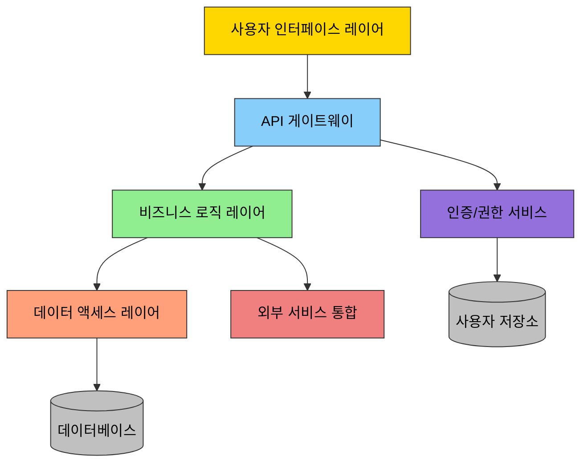
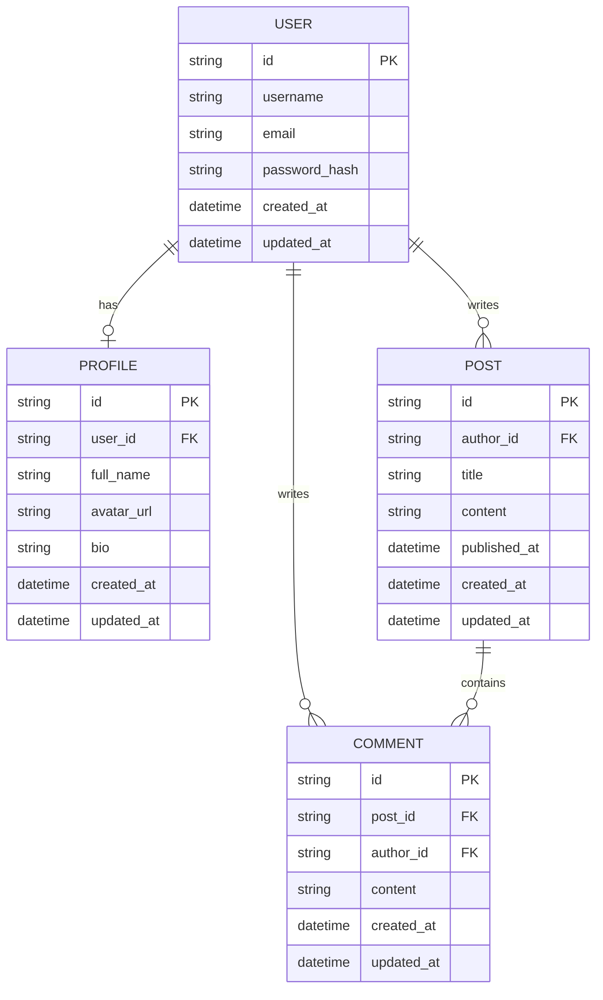
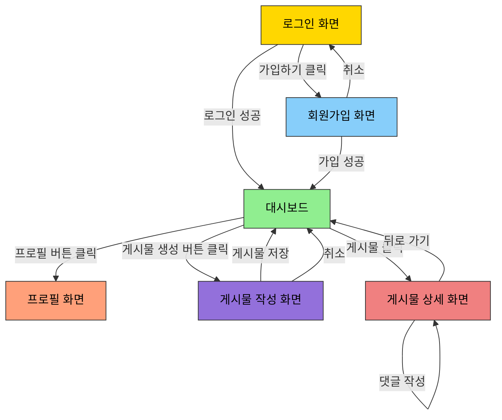

<!-- filepath: /Users/a11331/IdeaProjects/pdd/docs/00.methodology/00.prompt-driven-development-methodology-details-design.md -->
# 프롬프트 기반 개발방법론(PDD) - 설계 단계

## 목차

1. [개념 정의](#1-개념-정의)
   1. [설계 단계의 정의](#11-설계-단계의-정의)
   2. [목적](#12-목적)
   3. [범위](#13-범위)
2. [프로세스 설명](#2-프로세스-설명)
   1. [시스템 아키텍처 설계](#21-시스템-아키텍처-설계)
   2. [데이터 모델링](#22-데이터-모델링)
   3. [사용자 인터페이스 설계](#23-사용자-인터페이스-설계)
   4. [통합 및 인터페이스 설계](#24-통합-및-인터페이스-설계)
   5. [보안 아키텍처 설계](#25-보안-아키텍처-설계)
3. [적용 예시](#3-적용-예시)
   1. [아키텍처 다이어그램 예시](#31-아키텍처-다이어그램-예시)
   2. [데이터 모델 예시](#32-데이터-모델-예시)
   3. [UI/UX 설계 예시](#33-uiux-설계-예시)

---

## 1. 개념 정의

### 1.1 설계 단계의 정의

설계 단계는 요구사항을 구체적인 시스템 구조와 구성요소로 변환하는 과정입니다. PDD 접근 방식에서는 AI를 활용하여 아키텍처 설계, 데이터 모델링, 인터페이스 설계 등을 효율적으로 수행합니다. 이 단계에서는 요구사항 정의 단계에서 수집된 요구사항을 바탕으로 시스템의 청사진을 생성합니다.

### 1.2 목적

- 요구사항을 충족시키는 시스템 아키텍처 설계
- 효율적이고 확장 가능한 데이터 모델 정의
- 직관적이고 사용하기 쉬운 사용자 인터페이스 설계
- 모듈 간 상호작용 및 통합 방식 정의
- 비기능적 요구사항(성능, 보안, 확장성 등)을 만족하는 설계 보장

### 1.3 범위

- 시스템 아키텍처 설계(계층, 컴포넌트, 모듈 구조)
- 데이터베이스 설계 및 데이터 모델링
- 사용자 인터페이스 및 경험(UI/UX) 설계
- API 및 인터페이스 설계
- 보안 아키텍처 및 인증/인가 메커니즘 설계
- 성능 및 확장성을 위한 아키텍처 최적화

## 2. 프로세스 설명

### 2.1 시스템 아키텍처 설계

#### 2.1.1 전체 시스템 아키텍처 설계

프로젝트의 요구사항과 제약 조건에 기반하여 최적의 시스템 아키텍처를 설계합니다.

**프롬프트 템플릿 예시:**
```
다음 요구사항과 제약 조건을 바탕으로 [시스템 명]의 아키텍처를 설계해 주세요:

요구사항:
[요구사항 목록]

제약 조건:
[제약 조건 목록]

기술 스택:
[기술 스택 정보]

다음 내용을 포함해 주세요:
1. 아키텍처 다이어그램(계층, 컴포넌트, 모듈 구조)
2. 각 컴포넌트의 주요 책임 및 기능
3. 컴포넌트 간 상호작용 흐름
4. 적용된 아키텍처 패턴 및 선택 이유
5. 주요 기술적 결정과 그 근거
6. 확장성, 유지보수성, 보안 등 품질 속성 고려사항
```

#### 2.1.2 아키텍처 스타일 및 패턴 선택

시스템 특성과 요구사항에 가장 적합한 아키텍처 스타일과 패턴을 선택합니다.

**프롬프트 템플릿 예시:**
```
[시스템 명]의 다음 특성과 요구사항을 고려하여 가장 적합한 아키텍처 스타일과 패턴을 추천해 주세요:

시스템 특성:
[시스템 특성 목록]

주요 요구사항:
[주요 요구사항 목록]

비기능적 요구사항:
[성능, 확장성, 보안 등 비기능적 요구사항]

다음 내용을 포함해 주세요:
1. 추천하는 아키텍처 스타일(마이크로서비스, 모놀리식, 이벤트 기반 등)과 그 이유
2. 적용 가능한 디자인 패턴과 각각의 장단점
3. 선택한 아키텍처 스타일이 시스템 요구사항을 어떻게 충족시키는지 설명
4. 대안 아키텍처와의 비교 분석
5. 구현 시 고려해야 할 사항
```

#### 2.1.3 컴포넌트 세부 설계

시스템의 주요 컴포넌트에 대한 세부 설계를 수행합니다.

**프롬프트 템플릿 예시:**
```
[시스템 명]의 [컴포넌트 명] 컴포넌트에 대한 세부 설계를 해주세요:

컴포넌트 목적:
[컴포넌트의 주요 목적과 책임]

기능 요구사항:
[컴포넌트가 충족해야 할 기능적 요구사항]

인터페이스 요구사항:
[다른 컴포넌트와의 인터페이스 요구사항]

다음 내용을 포함해 주세요:
1. 컴포넌트 내부 구조 및 클래스/모듈 다이어그램
2. 주요 클래스/모듈과 그 역할
3. 주요 메서드와 기능
4. 내부 데이터 흐름
5. 오류 처리 전략
6. 다른 컴포넌트와의 통합 방식
7. 확장성을 위한 설계 고려사항
```

### 2.2 데이터 모델링

#### 2.2.1 개념적 데이터 모델 설계

시스템의 주요 엔티티와 그들 간의 관계를 식별하고 개념적 데이터 모델을 설계합니다.

**프롬프트 템플릿 예시:**
```
[시스템 명]의 개념적 데이터 모델을 설계해 주세요:

시스템 설명:
[시스템에 대한 간략한 설명]

주요 비즈니스 프로세스:
[시스템이 지원해야 할 주요 비즈니스 프로세스]

다음 내용을 포함해 주세요:
1. 주요 엔티티 식별 및 설명
2. 엔티티 간 관계 정의(ERD 다이어그램)
3. 각 엔티티의 주요 속성
4. 핵심 비즈니스 규칙 및 제약 조건
5. 데이터 계층 구조
```

#### 2.2.2 논리적/물리적 데이터 모델 설계

개념적 모델을 기반으로 구체적인 논리적/물리적 데이터 모델을 설계합니다.

**프롬프트 템플릿 예시:**
```
다음 개념적 데이터 모델을 바탕으로 [시스템 명]의 논리적/물리적 데이터 모델을 설계해 주세요:

개념적 모델:
[개념적 모델 설명 또는 다이어그램]

사용 데이터베이스:
[데이터베이스 종류: 관계형, NoSQL 등]

성능 요구사항:
[쿼리 성능, 확장성 등 고려사항]

다음 내용을 포함해 주세요:
1. 테이블/컬렉션 정의와 스키마
2. 기본 키와 외래 키 관계
3. 인덱스 전략
4. 정규화/비정규화 결정과 그 이유
5. 데이터 타입과 제약 조건
6. 성능 최적화를 위한 전략(파티셔닝, 샤딩 등)
7. 데이터 마이그레이션 고려사항
```

#### 2.2.3 데이터 접근 계층 설계

데이터 모델에 효율적으로 접근하기 위한 데이터 접근 계층을 설계합니다.

**프롬프트 템플릿 예시:**
```
[시스템 명]의 데이터 접근 계층을 설계해 주세요:

데이터 모델:
[데이터 모델 요약]

기술 스택:
[사용할 ORM, 데이터 접근 기술 등]

주요 요구사항:
[성능, 트랜잭션 관리, 보안 등 요구사항]

다음 내용을 포함해 주세요:
1. 데이터 접근 패턴(Repository, DAO 등) 선택과 구현 방식
2. 트랜잭션 관리 전략
3. 캐싱 전략
4. 동시성 제어 방법
5. 오류 처리 및 복구 전략
6. 주요 CRUD 연산 설계
7. 성능 최적화 기법
```

### 2.3 사용자 인터페이스 설계

#### 2.3.1 UI/UX 설계 원칙 정의

프로젝트의 UI/UX 설계 원칙을 정의합니다.

**프롬프트 템플릿 예시:**
```
[시스템 명]의 UI/UX 설계 원칙을 정의해 주세요:

타겟 사용자:
[주요 사용자 그룹 및 특성]

사용 환경:
[사용 기기, 환경적 제약 조건 등]

주요 사용자 여정:
[핵심 사용자 여정 설명]

다음 내용을 포함해 주세요:
1. 디자인 언어 및 스타일 가이드(색상, 타이포그래피, 아이콘 등)
2. 일관성 유지를 위한 디자인 패턴
3. 접근성 고려사항
4. 반응형/적응형 디자인 전략
5. 사용자 피드백 및 오류 처리 방식
6. 성능 최적화를 위한 UI 설계 고려사항
```

#### 2.3.2 화면 흐름 및 와이어프레임 설계

사용자 여정을 기반으로 화면 흐름과 와이어프레임을 설계합니다.

**프롬프트 템플릿 예시:**
```
[시스템 명]의 [사용자 여정/기능]에 대한 화면 흐름과 와이어프레임을 설계해 주세요:

사용자 여정:
[해당 기능의 사용자 여정 설명]

사용자 목표:
[사용자가 이 기능을 통해 달성하려는 목표]

주요 기능 요구사항:
[이 화면 흐름에서 지원해야 할 기능 목록]

다음 내용을 포함해 주세요:
1. 화면 흐름도(사용자 액션에 따른 화면 전환)
2. 각 화면의 와이어프레임(레이아웃, 주요 UI 요소 배치)
3. 각 화면의 주요 기능 및 컨트롤
4. 사용자 입력 및 유효성 검사 방식
5. 오류 상태 및 피드백 표시 방법
6. 접근성 고려사항
7. 반응형 디자인 적용 방식
```

#### 2.3.3 인터랙션 디자인

사용자 경험을 향상시키기 위한 상세 인터랙션을 설계합니다.

**프롬프트 템플릿 예시:**
```
[시스템 명]의 [특정 기능/화면]에 대한 인터랙션 디자인을 상세히 설계해 주세요:

화면 목적:
[해당 화면의 주요 목적]

주요 사용자 액션:
[사용자가 수행할 주요 액션 목록]

사용성 요구사항:
[효율성, 학습 용이성 등 고려사항]

다음 내용을 포함해 주세요:
1. 각 UI 요소의 상태 변화(호버, 포커스, 활성화 등)
2. 애니메이션 및 전환 효과
3. 마이크로인터랙션 디자인
4. 사용자 피드백 메커니즘(시각적, 청각적, 촉각적)
5. 제스처 및 단축키 지원
6. 로딩 상태 및 비동기 작업 표시 방법
7. 오류 상태 및 복구 인터랙션
```

### 2.4 통합 및 인터페이스 설계

#### 2.4.1 API 설계

시스템 내부 컴포넌트 간 또는 외부 시스템과의 통합을 위한 API를 설계합니다.

**프롬프트 템플릿 예시:**
```
[시스템 명]의 [API 목적]을 위한 API를 설계해 주세요:

API 목적:
[API의 주요 목적과 사용 사례]

주요 기능 요구사항:
[API가 지원해야 할 기능 목록]

기술 제약 조건:
[RESTful, GraphQL, 프로토콜 등 제약사항]

다음 내용을 포함해 주세요:
1. API 아키텍처 스타일(REST, GraphQL 등) 및 선택 이유
2. 엔드포인트 정의 및 리소스 명명 규칙
3. 요청/응답 형식 및 데이터 모델
4. 상태 코드 및 오류 처리 방식
5. 인증 및 권한 부여 메커니즘
6. 버전 관리 전략
7. 성능 최적화 고려사항(페이징, 필터링, 캐싱 등)
8. API 문서화 방식
```

#### 2.4.2 통합 아키텍처 설계

외부 시스템 및 서비스와의 통합을 위한 아키텍처를 설계합니다.

**프롬프트 템플릿 예시:**
```
[시스템 명]의 외부 시스템 통합 아키텍처를 설계해 주세요:

통합 대상 시스템:
[통합해야 할 외부 시스템/서비스 목록]

통합 요구사항:
[데이터 동기화, 실시간성 등 요구사항]

기술적 제약 조건:
[네트워크, 보안, 프로토콜 등 제약사항]

다음 내용을 포함해 주세요:
1. 통합 패턴 선택(Point-to-Point, Hub-and-Spoke, ESB, API Gateway 등)
2. 각 외부 시스템별 통합 방식
3. 데이터 변환 및 매핑 전략
4. 오류 처리 및 장애 극복 전략
5. 트랜잭션 관리 방식
6. 보안 고려사항
7. 모니터링 및 로깅 전략
8. 확장성 및 유지보수성 고려사항
```

#### 2.4.3 인터페이스 계약 정의

시스템 컴포넌트 간 또는 외부 시스템과의 인터페이스 계약을 정의합니다.

**프롬프트 템플릿 예시:**
```
[시스템 명]의 [컴포넌트/외부 시스템] 간 인터페이스 계약을 정의해 주세요:

인터페이스 목적:
[이 인터페이스의 주요 목적]

통신 당사자:
[인터페이스를 사용하는 컴포넌트/시스템]

통신 방식:
[동기/비동기, 프로토콜 등]

다음 내용을 포함해 주세요:
1. 인터페이스 식별자 및 버전
2. 제공 기능 및 메서드 정의
3. 입력 파라미터 및 반환값 상세 명세
4. 데이터 형식 및 제약 조건
5. 오류 코드 및 예외 처리
6. 비기능적 요구사항(성능, 보안 등)
7. 샘플 요청/응답
8. 테스트 시나리오
```

### 2.5 보안 아키텍처 설계

#### 2.5.1 보안 요구사항 분석

시스템의 보안 요구사항을 분석하고 위협 모델을 개발합니다.

**프롬프트 템플릿 예시:**
```
[시스템 명]의 보안 요구사항 분석과 위협 모델을 개발해 주세요:

시스템 개요:
[시스템 기능 및 민감한 자산 요약]

규제 요구사항:
[준수해야 할 보안 관련 규제]

주요 이해관계자 우려사항:
[보안 관련 이해관계자 우려]

다음 내용을 포함해 주세요:
1. 보호해야 할 주요 자산 식별
2. 잠재적 위협 행위자 분석
3. 위협 시나리오 및 공격 벡터
4. 취약점 평가
5. 위험 평가 및 우선순위 지정
6. 보안 요구사항 도출
7. 위험 완화 전략
```

#### 2.5.2 인증 및 권한 부여 설계

사용자 인증 및 권한 부여 메커니즘을 설계합니다.

**프롬프트 템플릿 예시:**
```
[시스템 명]의 인증 및 권한 부여 시스템을 설계해 주세요:

사용자 유형:
[시스템을 사용하는 사용자 유형]

인증 요구사항:
[인증 관련 요구사항 및 제약조건]

권한 부여 요구사항:
[세분화된 접근 제어 요구사항]

다음 내용을 포함해 주세요:
1. 인증 메커니즘 선택(세션 기반, 토큰 기반, OAuth 등)
2. 자격 증명 관리 및 저장 방법
3. 다중 인증 구현 방안
4. 역할 기반 접근 제어(RBAC) 또는 속성 기반 접근 제어(ABAC) 설계
5. 권한 부여 정책 및 규칙
6. 세션 관리 전략
7. 암호 정책 및 관리
8. 인증/권한 실패 처리
9. 감사 및 로깅 전략
```

#### 2.5.3 데이터 보안 설계

민감한 데이터를 보호하기 위한 데이터 보안 메커니즘을 설계합니다.

**프롬프트 템플릿 예시:**
```
[시스템 명]의 데이터 보안 메커니즘을 설계해 주세요:

민감한 데이터 유형:
[보호해야 할 데이터 유형 목록]

데이터 분류:
[데이터 민감도에 따른 분류]

규제 요구사항:
[데이터 보호 관련 규제]

다음 내용을 포함해 주세요:
1. 데이터 암호화 전략(저장 데이터/전송 중 데이터)
2. 암호화 알고리즘 및 키 관리
3. 데이터 마스킹 및 익명화 기법
4. 개인 식별 정보(PII) 처리 방법
5. 데이터 액세스 제어 및 모니터링
6. 데이터 무결성 보장 방법
7. 백업 및 복구 전략
8. 데이터 유출 방지 메커니즘
```

## 3. 적용 예시

### 3.1 아키텍처 다이어그램 예시



### 3.2 데이터 모델 예시



### 3.3 UI/UX 설계 예시

#### 디자인 시스템 컴포넌트

```
1. 타이포그래피
   - 제목: Roboto 24px Bold
   - 부제목: Roboto 18px Medium
   - 본문: Roboto 16px Regular
   - 버튼 텍스트: Roboto 14px Medium

2. 색상 팔레트
   - 주요 색상: #3498db
   - 보조 색상: #2ecc71
   - 강조 색상: #e74c3c
   - 중립 색상: #ecf0f1, #95a5a6, #7f8c8d, #34495e

3. 공간 시스템
   - 기본 간격: 8px
   - 여백 단위: 8px, 16px, 24px, 32px, 40px

4. 주요 UI 컴포넌트
   - 버튼: 기본, 강조, 비활성화, 텍스트 전용
   - 입력 필드: 텍스트, 숫자, 날짜, 선택
   - 카드: 기본, 강조, 클릭 가능
   - 탐색: 탭, 드롭다운, 사이드바
```

#### 사용자 흐름 예시


