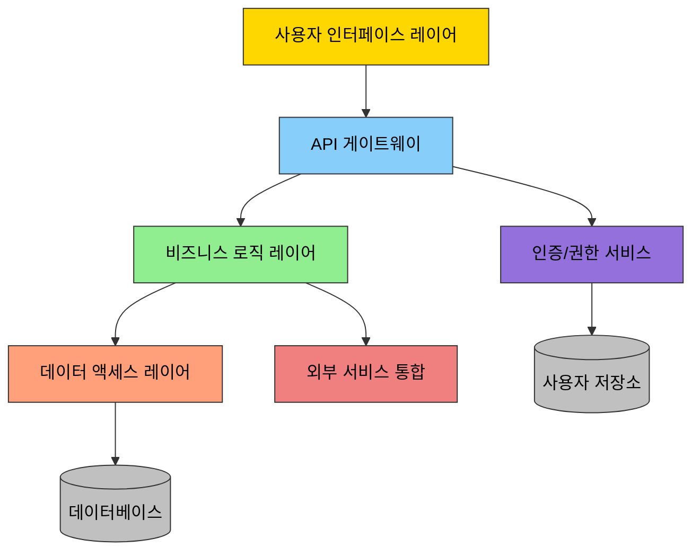
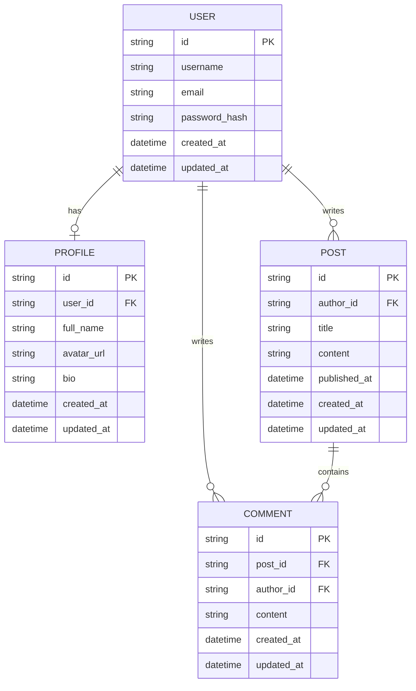
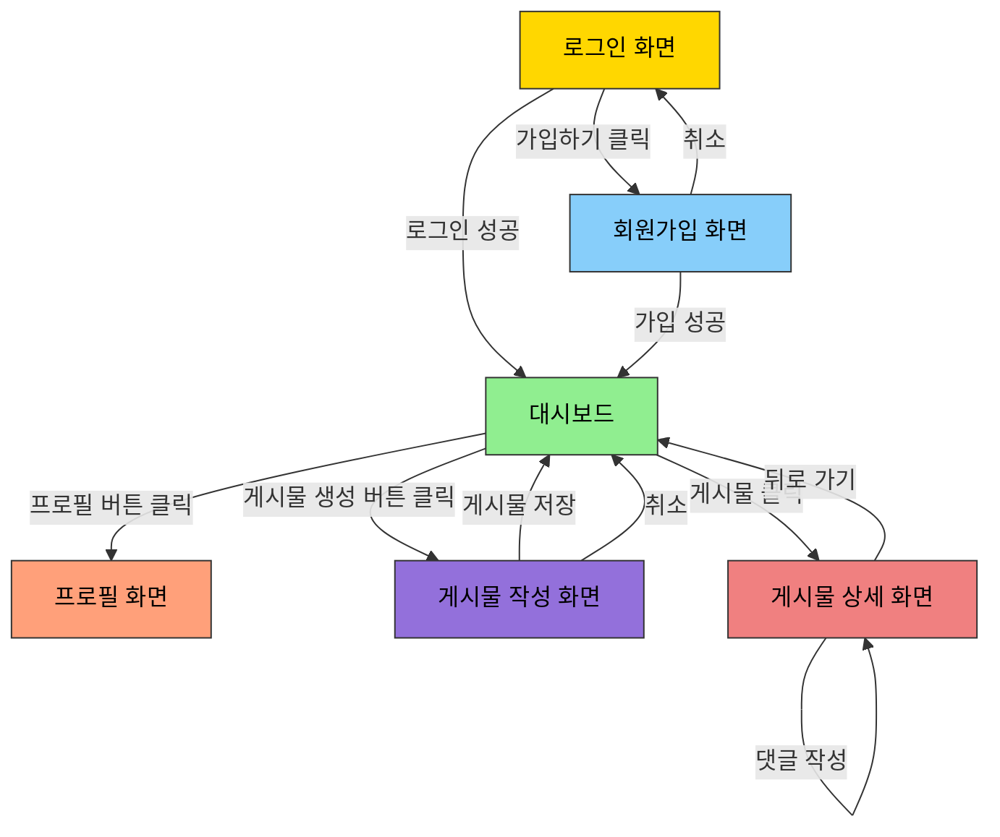

<!-- filepath: /Users/a11331/IdeaProjects/pdd/docs/00.methodology/00.prompt-driven-development-methodology-details-design.md -->
# Prompt-driven Development (PDD) - Design Phase

## Table of Contents

1. [Definition of the Design Phase](#1-definition-of-the-design-phase)
   1. [Definition](#11-definition)
   2. [Objectives](#12-objectives)
   3. [Scope](#13-scope)
2. [Process Description](#2-process-description)
   1. [System Architecture Design](#21-system-architecture-design)
   2. [Data Modeling](#22-data-modeling)
   3. [User Interface Design](#23-user-interface-design)
   4. [Integration & Interface Design](#24-integration--interface-design)
   5. [Security Architecture Design](#25-security-architecture-design)
3. [Application Examples](#3-application-examples)
   1. [Architecture Diagram Example](#31-architecture-diagram-example)
   2. [Data Model Example](#32-data-model-example)
   3. [UI/UX Design Example](#33-uiux-design-example)

---

## 1. Definition of the Design Phase

### 1.1 Definition

The design phase is the process of transforming requirements into concrete system structures and components. In the PDD approach, AI is used to efficiently perform architecture design, data modeling, and interface design. This phase creates the blueprint for the system based on the requirements gathered in the requirements definition phase.

### 1.2 Objectives

- Design a system architecture that satisfies requirements
- Define efficient and scalable data models
- Design intuitive and user-friendly interfaces
- Define integration and communication between modules
- Ensure design meets non-functional requirements (performance, security, scalability, etc.)

### 1.3 Scope

- System architecture design (layers, components, module structure)
- Database design and data modeling
- User interface and experience (UI/UX) design
- API and interface design
- Security architecture and authentication/authorization mechanisms
- Optimization of architecture for performance and scalability

## 2. Process Description

### 2.1 System Architecture Design

#### 2.1.1 Overall System Architecture Design

Design the optimal system architecture based on project requirements and constraints.

**Prompt Template Example:**
```
Based on the following requirements and constraints, design the architecture for [System Name]:

Requirements:
[Requirements List]

Constraints:
[Constraints List]

Tech Stack:
[Tech Stack Info]

Please include the following:
1. Architecture diagram (layers, components, module structure)
2. Key responsibilities and functions of each component
3. Interactions between components
4. Applied architecture patterns and reasons for selection
5. Key technical decisions and rationale
6. Considerations for scalability, maintainability, and security
```

#### 2.1.2 Architecture Style and Pattern Selection

Select the most appropriate architecture style and pattern for the system's characteristics and requirements.

**Prompt Template Example:**
```
Considering the following system characteristics and requirements, recommend the most suitable architecture style and pattern for [System Name]:

System Characteristics:
[System Characteristics List]

Key Requirements:
[Key Requirements List]

Non-functional Requirements:
[Performance, Scalability, Security, etc.]

Please include the following:
1. Recommended architecture style (e.g., microservices, monolithic, event-driven, etc.) and rationale
2. Applicable design patterns and their pros and cons
3. Explanation of how the chosen architecture style meets system requirements
4. Comparative analysis with alternative architectures
5. Implementation considerations
```

#### 2.1.3 Component Detailed Design

Perform detailed design for the system's key components.

**Prompt Template Example:**
```
Please provide a detailed design for the [Component Name] component of [System Name]:

Component Purpose:
[Main purpose and responsibilities of the component]

Functional Requirements:
[Functional requirements that the component must meet]

Interface Requirements:
[Interface requirements with other components]

Please include the following:
1. Internal structure and class/module diagram of the component
2. Key classes/modules and their roles
3. Key methods and functions
4. Internal data flow
5. Error handling strategy
6. Integration approach with other components
7. Design considerations for scalability
```

### 2.2 Data Modeling

#### 2.2.1 Conceptual Data Model Design

Identify the main entities of the system and their relationships, and design the conceptual data model.

**Prompt Template Example:**
```
Please design the conceptual data model for [System Name]:

System Description:
[Brief description of the system]

Key Business Processes:
[Main business processes that the system must support]

Please include the following:
1. Identification and description of key entities
2. Definition of relationships between entities (ERD diagram)
3. Main attributes of each entity
4. Core business rules and constraints
5. Data hierarchy
```

#### 2.2.2 Logical/Physical Data Model Design

Design the specific logical/physical data model based on the conceptual model.

**Prompt Template Example:**
```
Based on the following conceptual data model, please design the logical/physical data model for [System Name]:

Conceptual Model:
[Description or diagram of the conceptual model]

Target Database:
[Type of database: relational, NoSQL, etc.]

Performance Requirements:
[Considerations for query performance, scalability, etc.]

Please include the following:
1. Table/collection definitions and schema
2. Primary key and foreign key relationships
3. Indexing strategy
4. Normalization/denormalization decisions and rationale
5. Data types and constraints
6. Strategies for performance optimization (partitioning, sharding, etc.)
7. Data migration considerations
```

#### 2.2.3 Data Access Layer Design

Design the data access layer for efficient access to the data model.

**Prompt Template Example:**
```
Please design the data access layer for [System Name]:

Data Model:
[Summary of the data model]

Tech Stack:
[ORM, data access technologies to be used]

Key Requirements:
[Performance, transaction management, security, etc. requirements]

Please include the following:
1. Data access patterns (Repository, DAO, etc.) and implementation approach
2. Transaction management strategy
3. Caching strategy
4. Concurrency control methods
5. Error handling and recovery strategies
6. Design of key CRUD operations
7. Performance optimization techniques
```

### 2.3 User Interface Design

#### 2.3.1 UI/UX Design Principles Definition

Define the UI/UX design principles for the project.

**Prompt Template Example:**
```
Please define the UI/UX design principles for [System Name]:

Target Users:
[Main user groups and their characteristics]

Usage Environment:
[Devices, environmental constraints, etc.]

Key User Journeys:
[Description of core user journeys]

Please include the following:
1. Design language and style guide (colors, typography, icons, etc.)
2. Design patterns for consistency
3. Accessibility considerations
4. Responsive/adaptive design strategy
5. User feedback and error handling mechanisms
6. Performance considerations for UI design
```

#### 2.3.2 Screen Flow and Wireframe Design

Design the screen flow and wireframes based on the user journeys.

**Prompt Template Example:**
```
Please design the screen flow and wireframes for the [User Journey/Feature] of [System Name]:

User Journey:
[Description of the user journey for this feature]

User Goals:
[Goals that the user aims to achieve with this feature]

Key Functional Requirements:
[List of functions that must be supported in this screen flow]

Please include the following:
1. Screen flow diagram (screen transitions based on user actions)
2. Wireframes for each screen (layout, placement of key UI elements)
3. Key functions and controls for each screen
4. User input and validation methods
5. Error state and feedback display methods
6. Accessibility considerations
7. Responsive design implementation
```

#### 2.3.3 Interaction Design

Design detailed interactions to enhance the user experience.

**Prompt Template Example:**
```
Please design the interaction details for the [Specific Feature/Screen] of [System Name]:

Screen Purpose:
[Main purpose of the screen]

Key User Actions:
[List of key actions that users will perform]

Usability Requirements:
[Considerations for efficiency, ease of learning, etc.]

Please include the following:
1. State changes of each UI element (hover, focus, active, etc.)
2. Animation and transition effects
3. Micro-interaction designs
4. User feedback mechanisms (visual, auditory, haptic)
5. Gesture and shortcut key support
6. Loading state and asynchronous operation indicators
7. Error state and recovery interactions
```

### 2.4 Integration & Interface Design

#### 2.4.1 API Design

Design APIs for integration between internal components or with external systems.

**Prompt Template Example:**
```
Please design the API for [API Purpose] of [System Name]:

API Purpose:
[Main purpose and use cases of the API]

Key Functional Requirements:
[List of functions that the API must support]

Technical Constraints:
[Constraints such as RESTful, GraphQL, protocols, etc.]

Please include the following:
1. API architecture style (REST, GraphQL, etc.) and rationale
2. Endpoint definitions and resource naming conventions
3. Request/response formats and data models
4. Status codes and error handling methods
5. Authentication and authorization mechanisms
6. Versioning strategy
7. Performance optimization considerations (paging, filtering, caching, etc.)
8. API documentation approach
```

#### 2.4.2 Integration Architecture Design

Design the architecture for integration with external systems and services.

**Prompt Template Example:**
```
Please design the external system integration architecture for [System Name]:

Integration Targets:
[List of external systems/services to be integrated]

Integration Requirements:
[Data synchronization, real-time requirements, etc.]

Technical Constraints:
[Constraints such as network, security, protocols, etc.]

Please include the following:
1. Integration pattern selection (Point-to-Point, Hub-and-Spoke, ESB, API Gateway, etc.)
2. Integration approach for each external system
3. Data transformation and mapping strategies
4. Error handling and fault tolerance strategies
5. Transaction management approach
6. Security considerations
7. Monitoring and logging strategy
8. Considerations for scalability and maintainability
```

#### 2.4.3 Interface Contract Definition

Define the interface contracts between system components or with external systems.

**Prompt Template Example:**
```
Please define the interface contract between [Component/External System] of [System Name]:

Interface Purpose:
[Main purpose of this interface]

Communicating Parties:
[Components/systems using the interface]

Communication Method:
[Sync/Async, protocols, etc.]

Please include the following:
1. Interface identifier and version
2. Provided functions and method definitions
3. Input parameters and return value specifications
4. Data formats and constraints
5. Error codes and exception handling
6. Non-functional requirements (performance, security, etc.)
7. Sample requests/responses
8. Test scenarios
```

### 2.5 Security Architecture Design

#### 2.5.1 Security Requirements Analysis

Analyze the security requirements of the system and develop a threat model.

**Prompt Template Example:**
```
Please analyze the security requirements and develop a threat model for [System Name]:

System Overview:
[Summary of system functions and sensitive assets]

Regulatory Requirements:
[Security-related regulations to be complied with]

Key Stakeholder Concerns:
[Security concerns of stakeholders]

Please include the following:
1. Identification of key assets to be protected
2. Analysis of potential threat actors
3. Threat scenarios and attack vectors
4. Vulnerability assessment
5. Risk assessment and prioritization
6. Derivation of security requirements
7. Risk mitigation strategies
```

#### 2.5.2 Authentication and Authorization Design

Design the mechanisms for user authentication and authorization.

**Prompt Template Example:**
```
Please design the authentication and authorization system for [System Name]:

User Types:
[Types of users of the system]

Authentication Requirements:
[Requirements and constraints related to authentication]

Authorization Requirements:
[Granular access control requirements]

Please include the following:
1. Authentication mechanism selection (session-based, token-based, OAuth, etc.)
2. Credential management and storage methods
3. Multi-factor authentication implementation
4. Role-Based Access Control (RBAC) or Attribute-Based Access Control (ABAC) design
5. Authorization policies and rules
6. Session management strategy
7. Password policies and management
8. Handling of authentication/authorization failures
9. Audit and logging strategy
```

#### 2.5.3 Data Security Design

Design data security mechanisms to protect sensitive data.

**Prompt Template Example:**
```
Please design the data security mechanisms for [System Name]:

Sensitive Data Types:
[List of data types to be protected]

Data Classification:
[Classification based on data sensitivity]

Regulatory Requirements:
[Data protection-related regulations]

Please include the following:
1. Data encryption strategy (at rest/in transit)
2. Encryption algorithms and key management
3. Data masking and anonymization techniques
4. Personally Identifiable Information (PII) handling methods
5. Data access control and monitoring
6. Data integrity assurance methods
7. Backup and recovery strategy
8. Data loss prevention mechanisms
```

## 3. Application Examples

### 3.1 Architecture Diagram Example



### 3.2 Data Model Example



### 3.3 UI/UX Design Example

#### Design System Components

```
1. 타이포그래피
   - 제목: Roboto 24px Bold
   - 부제목: Roboto 18px Medium
   - 본문: Roboto 16px Regular
   - 버튼 텍스트: Roboto 14px Medium

2. 색상 팔레트
   - 주요 색상: #3498db
   - 보조 색상: #2ecc71
   - 강조 색상: #e74c3c
   - 중립 색상: #ecf0f1, #95a5a6, #7f8c8d, #34495e

3. 공간 시스템
   - 기본 간격: 8px
   - 여백 단위: 8px, 16px, 24px, 32px, 40px

4. 주요 UI 컴포넌트
   - 버튼: 기본, 강조, 비활성화, 텍스트 전용
   - 입력 필드: 텍스트, 숫자, 날짜, 선택
   - 카드: 기본, 강조, 클릭 가능
   - 탐색: 탭, 드롭다운, 사이드바
```

#### 사용자 흐름 예시


