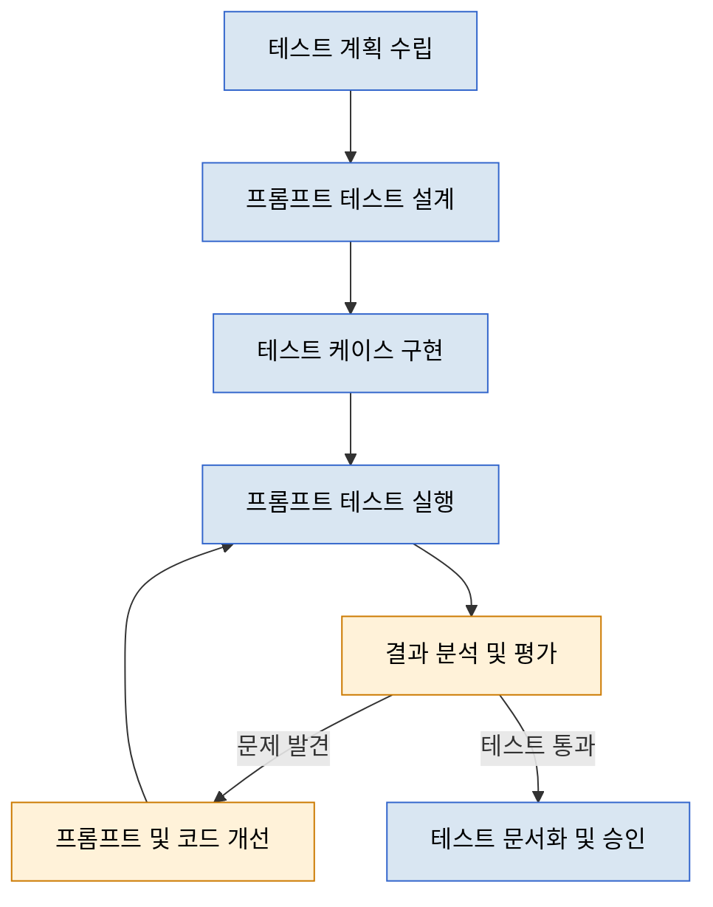

# 프롬프트 기반 개발방법론: 테스트 단계

## 목차

1. [개요](#개요)
2. [테스트 단계 작업 구성도](#테스트-단계-작업-구성도)
3. [주요 산출물](#주요-산출물)
4. [역할과 책임](#역할과-책임)
5. [프롬프트 테스트 유형 및 접근법](#프롬프트-테스트-유형-및-접근법)
   1. [기능성 테스트](#1-기능성-테스트)
   2. [일관성 및 안정성 테스트](#2-일관성-및-안정성-테스트)
   3. [보안 및 레드팀 테스트](#3-보안-및-레드팀-테스트)
   4. [편향성 및 윤리적 테스트](#4-편향성-및-윤리적-테스트)
6. [테스트 메트릭 및 평가 기준](#테스트-메트릭-및-평가-기준)
7. [테스트 도구 및 프레임워크](#테스트-도구-및-프레임워크)
8. [테스트 문서화 및 보고](#테스트-문서화-및-보고)
9. [테스트 단계의 지속적 개선](#테스트-단계의-지속적-개선)
10. [결론](#결론)
11. [참고 자료](#참고-자료)
12. [PDD 성공 지표와 테스트 단계의 연계](#pdd-성공-지표와-테스트-단계의-연계)

---

## 개요

테스트 단계는 프롬프트 기반 개발방법론(PDD)에서 핵심적인 역할을 합니다. 전통적인 소프트웨어 테스트와 달리, PDD 테스트는 프롬프트 및 생성형 AI 응답의 품질, 일관성, 보안성을 함께 검증합니다. 본 문서는 PDD 환경에서의 효과적인 테스트 접근법을 제시합니다.

## 테스트 단계 작업 구성도



## 주요 산출물

| 구분 | Activity | Task | 산출물 | 필수여부 |
|------|----------|------|--------|---------|
| **Test** | 테스트 계획 | 테스트 범위 정의 | 테스트 계획서 | 필수 |
| **Test** | 테스트 계획 | 테스트 환경 구성 | 테스트 환경 문서 | 필수 |
| **Test** | 프롬프트 테스트 설계 | 프롬프트 변형 설계 | 프롬프트 테스트 매트릭스 | 필수 |
| **Test** | 프롬프트 테스트 설계 | 에지 케이스 식별 | 에지 케이스 목록 | 필수 |
| **Test** | 테스트 구현 | 자동화 테스트 스크립트 작성 | 테스트 스크립트 | 권장 |
| **Test** | 테스트 구현 | 레드팀 테스트 시나리오 준비 | 레드팀 테스트 계획 | 권장 |
| **Test** | 테스트 실행 | 자동화 테스트 실행 | 테스트 실행 보고서 | 필수 |
| **Test** | 테스트 실행 | 인간 평가 테스트 | 인간 평가 결과 | 권장 |
| **Test** | 결과 분석 | 결함 분류 및 우선순위 지정 | 결함 트래킹 문서 | 필수 |
| **Test** | 결과 분석 | 메트릭 측정 및 분석 | 테스트 메트릭 보고서 | 필수 |
| **Test** | 테스트 문서화 | 테스트 결과 종합 | 테스트 종합 보고서 | 필수 |
| **Test** | 테스트 문서화 | 개선 권고사항 작성 | 개선 권고안 | 필수 |

## 역할과 책임

| 역할그룹 | 역할명 | 역할상세 |
|---------|-------|---------|
| **테스트 관리자** | PDD 테스트 리더 | - 테스트 전략 및 계획 수립<br>- 테스트 리소스 할당 및 관리<br>- 테스트 진행 상황 모니터링<br>- 이해관계자와 테스트 결과 커뮤니케이션 |
| **테스트 설계자** | 프롬프트 테스트 설계자 | - 프롬프트 테스트 케이스 설계<br>- 프롬프트 변형 및 에지 케이스 식별<br>- 테스트 데이터 준비<br>- 테스트 우선순위 설정 |
| **테스트 엔지니어** | 자동화 테스트 엔지니어 | - 테스트 자동화 프레임워크 구축<br>- 자동화 테스트 스크립트 개발<br>- 테스트 실행 및 모니터링<br>- 테스트 인프라 관리 |
| **검증 전문가** | 프롬프트 평가 전문가 | - 생성된 결과 품질 평가<br>- 프롬프트 응답 적합성 검증<br>- 편향성 및 윤리적 문제 검토<br>- 인간 평가 세션 진행 |
| **보안 전문가** | AI 보안 테스터 | - 프롬프트 인젝션 취약점 테스트<br>- 데이터 유출 위험 검증<br>- 레드팀 침투 테스트 수행<br>- 보안 권고사항 제공 |

## 프롬프트 테스트 유형 및 접근법

### 1. 기능성 테스트

기능성 테스트는 프롬프트와 생성된 코드가 의도한 기능 요구사항을 충족하는지 검증합니다.

#### 테스트 접근법:
- **입출력 테스트**: 다양한 입력에 대한 프롬프트 응답의 정확성 검증
- **시나리오 기반 테스트**: 실제 사용 시나리오를 기반으로 한 E2E 테스트
- **회귀 테스트**: 프롬프트 최적화 후 기존 기능이 유지되는지 확인

#### 모범 사례:
- 프롬프트 변형을 포함한 파라미터화된 테스트 케이스 설계
- 코드 생성 결과의 컴파일 및 기능 검증 자동화
- 경계 조건 및 에지 케이스에 대한 체계적 테스트

### 2. 일관성 및 안정성 테스트

일관성 테스트는 동일한 프롬프트가 다양한 조건에서도 일관된 품질의 결과를 생성하는지 검증합니다.

#### 테스트 접근법:
- **반복 테스트**: 동일 프롬프트의 여러 번 실행을 통한 일관성 검증
- **온도 변화 테스트**: 다양한 온도(무작위성) 설정에서의 응답 안정성 평가
- **모델 버전 호환성**: 모델 업데이트 간 응답 일관성 검증

#### 모범 사례:
- 결과의 통계적 분석을 위한 대량 샘플 수집
- 응답 편차 측정을 위한 표준화된 메트릭 정의
- 성능 저하 조기 감지를 위한 지속적 모니터링

### 3. 보안 및 레드팀 테스트

보안 테스트는 프롬프트 기반 시스템의 취약점을 식별하고 완화하는 데 초점을 맞춥니다.

#### 테스트 접근법:
- **프롬프트 인젝션 테스트**: 악의적인 지시를 통한 시스템 우회 시도
- **경계 우회 테스트**: 보안 제한을 우회하는 기법 테스트
- **데이터 유출 테스트**: 민감 정보 추출 가능성 평가

#### 모범 사례:
- 체계적인 레드팀 접근 방식으로 취약점 탐색
- 발견된 취약점에 대한 즉각적인 완화 전략 수립
- 보안 테스트 자동화 및 지속적 보안 모니터링

### 4. 편향성 및 윤리적 테스트

편향성 테스트는 생성된 결과물이 윤리적이고 공정하며 다양한 사용자 그룹에게 적합한지 평가합니다.

#### 테스트 접근법:
- **다양성 테스트**: 다양한 인구통계학적 컨텍스트에서의 응답 평가
- **윤리적 경계 테스트**: 윤리적 가이드라인 준수 검증
- **공정성 평가**: 특정 그룹에 대한 불공정한 결과 식별

#### 모범 사례:
- 다양한 배경의 평가자를 포함한 인간 평가 패널 구성
- 표준화된 편향성 평가 체크리스트 개발 및 적용
- 발견된 편향성에 대한 적극적 완화 및 지속적 모니터링

## 테스트 메트릭 및 평가 기준

### 핵심 테스트 메트릭

| 메트릭 | 설명 | 측정 방법 |
|-------|------|----------|
| **응답 정확도** | 생성된 응답이 요구사항과 일치하는 정도 | 전문가 평가, 자동화된 정확도 검증 |
| **응답 일관성** | 동일 프롬프트에 대한 응답의 일관성 | 통계적 변동성 분석 |
| **기능 충족률** | 요구된 기능이 올바르게 구현된 비율 | 기능별 합격/불합격 테스트 |
| **결함 발견률** | 테스트 케이스당 발견된 평균 결함 수 | 테스트 실행 결과 분석 |
| **테스트 자동화 커버리지** | 자동화된 테스트로 검증된 기능의 비율 | 테스트 범위 분석 |
| **보안 취약점 수** | 식별된 보안 취약점의 수와 심각도 | 보안 스캔 및 레드팀 테스트 |
| **편향성 점수** | 생성된 결과물의 편향 정도 | 표준화된 편향성 평가 도구 |

### 테스트 합격 기준

프롬프트 기반 시스템의 테스트 합격 기준은 다음과 같은 요소를 고려해야 합니다:

1. **기능 요구사항 충족**: 모든 핵심 기능 요구사항이 충족되어야 함
2. **일관성 기준**: 반복 테스트에서 일정 수준 이상의 일관성 유지
3. **보안 기준**: 심각한 보안 취약점이 없어야 함
4. **성능 기준**: 응답 시간 및 자원 사용이 정의된 임계값 내에 있어야 함
5. **윤리적 기준**: 편향성 점수가 허용 가능한 범위 내에 있어야 함

## 테스트 도구 및 프레임워크

### 프롬프트 테스트 도구

다음은 PDD 테스트에 활용할 수 있는 주요 도구들입니다:

1. **프롬프트 테스트 자동화 도구**
   - Promptfoo: 프롬프트 변형 자동 테스트
   - LangChain Evaluator: LLM 응답 품질 평가
   - RAGAS: RAG 시스템 평가 프레임워크

2. **보안 테스트 도구**
   - OWASP LLM Top 10 체크리스트
   - AI 보안 스캐너
   - 프롬프트 인젝션 테스트 프레임워크

3. **편향성 검사 도구**
   - Fairness Indicators
   - Responsible AI Toolkit
   - Bias Evaluator for LLMs

### 테스트 환경 구성

효과적인 PDD 테스트를 위한 환경 구성 지침:

1. **테스트 환경 분리**: 개발, 테스트, 프로덕션 환경의 명확한 분리
2. **버전 관리**: 프롬프트, 테스트 케이스, 예상 결과의 버전 관리
3. **통합 테스트 파이프라인**: CI/CD 파이프라인에 프롬프트 테스트 통합
4. **모니터링 인프라**: 테스트 결과 및 성능 지표 모니터링 시스템

## 테스트 문서화 및 보고

### 테스트 문서화 요소

효과적인 PDD 테스트 문서화에 포함되어야 할 요소:

1. **테스트 계획**
   - 테스트 범위 및 목표
   - 테스트 일정 및 리소스
   - 테스트 환경 요구사항

2. **테스트 케이스**
   - 테스트 ID 및 설명
   - 테스트 단계 및 예상 결과
   - 테스트 데이터 및 사전 조건

3. **테스트 결과 보고서**
   - 테스트 실행 요약
   - 발견된 결함 및 심각도
   - 메트릭 및 성능 데이터
   - 개선 권고사항

### 보고 템플릿

다음은 PDD 테스트 보고서의 권장 템플릿입니다:

```markdown
# 프롬프트 테스트 결과 보고서

## 프로젝트 정보
- 프로젝트명: [프로젝트명]
- 테스트 기간: [시작일] ~ [종료일]
- 테스트 환경: [환경 세부 정보]

## 테스트 범위
- 테스트된 프롬프트: [프롬프트 목록]
- 테스트 유형: [수행된 테스트 유형]

## 테스트 요약
- 실행된 테스트 케이스: [개수]
- 합격한 테스트: [개수] ([비율]%)
- 발견된 결함: [개수]
- 심각도별 결함 분포: [분포 데이터]

## 주요 발견 사항
- [주요 발견 사항 1]
- [주요 발견 사항 2]
...

## 메트릭 결과
- 응답 정확도: [점수]
- 응답 일관성: [점수]
- 편향성 점수: [점수]
...

## 개선 권고사항
- [권고사항 1]
- [권고사항 2]
...

## 결론 및 승인
- 테스트 결과 결론: [결론]
- 승인 상태: [승인됨/조건부 승인됨/거부됨]
- 승인자: [이름], [직책]
- 승인일: [날짜]
```

## 테스트 단계의 지속적 개선

PDD 테스트 프로세스는 다음과 같은 방법으로 지속적으로 개선해야 합니다:

1. **테스트 회고**: 각 테스트 주기 후 효과성 평가 및 교훈 도출
2. **메트릭 트렌드 분석**: 시간 경과에 따른 테스트 메트릭 추세 분석
3. **최신 기법 도입**: 새로운 프롬프트 테스트 기법 및 도구 도입
4. **자동화 확대**: 테스트 자동화 범위 지속적 확대
5. **피드백 루프 개선**: 테스트 결과가 프롬프트 및 시스템 개선으로 이어지는 프로세스 최적화

## 결론

PDD 테스트 단계는 전통적인 소프트웨어 테스트와 AI 시스템 평가의 원칙을 결합하여, 프롬프트 기반 시스템의 품질, 신뢰성, 보안성을 보장합니다. 본 문서에서 제시한 체계적인 테스트 접근법을 통해 PDD 프로젝트에서 높은 품질의 결과물을 달성할 수 있습니다.

## 참고 자료

1. Microsoft (2025), "Promptware Engineering: Software Engineering for LLM Prompt Development and Testing"
2. Google (2024), "Prompt Engineering Best Practices for Testing and Evaluation"
3. Aqua Cloud (2025), "Prompt Engineering for Software Testers: Best Practices for 2025"
4. IEEE (2025), "LLM4TDD: Best Practices for Test Driven Development Using Large Language Models"
5. Cursor (2025), "Test-Driven Development with AI Assistants"

## PDD 성공 지표와 테스트 단계의 연계

테스트 단계는 PDD의 전체 성공 지표를 평가하는 데 중요한 역할을 합니다. 테스트 단계에서 측정되는 메트릭은 PDD 방법론의 주요 비즈니스 목표 달성 여부를 직접적으로 반영합니다.

### 정량적 지표 측정

테스트 단계에서는 다음과 같은 정량적 지표를 측정하여 PDD의 효과성을 평가합니다:

| PDD 목표 지표 | 테스트 단계 측정 방법 | 목표 개선 |
|-------------|-------------------|----------|
| **개발 속도** | 테스트 자동화를 통한 개발-테스트 주기 시간 측정 | 30-50% 단축 |
| **코드 품질** | 자동화된 코드 분석 및 테스트 커버리지 | 20-30% 향상 |
| **버그 감소율** | 프로덕션 전 발견된 버그 비율 | 30-50% 증가 |
| **보안 취약점** | 보안 테스트를 통해 발견된 취약점 수 | 20-40% 감소 |
| **일관성 지표** | 동일 프롬프트의 반복 실행 결과 일관성 | 표준편차 10% 이내 |

### 정성적 지표 평가

테스트 단계에서는 다음과 같은 정성적 지표도 평가합니다:

1. **개발자 경험**
   - 테스트 프로세스 만족도 설문
   - 프롬프트 테스트 용이성 평가
   - 테스트 결과의 명확성 및 유용성 평가

2. **팀 협업 효과**
   - 테스트-개발 팀 간 협업 효율성
   - 테스트 피드백 반영 속도 및 품질
   - 지식 공유 및 학습 곡선 개선

3. **비즈니스 요구사항 충족도**
   - 고객 요구사항 충족 평가
   - 최종 사용자 관점의 테스트 결과 검증
   - 비즈니스 가치 전달 검증

### 지표 모니터링 및 개선 체계

테스트 단계에서 수집된 지표는 다음과 같은 체계로 모니터링되고 개선됩니다:

1. **지표 대시보드**
   - 테스트 메트릭 실시간 시각화
   - 추세 분석 및 이상 탐지
   - 목표 대비 실제 성과 추적

2. **개선 피드백 루프**
   - 테스트 결과 기반 프롬프트 최적화
   - 반복적 테스트-개선 주기 설정
   - A/B 테스트를 통한 개선 효과 검증

3. **경영진 보고**
   - 비즈니스 KPI와 테스트 메트릭 연계 보고
   - ROI 분석 및 효과성 증명
   - 전략적 의사결정 지원 데이터 제공
