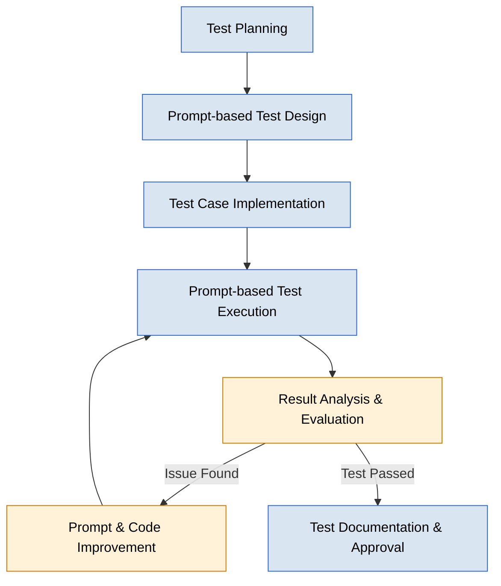

# Prompt-driven Development (PDD) - Testing Phase

**Document Number**: MTD-007  
**Version**: 1.0.0  
**Date**: 2025-05-26  
**Author**: Methodology Team  
**Status**: Approved

## Table of Contents

1. [Overview](#overview)
2. [Testing Phase Workflow Diagram](#testing-phase-workflow-diagram)
3. [Key Deliverables](#key-deliverables)
4. [Roles & Responsibilities](#roles--responsibilities)
5. [Types of Prompt-based Tests & Approaches](#types-of-prompt-based-tests--approaches)
   1. [Functional Testing](#1-functional-testing)
   2. [Consistency & Stability Testing](#2-consistency--stability-testing)
   3. [Security & Red Team Testing](#3-security--red-team-testing)
   4. [Usability & Heuristic Testing](#4-usability--heuristic-testing)
6. [Test Metrics & Evaluation Criteria](#test-metrics--evaluation-criteria)
7. [Testing Tools & Frameworks](#testing-tools--frameworks)
8. [Test Documentation & Reporting](#test-documentation--reporting)
9. [Continuous Improvement in the Testing Phase](#continuous-improvement-in-the-testing-phase)
10. [Conclusion](#conclusion)
11. [References](#references)
12. [PDD Success Metrics & Testing Phase Linkage](#pdd-success-metrics--testing-phase-linkage)

---

## Overview

The testing phase is a critical part of the Prompt-driven Development (PDD) methodology. Unlike traditional software testing, PDD testing verifies the quality, consistency, and security of both prompts and AI-generated outputs. This document presents effective prompt-based testing approaches for the PDD environment.

## Testing Phase Workflow Diagram



## Key Deliverables

| Category | Activity | Task | Deliverable | Mandatory |
|------|----------|------|--------|---------|
| **Test** | Test Planning | Define Test Scope | Test Plan Document | Yes |
| **Test** | Test Planning | Set Up Test Environment | Test Environment Document | Yes |
| **Test** | Prompt-based Test Design | Design Prompt Variations | Prompt Test Matrix | Yes |
| **Test** | Prompt-based Test Design | Identify Edge Cases | Edge Case List | Yes |
| **Test** | Test Implementation | Write Automated Test Scripts | Test Scripts | Recommended |
| **Test** | Test Implementation | Prepare Red Team Test Scenarios | Red Team Test Plan | Recommended |
| **Test** | Test Execution | Execute Automated Tests | Test Execution Report | Yes |
| **Test** | Test Execution | Conduct Human Evaluation Tests | Human Evaluation Results | Recommended |
| **Test** | Result Analysis | Classify and Prioritize Defects | Defect Tracking Document | Yes |
| **Test** | Result Analysis | Measure and Analyze Metrics | Test Metrics Report | Yes |
| **Test** | Test Documentation | Summarize Test Results | Test Summary Report | Yes |
| **Test** | Test Documentation | Write Improvement Recommendations | Improvement Proposal | Yes |

## Roles & Responsibilities

| Role Group | Role Name | Role Details |
|---------|-------|---------|
| **Test Manager** | PDD Test Lead | - Develop test strategy and plan<br>- Allocate and manage test resources<br>- Monitor test progress<br>- Communicate test results to stakeholders |
| **Test Designer** | Prompt Test Designer | - Design prompt test cases<br>- Identify prompt variations and edge cases<br>- Prepare test data<br>- Set test priorities |
| **Test Engineer** | Automation Test Engineer | - Build test automation framework<br>- Develop automated test scripts<br>- Execute and monitor tests<br>- Manage test infrastructure |
| **Validation Expert** | Prompt Evaluation Specialist | - Evaluate quality of generated results<br>- Validate prompt response relevance<br>- Review for bias and ethical issues<br>- Conduct human evaluation sessions |
| **Security Expert** | AI Security Tester | - Test for prompt injection vulnerabilities<br>- Validate data leakage risks<br>- Perform red team penetration tests<br>- Provide security recommendations |

## Types of Prompt-based Tests & Approaches

### 1. Functional Testing

Functional testing verifies that prompts and generated code meet the intended functional requirements.

#### Testing Approaches:
- **Input-Output Testing**: Validate the accuracy of prompt responses to various inputs
- **Scenario-based Testing**: End-to-end testing based on real-world usage scenarios
- **Regression Testing**: Ensure existing functionality is maintained after prompt optimization

#### Best Practices:
- Design parameterized test cases including prompt variations
- Automate compilation and functionality verification of code generation results
- Systematically test boundary conditions and edge cases

### 2. Consistency & Stability Testing

Consistency testing verifies that the same prompt produces consistently high-quality results under various conditions.

#### Testing Approaches:
- **Repetition Testing**: Execute the same prompt multiple times to verify consistency
- **Temperature Variation Testing**: Evaluate response stability across different temperature (randomness) settings
- **Model Version Compatibility**: Verify response consistency across model updates

#### Best Practices:
- Collect a large sample size for statistical analysis of results
- Define standardized metrics for measuring response variability
- Implement continuous monitoring for early detection of performance degradation

### 3. Security & Red Team Testing

Security testing focuses on identifying and mitigating vulnerabilities in prompt-based systems.

#### Testing Approaches:
- **Prompt Injection Testing**: Attempt to bypass system controls using malicious instructions
- **Boundary Bypass Testing**: Test techniques for circumventing security restrictions
- **Data Leakage Testing**: Assess the potential for sensitive information extraction

#### Best Practices:
- Explore vulnerabilities using a systematic red team approach
- Establish immediate mitigation strategies for identified vulnerabilities
- Automate security testing and implement continuous security monitoring

### 4. Usability & Heuristic Testing

Usability testing evaluates the ease of use, user experience, and adherence to heuristic principles in the generated outputs.

#### Testing Approaches:
- **Heuristic Evaluation**: Review outputs against established usability heuristics
- **Cognitive Walkthrough**: Simulate user tasks to identify usability issues
- **A/B Testing**: Compare different prompt designs or output formats

#### Best Practices:
- Involve actual users in the testing process for authentic feedback
- Prioritize issues based on their impact on user experience
- Iterate on prompt designs based on usability test findings

## Test Metrics & Evaluation Criteria

### Key Test Metrics

| Metric | Description | Measurement Method |
|-------|------|----------|
| **Response Accuracy** | Degree to which generated responses align with requirements | Expert review, automated accuracy checks |
| **Response Consistency** | Consistency of responses to the same prompt | Statistical variability analysis |
| **Functionality Coverage** | Proportion of required functions correctly implemented | Pass/fail testing by function |
| **Defect Density** | Average number of defects found per test case | Analysis of test execution results |
| **Test Automation Coverage** | Proportion of functions verified by automated tests | Test coverage analysis |
| **Security Vulnerabilities** | Number and severity of identified security vulnerabilities | Security scans and red team tests |
| **Bias Score** | Degree of bias in generated outputs | Standardized bias evaluation tools |

### Test Acceptance Criteria

The acceptance criteria for prompt-based systems should consider the following elements:

1. **Functional Requirements Fulfillment**: All critical functional requirements must be met
2. **Consistency Standards**: Maintain a certain level of consistency in repeated tests
3. **Security Standards**: Absence of critical security vulnerabilities
4. **Performance Standards**: Response times and resource usage within defined thresholds
5. **Ethical Standards**: Bias scores within acceptable ranges

## Testing Tools & Frameworks

### Prompt Testing Tools

Here are some key tools that can be used for PDD testing:

1. **Prompt Testing Automation Tools**
   - Promptfoo: Automated testing of prompt variations
   - LangChain Evaluator: Evaluation of LLM response quality
   - RAGAS: Evaluation framework for RAG systems

2. **Security Testing Tools**
   - OWASP LLM Top 10 Checklist
   - AI Security Scanner
   - Prompt Injection Testing Framework

3. **Bias Detection Tools**
   - Fairness Indicators
   - Responsible AI Toolkit
   - Bias Evaluator for LLMs

### Test Environment Setup

Guidelines for setting up an effective environment for PDD testing:

1. **Environment Separation**: Clear separation of development, testing, and production environments
2. **Version Control**: Versioning of prompts, test cases, and expected results
3. **Integrated Test Pipeline**: Integration of prompt testing into the CI/CD pipeline
4. **Monitoring Infrastructure**: Systems for monitoring test results and performance metrics

## Test Documentation & Reporting

### Test Documentation Elements

Elements that should be included in effective PDD test documentation:

1. **Test Plan**
   - Test scope and objectives
   - Test schedule and resources
   - Test environment requirements

2. **Test Cases**
   - Test ID and description
   - Test steps and expected results
   - Test data and prerequisites

3. **Test Result Report**
   - Summary of test execution
   - Detected defects and their severity
   - Metrics and performance data
   - Improvement recommendations

### Reporting Template

Here is a recommended template for the PDD test report:

```markdown
# Prompt Test Result Report

## Project Information
- Project Name: [Project Name]
- Test Period: [Start Date] ~ [End Date]
- Test Environment: [Environment Details]

## Test Scope
- Tested Prompts: [List of Prompts]
- Test Types: [Types of Tests Conducted]

## Test Summary
- Executed Test Cases: [Number]
- Passed Tests: [Number] ([Percentage]%)
- Detected Defects: [Number]
- Defect Distribution by Severity: [Distribution Data]

## Key Findings
- [Key Finding 1]
- [Key Finding 2]
...

## Metric Results
- Response Accuracy: [Score]
- Response Consistency: [Score]
- Bias Score: [Score]
...

## Improvement Recommendations
- [Recommendation 1]
- [Recommendation 2]
...

## Conclusion & Approval
- Test Result Conclusion: [Conclusion]
- Approval Status: [Approved/Conditionally Approved/Rejected]
- Approver: [Name], [Position]
- Approval Date: [Date]
```

## Continuous Improvement in the Testing Phase

The PDD testing process should be continuously improved through the following methods:

1. **Test Retrospectives**: Evaluate effectiveness and derive lessons learned after each testing cycle
2. **Metric Trend Analysis**: Analyze trends in test metrics over time
3. **Adoption of Latest Techniques**: Introduce new prompt testing techniques and tools
4. **Expansion of Automation**: Continuously expand the scope of test automation
5. **Improvement of Feedback Loops**: Optimize processes to ensure test results lead to prompt and system improvements

## Conclusion

The PDD testing phase combines principles of traditional software testing and AI system evaluation to ensure the quality, reliability, and security of prompt-based systems. By following the systematic testing approaches presented in this document, high-quality outcomes can be achieved in PDD projects.

## References

1. Microsoft (2025), "Promptware Engineering: Software Engineering for LLM Prompt Development and Testing"
2. Google (2024), "Prompt Engineering Best Practices for Testing and Evaluation"
3. Aqua Cloud (2025), "Prompt Engineering for Software Testers: Best Practices for 2025"
4. IEEE (2025), "LLM4TDD: Best Practices for Test Driven Development Using Large Language Models"
5. Cursor (2025), "Test-Driven Development with AI Assistants"

## PDD Success Metrics & Testing Phase Linkage

The testing phase plays a crucial role in evaluating the overall success metrics of PDD. The metrics measured during the testing phase directly reflect the achievement of the key business objectives of the PDD methodology.

### Quantitative Metric Measurement

The testing phase measures the following quantitative metrics to evaluate the effectiveness of PDD:

| PDD Goal Metric | Testing Phase Measurement Method | Target Improvement |
|-------------|-------------------|----------|
| **Development Speed** | Measure development-testing cycle time through test automation | 30-50% reduction |
| **Code Quality** | Automated code analysis and test coverage | 20-30% improvement |
| **Bug Reduction Rate** | Ratio of bugs found before production | 30-50% increase |
| **Security Vulnerabilities** | Number of vulnerabilities found through security testing | 20-40% reduction |
| **Consistency Metric** | Consistency of results from repeated prompts | Standard deviation within 10% |

### Qualitative Metric Evaluation

The testing phase also evaluates the following qualitative metrics:

1. **Developer Experience**
   - Satisfaction survey on the testing process
   - Evaluation of prompt testing ease
   - Clarity and usefulness of test results

2. **Team Collaboration Effectiveness**
   - Efficiency of collaboration between testing and development teams
   - Speed and quality of test feedback implementation
   - Knowledge sharing and improvement of the learning curve

3. **Business Requirements Fulfillment**
   - Evaluation of customer requirements fulfillment
   - Validation of test results from the end-user perspective
   - Verification of business value delivery

### Metric Monitoring & Improvement System

The metrics collected during the testing phase are monitored and improved through the following system:

1. **Metric Dashboard**
   - Real-time visualization of test metrics
   - Trend analysis and anomaly detection
   - Tracking of actual performance against goals

2. **Improvement Feedback Loop**
   - Optimization of prompts based on test results
   - Establishment of iterative test-improvement cycles
   - Validation of improvement effects through A/B testing

3. **Executive Reporting**
   - Reporting on the linkage between business KPIs and test metrics
   - ROI analysis and effectiveness demonstration
   - Provision of data to support strategic decision-making
