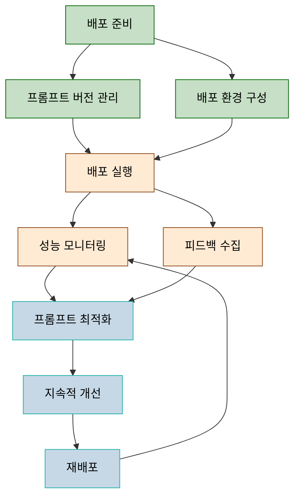

# 프롬프트 기반 개발방법론: 배포 및 유지보수 단계

## 목차

1. [개요](#개요)
2. [배포 및 유지보수 단계 작업 구성도](#배포-및-유지보수-단계-작업-구성도)
3. [주요 산출물](#주요-산출물)
4. [역할과 책임](#역할과-책임)
5. [배포 프로세스 상세](#배포-프로세스-상세)
   1. [배포 준비](#1-배포-준비)
   2. [프롬프트 버전 관리](#2-프롬프트-버전-관리)
   3. [배포 환경 구성](#3-배포-환경-구성)
   4. [배포 실행](#4-배포-실행)
6. [유지보수 프로세스 상세](#유지보수-프로세스-상세)
   1. [성능 모니터링](#1-성능-모니터링)
   2. [피드백 수집](#2-피드백-수집)
   3. [프롬프트 최적화](#3-프롬프트-최적화)
   4. [지속적 개선](#4-지속적-개선)
7. [배포 및 유지보수 전략](#배포-및-유지보수-전략)
8. [프롬프트 버전 관리 모범 사례](#프롬프트-버전-관리-모범-사례)
9. [프롬프트 유지보수 도구 및 프레임워크](#프롬프트-유지보수-도구-및-프레임워크)
10. [롤백 및 재해 복구 전략](#롤백-및-재해-복구-전략)
11. [결론](#결론)
12. [참고 자료](#참고-자료)

---

## 개요

프롬프트 기반 개발방법론(PDD)의 배포 및 유지보수 단계는 개발된 프롬프트와 관련 시스템을 효과적으로 운영 환경에 전달하고 지속적으로 개선하는 과정을 다룹니다. 이 단계는 전통적인 소프트웨어 배포와 유지보수의 원칙을 따르면서도, 프롬프트 엔지니어링의 특성을 고려한 추가적인 활동과 고려사항을 포함합니다.

## 배포 및 유지보수 단계 작업 구성도

## 주요 산출물

| 구분 | Activity | Task | 산출물 | 필수여부 |
|------|----------|------|--------|---------|
| **Deployment** | 배포 준비 | 릴리스 계획 수립 | 릴리스 계획서 | 필수 |
| **Deployment** | 배포 준비 | 배포 체크리스트 작성 | 배포 체크리스트 | 필수 |
| **Deployment** | 프롬프트 버전 관리 | 프롬프트 버전 문서화 | 프롬프트 버전 문서 | 필수 |
| **Deployment** | 프롬프트 버전 관리 | 변경 로그 작성 | 변경 로그 | 필수 |
| **Deployment** | 배포 환경 구성 | 인프라 구성 | 인프라 구성 문서 | 필수 |
| **Deployment** | 배포 환경 구성 | 보안 설정 | 보안 구성 문서 | 필수 |
| **Deployment** | 배포 실행 | 배포 스크립트 작성 | 배포 스크립트 | 권장 |
| **Deployment** | 배포 실행 | 배포 검증 | 배포 검증 보고서 | 필수 |
| **Maintenance** | 성능 모니터링 | 모니터링 시스템 구축 | 모니터링 대시보드 | 필수 |
| **Maintenance** | 성능 모니터링 | 성능 지표 수집 | 성능 보고서 | 필수 |
| **Maintenance** | 피드백 수집 | 사용자 피드백 시스템 구축 | 피드백 수집 시스템 | 권장 |
| **Maintenance** | 피드백 수집 | 피드백 분석 | 피드백 분석 보고서 | 권장 |
| **Maintenance** | 프롬프트 최적화 | 프롬프트 개선 | 개선된 프롬프트 | 필수 |
| **Maintenance** | 프롬프트 최적화 | A/B 테스트 | A/B 테스트 결과 | 권장 |
| **Maintenance** | 지속적 개선 | 개선 계획 수립 | 개선 로드맵 | 필수 |
| **Maintenance** | 지속적 개선 | 모델 업데이트 대응 | 모델 호환성 보고서 | 필수 |

## 역할과 책임

| 역할그룹 | 역할명 | 역할상세 |
|---------|-------|---------|
| **배포 관리자** | PDD 배포 관리자 | - 배포 계획 수립 및 조정 - 배포 과정 감독 - 배포 리스크 관리 - 배포 승인 프로세스 관리 |
| **인프라 엔지니어** | 프롬프트 인프라 엔지니어 | - 배포 환경 구성 및 관리 - 인프라 요구사항 정의 - 확장성 계획 수립 - 인프라 보안 구성 |
| **모니터링 전문가** | 성능 모니터링 전문가 | - 모니터링 시스템 구축 - 알림 임계값 설정 - 성능 지표 분석 - 모니터링 대시보드 관리 |
| **프롬프트 유지관리자** | 프롬프트 유지보수 엔지니어 | - 프롬프트 버전 관리 - 프롬프트 업데이트 계획 - 문제 진단 및 해결 - 프롬프트 최적화 |
| **사용자 경험 분석가** | UX 피드백 분석가 | - 사용자 피드백 수집 시스템 관리 - 피드백 데이터 분석 - 개선 제안 도출 - 사용자 만족도 측정 |
| **시스템 관리자** | PDD 시스템 관리자 | - 시스템 가용성 관리 - 백업 및 복구 전략 수립 - 서비스 수준 협약(SLA) 모니터링 - 장애 대응 및 관리 |

## 배포 프로세스 상세

### 1. 배포 준비

배포 준비 단계에서는 프롬프트 기반 시스템의 안정적인 배포를 위한 모든 준비 작업을 수행합니다.

#### 주요 활동:

1. **릴리스 계획 수립**
   - 배포 일정 및 마일스톤 정의
   - 참여 이해관계자 식별
   - 롤백 전략 및 비상 계획 수립

2. **배포 체크리스트 작성**
   - 배포 전 검증 항목 정의
   - 필수 품질 기준 및 지표 설정
   - 승인 프로세스 정의

3. **리스크 평가**
   - 잠재적 배포 리스크 식별
   - 완화 전략 수립
   - 리스크 우선순위 지정

#### 입력/출력:

- **입력**: 테스트 보고서, 품질 지표, 프롬프트 문서
- **출력**: 릴리스 계획서, 배포 체크리스트, 리스크 평가 문서

#### 품질 기준:
- 모든 필수 테스트 통과
- 보안 평가 완료
- 성능 요구사항 충족
- 이해관계자 승인 획득

### 2. 프롬프트 버전 관리

프롬프트 버전 관리는 프롬프트 업데이트와 변경사항을 체계적으로 추적하고 관리하는 과정입니다.

#### 주요 활동:

1. **프롬프트 버전 문서화**
   - 버전 번호 체계 정의 (예: x.y.z)
   - 버전별 프롬프트 세트 관리
   - 버전 저장소 구축 및 관리

2. **변경 로그 작성**
   - 버전별 변경사항 상세 기록
   - 개선 내용 및 수정사항 문서화
   - 영향을 받는 기능 식별

3. **버전 간 호환성 검증**
   - 이전 버전과의 호환성 확인
   - 통합 지점 검증
   - 마이그레이션 가이드 작성

#### 입력/출력:

- **입력**: 이전 프롬프트 버전, 개발된 프롬프트 개선사항
- **출력**: 프롬프트 버전 문서, 변경 로그, 호환성 보고서

#### 품질 기준:
- 명확한 버전 번호 체계
- 상세한 변경 이력
- 쉽게 접근 가능한 버전 저장소
- 이전 버전으로의 롤백 가능성

### 3. 배포 환경 구성

배포 환경 구성은 프롬프트 기반 시스템이 운영될 인프라와 기술 환경을 준비하는 과정입니다.

#### 주요 활동:

1. **인프라 구성**
   - 서버 및 클라우드 리소스 프로비저닝
   - 네트워크 및 스토리지 구성
   - 확장성 및 고가용성 설계 구현

2. **보안 설정**
   - 접근 제어 메커니즘 구성
   - 데이터 암호화 설정
   - 보안 모니터링 시스템 구축

3. **통합 구성**
   - 외부 시스템과의 연동 설정
   - API 게이트웨이 구성
   - 데이터 흐름 설정

#### 입력/출력:

- **입력**: 인프라 요구사항, 보안 정책, 아키텍처 문서
- **출력**: 인프라 구성 문서, 보안 구성 문서, 통합 설정 가이드

#### 품질 기준:
- 인프라 자동화 구현
- 보안 베스트 프랙티스 준수
- 확장성 및 성능 요구사항 충족
- 장애 복구 메커니즘 검증

### 4. 배포 실행

배포 실행은 준비된 프롬프트 시스템을 운영 환경에 적용하는 과정입니다.

#### 주요 활동:

1. **배포 스크립트 작성**
   - 자동화된 배포 스크립트 개발
   - 롤백 스크립트 준비
   - 배포 순서 및 의존성 정의

2. **단계적 배포**
   - 카나리 배포 또는 블루/그린 배포 전략 적용
   - 초기 사용자 그룹 대상 제한 배포
   - 점진적 트래픽 확대

3. **배포 검증**
   - 배포 후 기능 검증
   - 성능 및 보안 검증
   - 통합 지점 확인

#### 입력/출력:

- **입력**: 배포 계획, 프롬프트 패키지, 인프라 구성
- **출력**: 배포 로그, 배포 검증 보고서, 라이브 시스템

#### 품질 기준:
- 무중단 배포 달성
- 모든 배포 후 검증 통과
- 롤백 가능성 확보
- 배포 과정의 투명한 문서화

## 유지보수 프로세스 상세

### 1. 성능 모니터링

성능 모니터링은 배포된 프롬프트 기반 시스템의 운영 상태와 성능을 지속적으로 관찰하는 과정입니다.

#### 주요 활동:

1. **모니터링 시스템 구축**
   - 성능 지표 정의 및 수집 시스템 구축
   - 모니터링 대시보드 개발
   - 알림 시스템 구성

2. **성능 지표 수집**
   - 응답 시간, 처리량, 오류율 등 기술적 지표 수집
   - 정확도, 적합성 등 AI 품질 지표 측정
   - 사용자 만족도 및 비즈니스 지표 추적

3. **이상 감지 및 대응**
   - 비정상 패턴 감지 알고리즘 구현
   - 자동화된 대응 메커니즘 설정
   - 에스컬레이션 경로 정의

#### 입력/출력:

- **입력**: 시스템 로그, 사용자 상호작용 데이터, 성능 데이터
- **출력**: 성능 대시보드, 성능 보고서, 알림 로그

#### 품질 기준:
- 실시간 모니터링 구현
- 주요 지표의 가시성 확보
- 신속한 문제 감지 및 알림
- 과거 데이터 분석 가능성

### 2. 피드백 수집

피드백 수집은 프롬프트 기반 시스템의 개선을 위한 사용자 및 이해관계자의 의견을 체계적으로 수집하는 과정입니다.

#### 주요 활동:

1. **사용자 피드백 시스템 구축**
   - 인라인 피드백 메커니즘 구현
   - 정기적인 사용자 설문 설계
   - 사용자 테스트 세션 계획

2. **피드백 분석**
   - 정성적/정량적 피드백 분석
   - 주요 개선점 및 패턴 식별
   - 우선순위 지정 프레임워크 적용

3. **이해관계자 소통**
   - 피드백 결과 공유 채널 구축
   - 개선 계획 커뮤니케이션
   - 피드백 제공자에게 조치 사항 전달

#### 입력/출력:

- **입력**: 사용자 피드백, 이해관계자 의견, 시스템 사용 데이터
- **출력**: 피드백 분석 보고서, 개선 제안, 커뮤니케이션 자료

#### 품질 기준:
- 다양한 사용자 그룹으로부터의 피드백 수집
- 편향되지 않은 분석 방법론
- 피드백에 기반한 행동 가능한 인사이트 도출
- 피드백 루프 완성(피드백→개선→확인)

### 3. 프롬프트 최적화

프롬프트 최적화는 수집된 데이터와 피드백을 기반으로 프롬프트의 성능과 품질을 향상시키는 과정입니다.

#### 주요 활동:

1. **프롬프트 개선**
   - 식별된 문제점 해결을 위한 프롬프트 수정
   - 성능 향상을 위한 프롬프트 재구성
   - 새로운 사용 사례 지원을 위한 프롬프트 확장

2. **A/B 테스트**
   - 대안 프롬프트 변형 설계
   - 통제된 환경에서의 비교 테스트
   - 통계적으로 유의미한 결과 분석

3. **최적화 문서화**
   - 최적화 과정 및 결정 사항 기록
   - 성능 개선 측정 및 문서화
   - 최적화 패턴 및 교훈 추출

#### 입력/출력:

- **입력**: 성능 데이터, 피드백 분석, 현재 프롬프트
- **출력**: 개선된 프롬프트, A/B 테스트 결과, 최적화 문서

#### 품질 기준:
- 측정 가능한 성능 향상
- 체계적인 테스트 방법론
- 최적화 결정의 명확한 근거
- 변경 사항의 부작용 최소화

### 4. 지속적 개선

지속적 개선은 프롬프트 기반 시스템을 장기적으로 발전시키고 변화하는 요구사항에 적응시키는 과정입니다.

#### 주요 활동:

1. **개선 계획 수립**
   - 장단기 개선 목표 설정
   - 우선순위가 지정된 개선 로드맵 작성
   - 자원 할당 및 일정 계획

2. **모델 업데이트 대응**
   - 기반 AI 모델 업데이트 모니터링
   - 새 버전 호환성 테스트
   - 모델 변경에 따른 프롬프트 조정

3. **트렌드 및 신기술 적용**
   - 프롬프트 엔지니어링 트렌드 추적
   - 새로운 기술 및 방법론 평가
   - 혁신적 접근법 시범 적용

#### 입력/출력:

- **입력**: 성능 트렌드, 산업 동향, 모델 업데이트 정보
- **출력**: 개선 로드맵, 모델 호환성 보고서, 혁신 파일럿 결과

#### 품질 기준:
- 명확한 개선 방향성
- 데이터 기반 의사결정
- 모델 변경에 대한 민첩한 대응
- 지속적인 학습 및 혁신 문화

## 배포 및 유지보수 전략

### 배포 전략

프롬프트 기반 시스템을 위한 최적의 배포 전략은 시스템의 규모, 중요도, 사용자 기반에 따라 달라질 수 있습니다. 다음은 주요 배포 전략과 그 적용 시나리오입니다:

#### 1. 블루/그린 배포
- **설명**: 두 개의 동일한 환경(블루와 그린)을 준비하고, 하나는 현재 버전, 다른 하나는 새 버전을 호스팅하여 트래픽을 빠르게 전환
- **적용 시나리오**: 중요한 프롬프트 시스템의 무중단 업데이트, 빠른 롤백이 필요한 경우
- **장점**: 무중단 서비스, 빠른 롤백 가능, 완전한 테스트 가능
- **고려사항**: 추가 인프라 비용, 데이터 동기화 복잡성

#### 2. 카나리 배포
- **설명**: 새 버전을 소수의 사용자 또는 트래픽에만 점진적으로 노출하면서 모니터링
- **적용 시나리오**: 실제 사용자 반응을 측정하며 안전하게 배포하고자 할 때, 대규모 사용자 기반
- **장점**: 리스크 최소화, 실제 환경에서의 검증, 점진적 문제 식별
- **고려사항**: 배포 기간 증가, 여러 버전 동시 운영

#### 3. 단계적 롤아웃
- **설명**: 지역, 사용자 그룹, 기능별로 단계적으로 새 버전 배포
- **적용 시나리오**: 글로벌 서비스, 다양한 사용자 그룹이 있는 경우
- **장점**: 리스크 관리, 지역별 최적화 가능, 리소스 사용 효율화
- **고려사항**: 복잡한 배포 조정, 장기간 여러 버전 관리

#### 4. 섀도우 배포
- **설명**: 실제 트래픽을 현재 시스템과 새 시스템에 동시에 보내지만, 응답은 현재 시스템만 제공하며 새 시스템의 응답은 로깅만 함
- **적용 시나리오**: 고위험 변경사항, 성능 영향이 불확실한 프롬프트 최적화
- **장점**: 제로 리스크로 실제 환경 테스트, 정확한 성능 비교
- **고려사항**: 추가 인프라 비용, 복잡한 설정, 데이터 처리 부담

### 유지보수 모델

프롬프트 기반 시스템의 유지보수는 전통적인 소프트웨어 유지보수 모델에 프롬프트 특화 요소를 결합해야 합니다:

#### 1. 계획된 유지보수
- **주기적 프롬프트 검토**: 정기적인 프롬프트 성능 및 관련성 검토
- **모델 버전 업그레이드**: 기반 AI 모델의 계획된 업그레이드 및 호환성 보장
- **프롬프트 라이브러리 정리**: 중복, 폐기된 프롬프트 제거 및 최적화

#### 2. 적응형 유지보수
- **모델 드리프트 대응**: 시간 경과에 따른 모델 동작 변화 모니터링 및 조정
- **사용 패턴 적응**: 변화하는 사용자 행동 패턴에 맞게 프롬프트 최적화
- **컨텍스트 업데이트**: 변화하는 비즈니스 환경에 맞게 프롬프트 컨텍스트 업데이트

#### 3. 예방적 유지보수
- **취약점 스캔**: 보안 취약점 및 프롬프트 인젝션 위험 정기 검사
- **성능 벤치마킹**: 성능 저하를 조기 감지하기 위한 주기적 벤치마킹
- **용량 계획**: 증가하는 사용량에 대비한 인프라 확장 계획

#### 4. 수정 유지보수
- **프롬프트 오류 수정**: 식별된 프롬프트 문제 즉각 해결
- **예외 처리 개선**: 예상치 못한 입력에 대한 대응 강화
- **긴급 보안 패치**: 프롬프트 보안 취약점 즉시 해결

## 프롬프트 버전 관리 모범 사례

프롬프트 버전 관리는 PDD의 배포 및 유지보수 단계에서 핵심적인 요소입니다. 다음은 효과적인 프롬프트 버전 관리를 위한 모범 사례입니다:

### 버전 관리 시스템

1. **의미적 버전 관리 채택**
   - MAJOR.MINOR.PATCH 형식 사용 (예: 2.3.1)
   - MAJOR: 호환성이 깨지는 변경
   - MINOR: 호환성을 유지하며 기능 추가
   - PATCH: 버그 수정 및 성능 최적화

2. **버전 관리 도구 활용**
   - Git 또는 전용 프롬프트 저장소 시스템 사용
   - 브랜치 전략 정의 (예: main, develop, feature)
   - 태그 및 릴리스 관리 자동화

3. **프롬프트 메타데이터 포함**
   - 버전 번호 및 날짜
   - 작성자 및 검토자
   - 호환 모델 버전
   - 목적 및 사용 컨텍스트

### 변경 관리 프로세스

1. **변경 요청 프로세스**
   - 표준화된 변경 요청 양식
   - 변경 영향 평가 절차
   - 승인 워크플로 및 책임 할당

2. **코드 리뷰 프로세스**
   - 프롬프트 변경에 대한 다중 검토
   - 표준 및 지침 준수 확인
   - 성능 및 보안 영향 검토

3. **변경 문서화**
   - 상세한 변경 로그 유지
   - 변경 근거 및 예상 결과 문서화
   - 관련 테스트 결과 링크

## 프롬프트 유지보수 도구 및 프레임워크

효율적인 PDD 유지보수를 위한 전문 도구 및 프레임워크:

### 1. 프롬프트 관리 시스템

- **Promptflow (Microsoft)**: 프롬프트 워크플로 관리 및 배포
- **LangChain**: 프롬프트 체인 및 템플릿 관리
- **PromptTools**: 프롬프트 테스트 및 버전 관리

### 2. 모니터링 도구

- **Prompt Observability Platforms**: 프롬프트 성능 및 사용 패턴 모니터링
- **AI 대시보드**: LLM 기반 시스템의 품질 및 성능 지표 시각화
- **로그 분석 도구**: 실패 패턴 및 이상 탐지

### 3. 최적화 프레임워크

- **A/B 테스트 플랫폼**: 프롬프트 변형 비교
- **자동 프롬프트 최적화 도구**: 성능 지표 기반 자동 튜닝
- **프롬프트 벤치마킹 도구**: 다양한 조건에서 프롬프트 성능 평가

## 롤백 및 재해 복구 전략

프롬프트 기반 시스템의 안정성 보장을 위한 롤백 및 재해 복구 전략:

### 롤백 전략

1. **자동화된 롤백 메커니즘**
   - 성능 임계값 기반 자동 롤백
   - 롤백 프로세스 자동화 스크립트
   - 롤백 테스트 및 검증 절차

2. **부분 롤백 옵션**
   - 특정 프롬프트 세트만 롤백
   - 특정 사용자 그룹만 이전 버전으로 전환
   - 단계적 롤백 계획

3. **롤백 결정 매트릭스**
   - 롤백 결정 기준 및 책임자
   - 롤백 임계값 및 지표
   - 롤백 후 후속 조치 계획

### 재해 복구 전략

1. **백업 및 복구 절차**
   - 프롬프트 라이브러리 정기 백업
   - 다중 지역 백업 전략
   - 복구 시간 목표(RTO) 및 복구 지점 목표(RPO) 정의

2. **비상 대응 계획**
   - 서비스 중단 시나리오별 대응 절차
   - 에스컬레이션 매트릭스
   - 커뮤니케이션 계획

3. **대체 서비스 옵션**
   - 폴백 메커니즘 및 대체 프롬프트 세트
   - 중요 기능 우선순위 지정
   - 수동 처리 옵션

## 결론

배포 및 유지보수 단계는 프롬프트 기반 개발방법론의 성공을 결정짓는 중요한 요소입니다. 본 문서에서 제시한 체계적인 배포 및 유지보수 접근법을 통해 프롬프트 기반 시스템의 안정성, 성능, 및 지속적 개선을 보장할 수 있습니다.

효과적인 배포 전략, 체계적인 모니터링, 지속적인 피드백 수집 및 프롬프트 최적화를 통해 프롬프트 기반 시스템은 시간이 지남에 따라 더욱 강화되고 비즈니스 가치를 극대화할 수 있습니다.

## 참고 자료

1. Microsoft (2025), "Prompt flow in Azure AI Foundry portal"
2. Google Cloud (2025), "Google Cloud Next 2025: AI Application Infrastructure Design and Deployment"
3. Andrew Miller (2025), "Prompt-driven Development: The shift from syntax fluency to architectural understanding"
4. Raghubir Bose (2025), "Vibe Coding: Redefining Enterprise Development with PromptOps"
5. MIT News (2025), "Explained: Generative AI's environmental impact and deployment considerations"
