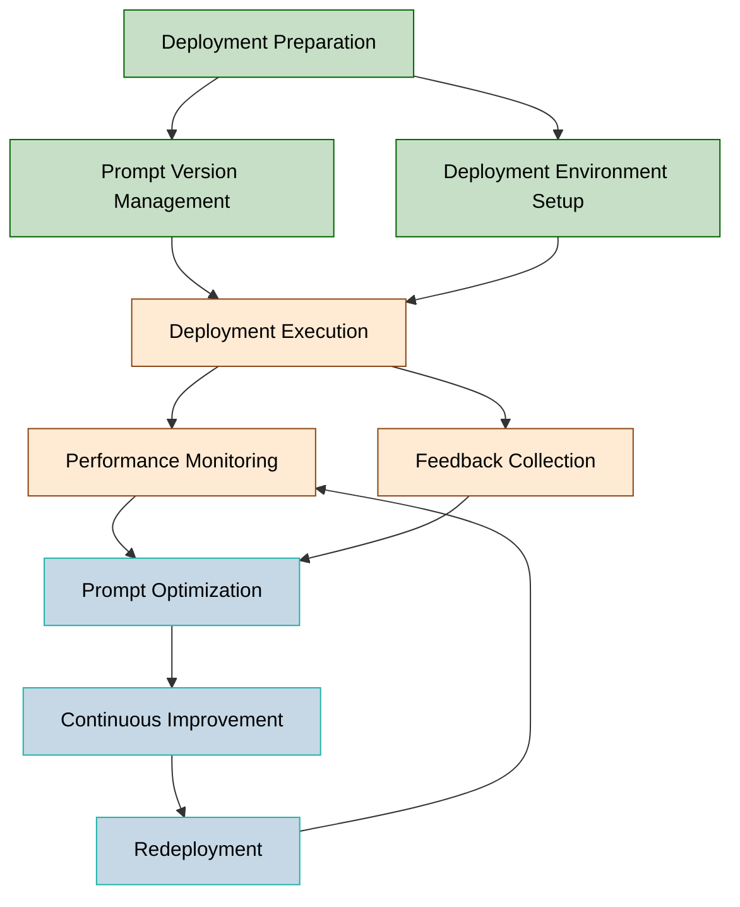

# Prompt-driven Development (PDD): Deployment & Maintenance Phase

**Document Number**: MTD-008  
**Version**: 1.0.0  
**Date**: 2025-05-26  
**Author**: Methodology Team  
**Status**: Approved

## Table of Contents

1. [Overview](#overview)
2. [Deployment & Maintenance Phase Workflow Diagram](#deployment--maintenance-phase-workflow-diagram)
3. [Key Deliverables](#key-deliverables)
4. [Roles & Responsibilities](#roles--responsibilities)
5. [Deployment Process Details](#deployment-process-details)
   1. [Deployment Preparation](#1-deployment-preparation)
   2. [Prompt Version Management](#2-prompt-version-management)
   3. [Deployment Environment Setup](#3-deployment-environment-setup)
   4. [Deployment Execution](#4-deployment-execution)
6. [Maintenance Process Details](#maintenance-process-details)
   1. [Performance Monitoring](#1-performance-monitoring)
   2. [Feedback Collection](#2-feedback-collection)
   3. [Prompt Optimization](#3-prompt-optimization)
   4. [Continuous Improvement](#4-continuous-improvement)
7. [Deployment & Maintenance Strategies](#deployment--maintenance-strategies)
8. [Prompt Version Management Best Practices](#prompt-version-management-best-practices)
9. [Prompt Maintenance Tools & Frameworks](#prompt-maintenance-tools--frameworks)
10. [Rollback & Disaster Recovery Strategies](#rollback--disaster-recovery-strategies)
11. [Conclusion](#conclusion)
12. [References](#references)

---

## Overview

The deployment & maintenance phase in Prompt-driven Development (PDD) covers the process of delivering developed prompts and related systems to the operational environment and continuously improving them. This phase follows the principles of traditional software deployment and maintenance, while also including additional activities and considerations unique to prompt engineering.

## Deployment & Maintenance Phase Workflow Diagram

## Key Deliverables

| Category | Activity | Task | Deliverable | Required |
|----------|----------|------|------------|----------|
| **Deployment** | Deployment Preparation | Release Planning | Release Plan | Required |
| **Deployment** | Deployment Preparation | Deployment Checklist | Deployment Checklist | Required |
| **Deployment** | Prompt Version Management | Prompt Version Documentation | Prompt Version Doc | Required |
| **Deployment** | Prompt Version Management | Change Log Creation | Change Log | Required |
| **Deployment** | Deployment Environment Setup | Infrastructure Setup | Infrastructure Doc | Required |
| **Deployment** | Deployment Environment Setup | Security Configuration | Security Config Doc | Required |
| **Deployment** | Deployment Execution | Deployment Script Creation | Deployment Script | Recommended |
| **Deployment** | Deployment Execution | Deployment Verification | Deployment Verification Report | Required |
| **Maintenance** | Performance Monitoring | Monitoring System Setup | Monitoring Dashboard | Required |
| **Maintenance** | Performance Monitoring | Performance Metrics Collection | Performance Report | Required |
| **Maintenance** | Feedback Collection | User Feedback System Setup | Feedback Collection System | Recommended |
| **Maintenance** | Feedback Collection | Feedback Analysis | Feedback Analysis Report | Recommended |
| **Maintenance** | Prompt Optimization | Prompt Improvement | Improved Prompt | Required |
| **Maintenance** | Prompt Optimization | A/B Testing | A/B Test Results | Recommended |
| **Maintenance** | Continuous Improvement | Improvement Planning | Improvement Roadmap | Required |
| **Maintenance** | Continuous Improvement | Model Update Response | Model Compatibility Report | Required |

## Roles & Responsibilities

| Role Group | Role Name | Role Details |
|------------|-----------|-------------|
| **Deployment Manager** | PDD Deployment Manager | - Establish and coordinate deployment plans - Supervise deployment process - Manage deployment risks - Oversee deployment approval process |
| **Infrastructure Engineer** | Prompt Infrastructure Engineer | - Set up and manage deployment environment - Define infrastructure requirements - Plan for scalability - Configure infrastructure security |
| **Monitoring Specialist** | Performance Monitoring Specialist | - Build monitoring systems - Set alert thresholds - Analyze performance metrics - Manage monitoring dashboards |
| **Prompt Maintainer** | Prompt Maintenance Engineer | - Manage prompt versions - Plan prompt updates - Diagnose and resolve issues - Optimize prompts |
| **User Experience Analyst** | UX Feedback Analyst | - Manage user feedback collection systems - Analyze feedback data - Propose improvements - Measure user satisfaction |
| **System Administrator** | PDD System Administrator | - Manage system availability - Establish backup and recovery strategies - Monitor service level agreements (SLA) - Respond to and manage incidents |

## Deployment Process Details

### 1. Deployment Preparation

This stage covers all preparatory work for stable deployment of prompt-based systems.

**Key Activities:**

1. **Release Planning**
   - Define deployment schedule and milestones
   - Identify stakeholders
   - Establish rollback and contingency plans

2. **Deployment Checklist Creation**
   - Define pre-deployment verification items
   - Set essential quality criteria and metrics
   - Define approval process

3. **Risk Assessment**
   - Identify potential deployment risks
   - Develop mitigation strategies
   - Prioritize risks

**Inputs/Outputs:**
- **Inputs:** Test reports, quality metrics, prompt documentation
- **Outputs:** Release plan, deployment checklist, risk assessment doc

**Quality Criteria:**
- All required tests passed
- Security assessment completed
- Performance requirements met
- Stakeholder approval obtained

### 2. Prompt Version Management

Prompt version management systematically tracks and manages prompt updates and changes.

**Key Activities:**

1. **Prompt Version Documentation**
   - Define version numbering scheme (e.g., x.y.z)
   - Manage prompt sets by version
   - Build and manage version repository

2. **Change Log Creation**
   - Record detailed changes for each version
   - Document improvements and fixes
   - Identify affected features

3. **Version Compatibility Verification**
   - Check compatibility with previous versions
   - Verify integration points
   - Create migration guides

**Inputs/Outputs:**
- **Inputs:** Previous prompt versions, developed prompt improvements
- **Outputs:** Prompt version doc, change log, compatibility report

**Quality Criteria:**
- Clear version numbering scheme
- Detailed change history
- Easily accessible version repository
- Ability to roll back to previous versions

### 3. Deployment Environment Setup

This process prepares the infrastructure and technical environment for operating prompt-based systems.

**Key Activities:**

1. **Infrastructure Setup**
   - Provision servers and cloud resources
   - Configure network and storage
   - Implement scalability and high availability design

2. **Security Configuration**
   - Set up access control mechanisms
   - Configure data encryption
   - Build security monitoring systems

3. **Integration Setup**
   - Configure integration with external systems
   - Set up API gateways
   - Define data flows

**Inputs/Outputs:**
- **Inputs:** Infrastructure requirements, security policies, architecture docs
- **Outputs:** Infrastructure doc, security config doc, integration setup guide

**Quality Criteria:**
- Infrastructure automation implemented
- Security best practices followed
- Scalability and performance requirements met
- Disaster recovery mechanisms verified

### 4. Deployment Execution

This is the process of applying the prepared prompt system to the operational environment.

**Key Activities:**

1. **Deployment Script Creation**
   - Develop automated deployment scripts
   - Prepare rollback scripts
   - Define deployment order and dependencies

2. **Phased Deployment**
   - Apply canary or blue/green deployment strategies
   - Limit initial deployment to a subset of users
   - Gradually increase traffic

3. **Deployment Verification**
   - Verify functionality after deployment
   - Check performance and security
   - Confirm integration points

**Inputs/Outputs:**
- **Inputs:** Deployment plan, prompt package, infrastructure setup
- **Outputs:** Deployment logs, deployment verification report, live system

**Quality Criteria:**
- Achieve zero-downtime deployment
- All post-deployment verifications passed
- Rollback capability ensured
- Transparent documentation of deployment process

## Maintenance Process Details

### 1. Performance Monitoring

Performance monitoring continuously observes the operational status and performance of deployed prompt-based systems.

**Key Activities:**

1. **Monitoring System Setup**
   - Define and collect performance metrics
   - Develop monitoring dashboards
   - Configure alerting systems

2. **Performance Metrics Collection**
   - Collect technical metrics (response time, throughput, error rate)
   - Measure AI quality metrics (accuracy, relevance)
   - Track user satisfaction and business metrics

3. **Anomaly Detection & Response**
   - Implement abnormal pattern detection algorithms
   - Set up automated response mechanisms
   - Define escalation paths

**Inputs/Outputs:**
- **Inputs:** System logs, user interaction data, performance data
- **Outputs:** Performance dashboard, performance report, alert logs

**Quality Criteria:**
- Real-time monitoring implemented
- Visibility of key metrics ensured
- Rapid issue detection and alerting
- Ability to analyze historical data

### 2. Feedback Collection

Feedback collection systematically gathers opinions from users and stakeholders for system improvement.

**Key Activities:**

1. **User Feedback System Setup**
   - Implement inline feedback mechanisms
   - Design regular user surveys
   - Plan user testing sessions

2. **Feedback Analysis**
   - Analyze qualitative and quantitative feedback
   - Identify key improvement points and patterns
   - Apply prioritization frameworks

3. **Stakeholder Communication**
   - Build channels for sharing feedback results
   - Communicate improvement plans
   - Report actions taken to feedback providers

**Inputs/Outputs:**
- **Inputs:** User feedback, stakeholder opinions, system usage data
- **Outputs:** Feedback analysis report, improvement proposals, communication materials

**Quality Criteria:**
- Feedback collected from diverse user groups
- Unbiased analysis methodology
- Actionable insights derived from feedback
- Completed feedback loop (feedback→improvement→confirmation)

### 3. Prompt Optimization

Prompt optimization improves prompt performance and quality based on collected data and feedback.

**Key Activities:**

1. **Prompt Improvement**
   - Revise prompts to address identified issues
   - Reconstruct prompts for better performance
   - Expand prompts to support new use cases

2. **A/B Testing**
   - Design alternative prompt variants
   - Conduct controlled comparison tests
   - Analyze statistically significant results

3. **Optimization Documentation**
   - Record optimization process and decisions
   - Measure and document performance improvements
   - Extract optimization patterns and lessons learned

**Inputs/Outputs:**
- **Inputs:** Performance data, feedback analysis, current prompts
- **Outputs:** Improved prompts, A/B test results, optimization docs

**Quality Criteria:**
- Measurable performance improvement
- Systematic testing methodology
- Clear rationale for optimization decisions
- Minimized side effects of changes

### 4. Continuous Improvement

Continuous improvement ensures long-term evolution and adaptation of prompt-based systems to changing requirements.

**Key Activities:**

1. **Improvement Planning**
   - Set short- and long-term improvement goals
   - Develop prioritized improvement roadmap
   - Allocate resources and schedule

2. **Model Update Response**
   - Monitor updates to underlying AI models
   - Test compatibility with new versions
   - Adjust prompts for model changes

3. **Adoption of Trends & New Technologies**
   - Track prompt engineering trends
   - Evaluate new technologies and methodologies
   - Pilot innovative approaches

**Inputs/Outputs:**
- **Inputs:** Performance trends, industry trends, model update info
- **Outputs:** Improvement roadmap, model compatibility report, innovation pilot results

**Quality Criteria:**
- Clear improvement direction
- Data-driven decision making
- Agile response to model changes
- Culture of continuous learning and innovation

## Deployment & Maintenance Strategies

### Deployment Strategies

The optimal deployment strategy for prompt-based systems depends on system scale, criticality, and user base. Key strategies include:

#### 1. Blue/Green Deployment
- **Description:** Prepare two identical environments (blue and green), one hosting the current version and the other the new version, enabling rapid traffic switching
- **When to Use:** Zero-downtime updates for critical systems, fast rollback required
- **Advantages:** No downtime, fast rollback, full testing possible
- **Considerations:** Extra infrastructure cost, data sync complexity

#### 2. Canary Deployment
- **Description:** Gradually expose the new version to a small subset of users or traffic while monitoring
- **When to Use:** Safely deploy to large user bases, measure real user response
- **Advantages:** Minimized risk, real-world validation, incremental issue detection
- **Considerations:** Longer deployment period, multiple versions in operation

#### 3. Phased Rollout
- **Description:** Deploy new version by region, user group, or feature in stages
- **When to Use:** Global services, diverse user groups
- **Advantages:** Risk management, regional optimization, efficient resource use
- **Considerations:** Complex coordination, multiple versions over time

#### 4. Shadow Deployment
- **Description:** Send real traffic to both current and new systems, but only the current system responds; new system's responses are logged
- **When to Use:** High-risk changes, uncertain performance impact
- **Advantages:** Zero-risk real-world testing, accurate performance comparison
- **Considerations:** Extra infrastructure cost, complex setup, data processing load

### Maintenance Models

Prompt-based system maintenance combines traditional software maintenance models with prompt-specific elements:

#### 1. Planned Maintenance
- **Periodic Prompt Review:** Regularly review prompt performance and relevance
- **Model Version Upgrades:** Planned upgrades of underlying AI models and compatibility assurance
- **Prompt Library Cleanup:** Remove duplicates and deprecated prompts, optimize library

#### 2. Adaptive Maintenance
- **Model Drift Response:** Monitor and adjust for changes in model behavior over time
- **Usage Pattern Adaptation:** Optimize prompts for changing user behavior
- **Context Update:** Update prompt context for evolving business environment

#### 3. Preventive Maintenance
- **Vulnerability Scanning:** Regularly check for security vulnerabilities and prompt injection risks
- **Performance Benchmarking:** Periodic benchmarking to detect performance degradation early
- **Capacity Planning:** Plan infrastructure expansion for increasing usage

#### 4. Corrective Maintenance
- **Prompt Error Fixes:** Immediately resolve identified prompt issues
- **Exception Handling Improvement:** Strengthen handling of unexpected inputs
- **Urgent Security Patches:** Address prompt security vulnerabilities promptly

## Prompt Version Management Best Practices

Prompt version management is a core element of the deployment & maintenance phase in PDD. Best practices include:

### Version Control System

1. **Adopt Semantic Versioning**
   - Use MAJOR.MINOR.PATCH format (e.g., 2.3.1)
   - MAJOR: Breaking changes
   - MINOR: Backward-compatible feature additions
   - PATCH: Bug fixes and optimizations

2. **Utilize Version Control Tools**
   - Use Git or dedicated prompt repository systems
   - Define branching strategies (e.g., main, develop, feature)
   - Automate tagging and release management

3. **Include Prompt Metadata**
   - Version number and date
   - Author and reviewer
   - Compatible model version
   - Purpose and usage context

### Change Management Process

1. **Change Request Process**
   - Standardized change request forms
   - Change impact assessment procedures
   - Approval workflow and responsibility assignment

2. **Code Review Process**
   - Multiple reviewers for prompt changes
   - Check for standards and guideline compliance
   - Review performance and security impact

3. **Change Documentation**
   - Maintain detailed change logs
   - Document rationale and expected outcomes
   - Link to related test results

## Prompt Maintenance Tools & Frameworks

Specialized tools and frameworks for efficient PDD maintenance:

### 1. Prompt Management Systems
- **Promptflow (Microsoft):** Workflow management and deployment for prompts
- **LangChain:** Prompt chain and template management
- **PromptTools:** Prompt testing and version management

### 2. Monitoring Tools
- **Prompt Observability Platforms:** Monitor prompt performance and usage patterns
- **AI Dashboards:** Visualize quality and performance metrics for LLM-based systems
- **Log Analysis Tools:** Detect failure patterns and anomalies

### 3. Optimization Frameworks
- **A/B Testing Platforms:** Compare prompt variants
- **Automated Prompt Optimization Tools:** Auto-tune based on performance metrics
- **Prompt Benchmarking Tools:** Evaluate prompt performance under various conditions

## Rollback & Disaster Recovery Strategies

Strategies to ensure the stability of prompt-based systems:

### Rollback Strategies

1. **Automated Rollback Mechanisms**
   - Auto-rollback based on performance thresholds
   - Automated rollback scripts
   - Rollback testing and verification procedures

2. **Partial Rollback Options**
   - Roll back only specific prompt sets
   - Switch only certain user groups to previous versions
   - Plan phased rollback

3. **Rollback Decision Matrix**
   - Define rollback criteria and responsible parties
   - Set rollback thresholds and metrics
   - Plan post-rollback follow-up actions

### Disaster Recovery Strategies

1. **Backup & Recovery Procedures**
   - Regular backup of prompt libraries
   - Multi-region backup strategies
   - Define Recovery Time Objective (RTO) and Recovery Point Objective (RPO)

2. **Emergency Response Plans**
   - Procedures for various service outage scenarios
   - Escalation matrix
   - Communication plan

3. **Fallback Service Options**
   - Fallback mechanisms and alternative prompt sets
   - Prioritize critical functions
   - Manual processing options

## Conclusion

The deployment & maintenance phase is a critical factor in the success of Prompt-driven Development. By following the systematic approaches presented in this document, you can ensure the stability, performance, and continuous improvement of prompt-based systems.

Effective deployment strategies, systematic monitoring, continuous feedback collection, and prompt optimization will strengthen prompt-based systems over time and maximize business value.

## References

1. Microsoft (2025), "Prompt flow in Azure AI Foundry portal"
2. Google Cloud (2025), "Google Cloud Next 2025: AI Application Infrastructure Design and Deployment"
3. Andrew Miller (2025), "Prompt-driven Development: The shift from syntax fluency to architectural understanding"
4. Raghubir Bose (2025), "Vibe Coding: Redefining Enterprise Development with PromptOps"
5. MIT News (2025), "Explained: Generative AI's environmental impact and deployment considerations"
