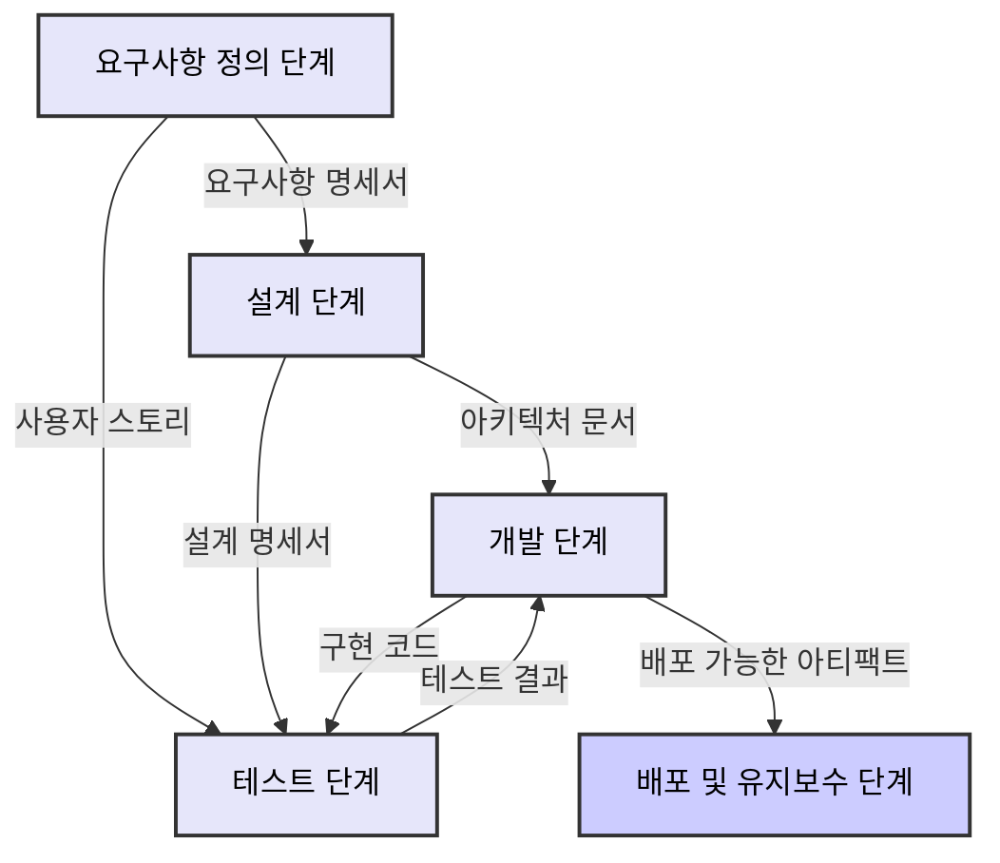

# 프롬프트 기반 개발방법론(PDD) - 세부 내용

**문서 번호**: MTD-014  
**버전**: 1.0.0  
**작성일**: 2025-05-26  
**작성자**: 방법론 팀  
**상태**: 승인됨

## 목차

1. [개요](#개요)
2. [공통 구성 요소](#공통-구성-요소)
3. [요구사항 정의 단계](4.1.prompt-driven-development-methodology-details-requirements.md)
4. [설계 단계](4.2.prompt-driven-development-methodology-details-design.md)
5. [개발 단계](4.3.prompt-driven-development-methodology-details-development.md)
6. [테스트 단계](4.4.prompt-driven-development-methodology-details-testing.md)
7. [배포 및 유지보수 단계](4.5.prompt-driven-development-methodology-details-deployment.md)

---

이 문서는 프롬프트 기반 개발방법론(PDD)의 각 단계별 세부 내용을 설명합니다. 소프트웨어 개발 생명주기의 각 단계에서 PDD를 적용하는 방법, 사용되는 프롬프트 패턴, 주요 고려사항 및 모범 사례를 다룹니다.

## 개요

PDD 세부 내용은 소프트웨어 개발 생명주기의 주요 단계에 따라 구성되어 있으며, 각 단계는 별도의 문서로 상세히 설명됩니다:

1. [요구사항 정의 단계](4.1.prompt-driven-development-methodology-details-requirements.md)
2. [설계 단계](4.2.prompt-driven-development-methodology-details-design.md)
3. [개발 단계](4.3.prompt-driven-development-methodology-details-development.md)
4. [테스트 단계](4.4.prompt-driven-development-methodology-details-testing.md)
5. [배포 및 유지보수 단계](4.5.prompt-driven-development-methodology-details-deployment.md)

각 단계에서는 PDD의 적용 방식에 초점을 맞추고, 기존 개발 방법론과의 주요 차이점을 강조하며, 실무 적용을 위한 구체적인 지침을 제공합니다.

## 공통 구성 요소

각 단계별 문서는 다음과 같은 공통 구성 요소를 포함합니다:

1. **단계 개요**: 해당 단계의 목적, 범위, 주요 활동 등을 설명합니다.
2. **주요 활동 및 태스크**: 해당 단계에서 수행해야 할 구체적인 활동과 태스크를 정의합니다.
3. **프롬프트 패턴 및 템플릿**: 해당 단계에서 효과적으로 사용할 수 있는 프롬프트 패턴과 템플릿을 제공합니다.
4. **핵심 산출물**: 해당 단계에서 생성되어야 할 주요 산출물을 정의합니다.
5. **품질 기준 및 체크리스트**: 산출물의 품질을 평가하기 위한 기준과 체크리스트를 제공합니다.
6. **도구 및 기술**: 해당 단계를 효과적으로 수행하기 위한 추천 도구와 기술을 소개합니다.
7. **사례 연구**: 실제 프로젝트에서 해당 단계를 성공적으로 적용한 사례를 공유합니다.
8. **문제 해결 가이드**: 일반적으로 발생할 수 있는 문제와 그 해결 방법을 안내합니다.

## 단계 간 연계

PDD의 각 단계는 독립적으로 적용될 수 있지만, 최대의 효과를 위해서는 단계 간의 연계가 중요합니다. 다음 다이어그램은 각 단계 간의 정보 흐름과 연계를 보여줍니다:

각 단계는 이전 단계의 산출물을 입력으로 받아 처리하고, 그 결과를 다음 단계로 전달합니다. 이러한 연속적인 흐름은 AI 생성 결과물의 일관성과 품질을 보장하는 데 중요합니다.

## 단계별 핵심 질문

각 단계에서 팀은 다음과 같은 핵심 질문을 스스로에게 물어봄으로써 PDD의 효과적인 적용을 확인할 수 있습니다:

### 요구사항 정의 단계
- 요구사항이 명확하고 측정 가능하게 정의되었는가?
- AI를 통해 도출된 추가 요구사항이 비즈니스 목표와 일치하는가?
- 이해관계자의 다양한 관점이 요구사항에 적절히 반영되었는가?

### 설계 단계
- 설계가 요구사항을 충족시키는가?
- AI가 제안한 아키텍처 패턴이 시스템 특성에 적합한가?
- 설계가 확장성, 유지보수성, 보안 등의 품질 속성을 충족하는가?

### 개발 단계
- AI 생성 코드가 설계 명세에 부합하는가?
- 생성된 코드가 코딩 표준 및 모범 사례를 준수하는가?
- 개발자와 AI 간의 협업이 효과적으로 이루어지고 있는가?

### 테스트 단계
- AI 생성 테스트가 요구사항과 기능을 적절히 검증하는가?
- 테스트 커버리지가 충분한가?
- 발견된 결함이 효과적으로 추적되고 해결되는가?

### 배포 및 유지보수 단계
- 배포 프로세스가 자동화되고 신뢰할 수 있는가?
- 시스템 모니터링이 적절히 설정되었는가?
- 유지보수 및 개선 작업이 효율적으로 수행되는가?

## 적용 범위 설정

PDD는 소프트웨어 개발 생명주기의 모든 단계에 적용할 수 있으며, 프로젝트의 특성과 조직의 준비도에 따라 선택적으로 적용할 수 있습니다.

### 개발 단계별 적용 범위

| 개발 단계 | PDD 적용 사례 | 적용 난이도 | 기대 효과 |
|---------|------------|-----------|---------|
| **요구사항 정의** | - 요구사항 명세서 자동 생성 - 사용자 스토리 구체화 - 요구사항 불일치 탐지 | ★★☆☆☆ | 높음 |
| **설계** | - 아키텍처 패턴 추천 - 인터페이스 설계 지원 - 데이터 모델 생성 | ★★★☆☆ | 높음 |
| **개발** | - 코드 자동 생성 - 리팩토링 제안 - 코드 최적화 | ★★★★☆ | 매우 높음 |
| **테스트** | - 테스트 케이스 생성 - 커버리지 분석 - 버그 예측 | ★★★☆☆ | 높음 |
| **배포** | - 배포 스크립트 생성 - 인프라 구성 자동화 - 롤백 계획 수립 | ★★☆☆☆ | 중간 |
| **유지보수** | - 코드 문서화 - 레거시 코드 분석 - 업그레이드 경로 추천 | ★★★★★ | 높음 |

### 프로젝트 유형별 적용 적합성

각 프로젝트 유형에 따른 PDD의 적합성은 다음과 같습니다:

1. **웹 애플리케이션**
   - 적합성: 매우 높음
   - 주요 영역: 풀스택 개발, API 설계, 프론트엔드 컴포넌트

2. **모바일 앱**
   - 적합성: 높음
   - 주요 영역: UI/UX, 백엔드 통합, 네이티브 기능 연동

3. **데이터 분석/ML**
   - 적합성: 매우 높음
   - 주요 영역: 데이터 처리 파이프라인, 모델링, 특성 공학

4. **임베디드 시스템**
   - 적합성: 중간
   - 주요 영역: 설계, 시뮬레이션, 인터페이스 정의

5. **엔터프라이즈 시스템**
   - 적합성: 높음
   - 주요 영역: 시스템 통합, 마이그레이션, 워크플로우 자동화

### 조직 준비도에 따른 적용 단계

1. **탐색 단계**
   - 소규모 파일럿 프로젝트 진행
   - 개발자 교육 및 인식 제고
   - AI 도구 및 인프라 검토

2. **부분 적용 단계**
   - 특정 개발 단계에 PDD 적용 (예: 코드 생성, 테스트)
   - 성공 지표 모니터링 및 피드백 수집
   - 프로세스 최적화

3. **통합 단계**
   - 개발 워크플로우 전반에 PDD 통합
   - 개발 방법론 및 거버넌스 조정
   - 조직 전체로 모범 사례 확산

4. **혁신 단계**
   - AI와 개발자 간 시너지 극대화
   - 고유한 PDD 패턴 및 사례 개발
   - 지속적 개선 및 적응

## 다음 단계

각 개발 단계에 대한 상세 정보는 해당 단계별 문서를 참조하십시오. 각 문서는 해당 단계에서 PDD를 성공적으로 적용하기 위한 구체적인 지침, 템플릿, 예시 및 체크리스트를 제공합니다.

- [요구사항 정의 단계](4.1.prompt-driven-development-methodology-details-requirements.md)
- [설계 단계](4.2.prompt-driven-development-methodology-details-design.md)
- [개발 단계](4.3.prompt-driven-development-methodology-details-development.md)
- [테스트 단계](4.4.prompt-driven-development-methodology-details-testing.md)
- [배포 및 유지보수 단계](4.5.prompt-driven-development-methodology-details-deployment.md)
