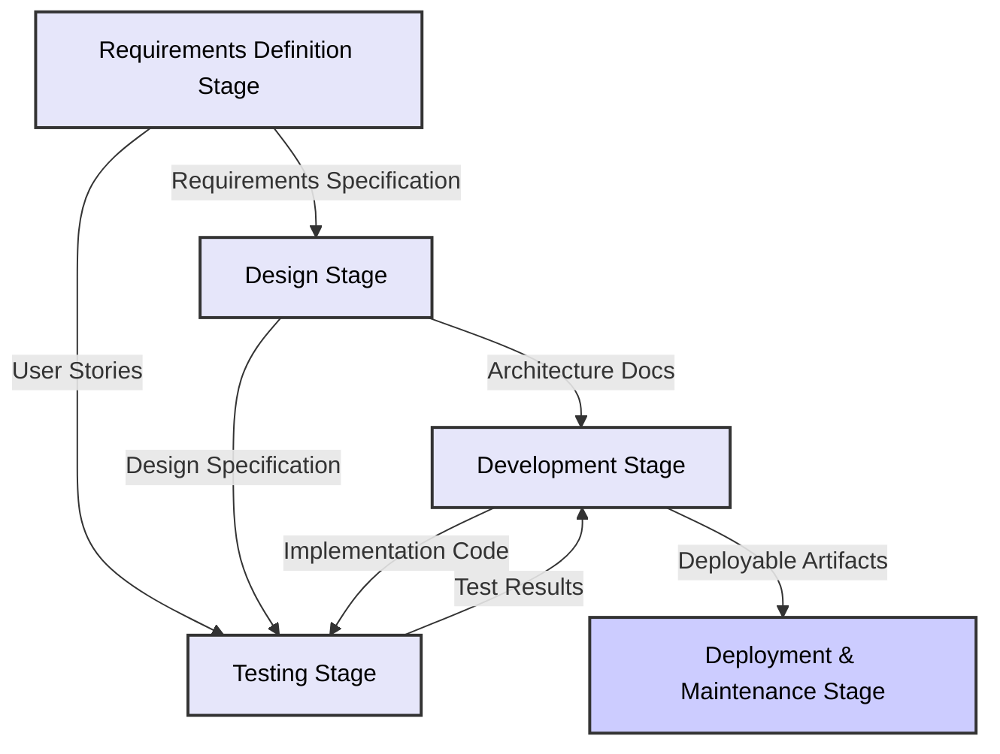

# Prompt-driven Development Methodology (PDD) - Detailed Stages

**Document Number**: MTD-014  
**Version**: 1.0.0  
**Date**: 2025-05-26  
**Author**: Methodology Team  
**Status**: Approved

## Table of Contents

1. [Overview](#overview)
2. [Common Structural Elements](#common-structural-elements)
3. [Requirements Definition Stage](4.1.prompt-driven-development-methodology-details-requirements.md)
4. [Design Stage](4.2.prompt-driven-development-methodology-details-design.md)
5. [Development Stage](4.3.prompt-driven-development-methodology-details-development.md)
6. [Testing Stage](4.4.prompt-driven-development-methodology-details-testing.md)
7. [Deployment & Maintenance Stage](4.5.prompt-driven-development-methodology-details-deployment.md)

---

This document explains the detailed contents of each stage in the Prompt-driven Development Methodology (PDD). It covers how to apply PDD at each stage of the software development lifecycle, the prompt patterns used, key considerations, and exemplary cases.

## Overview

The detailed contents of PDD are organized according to the main stages of the software development lifecycle. Each stage is described in detail in a separate document:

1. [Requirements Definition Stage](4.1.prompt-driven-development-methodology-details-requirements.md)
2. [Design Stage](4.2.prompt-driven-development-methodology-details-design.md)
3. [Development Stage](4.3.prompt-driven-development-methodology-details-development.md)
4. [Testing Stage](4.4.prompt-driven-development-methodology-details-testing.md)
5. [Deployment & Maintenance Stage](4.5.prompt-driven-development-methodology-details-deployment.md)

Each stage focuses on the application of PDD, highlights the main differences from traditional development methodologies, and provides practical guidelines for implementation.

## Common Structural Elements

Each stage document includes the following common structural elements:

1. **Stage Overview**: Describes the purpose, scope, and main activities of the stage.
2. **Key Activities & Tasks**: Defines the core activities and tasks to be performed in the stage.
3. **Prompt Patterns & Templates**: Provides prompt patterns and templates that can be effectively used in the stage.
4. **Key Deliverables**: Specifies the main deliverables to be produced in the stage.
5. **Quality Criteria & Checklists**: Offers criteria and checklists for evaluating the quality of deliverables.
6. **Tools & Techniques**: Introduces recommended tools and techniques for effective execution.
7. **Case Studies**: Shares real-world examples of successful application in projects.
8. **Problem-Solving Guides**: Presents common issues and solutions.

## Stage Interconnections

While each PDD stage can be applied independently, maximizing effectiveness requires careful connection between stages. The following diagram illustrates the flow and relationships between stages:

Each stage receives the outputs of the previous stage as inputs, processes them, and passes the results to the next stage. This continuity is crucial for maintaining consistency and quality in AI-generated artifacts.

## Key Questions by Stage

At each stage, the team should ask the following key questions to ensure effective application of PDD:

### Requirements Definition Stage
- Are the requirements clearly and concretely defined?
- Do the additional requirements generated by AI align with business goals?
- Are the perspectives of various stakeholders appropriately reflected?

### Design Stage
- Does the design satisfy all requirements?
- Are the AI-generated architecture patterns suitable for the system?
- Does the design meet quality attributes such as scalability, maintainability, and security?

### Development Stage
- Does the AI-generated code conform to the design specifications?
- Does the code meet coding standards and exemplary cases?
- Is collaboration between developers and AI effective?

### Testing Stage
- Do AI-generated tests adequately verify requirements and functionality?
- Is test coverage sufficient?
- Are detected defects effectively tracked and resolved?

### Deployment & Maintenance Stage
- Is the deployment process automated and reliable?
- Are system monitoring settings appropriate?
- Are maintenance and improvement activities performed efficiently?

## Scope of Application

PDD can be applied to all stages of the software development lifecycle and can be selectively applied depending on the project's characteristics and organizational readiness.

### Application Scope by Development Stage

| Stage | Example PDD Applications | Difficulty | Expected Effect |
|---------|------------------------|------------|----------------|
| **Requirements Definition** | - Automated requirements specification - User story structuring - Requirements inconsistency detection | ★★☆☆☆ | High |
| **Design** | - Architecture pattern recommendation - Interface design support - Data model generation | ★★★☆☆ | High |
| **Development** | - Automated code generation - Refactoring suggestions - Code optimization | ★★★★☆ | Very High |
| **Testing** | - Test case generation - Coverage analysis - Bug prediction | ★★★☆☆ | High |
| **Deployment** | - Deployment script generation - Automated infrastructure setup - Rollback planning | ★★☆☆☆ | Medium |
| **Maintenance** | - Code documentation - Legacy code analysis - Upgrade path recommendation | ★★★★★ | High |

### Suitability by Project Type

The suitability of PDD for each project type is as follows:

1. **Web Applications**
   - Suitability: Very High
   - Key Areas: Full-stack development, API design, frontend componentization

2. **Mobile Apps**
   - Suitability: High
   - Key Areas: UI/UX, backend integration, native feature linkage

3. **Data Analysis/ML**
   - Suitability: Very High
   - Key Areas: Data pipeline, modeling, feature engineering

4. **Embedded Systems**
   - Suitability: Medium
   - Key Areas: Design, simulation, interface definition

5. **Enterprise Systems**
   - Suitability: High
   - Key Areas: System integration, migration, workflow automation

### Application by Organizational Readiness

1. **Exploratory Stage**
   - Small pilot projects
   - Developer training and awareness
   - AI tool and infrastructure exploration

2. **Partial Application Stage**
   - Applying PDD to specific development stages (e.g., code generation, testing)
   - Collecting success metrics and feedback
   - Process optimization

3. **Integration Stage**
   - Integrating PDD throughout the development workflow
   - Adjusting methodologies and governance
   - Expanding best practices organization-wide

4. **Innovation Stage**
   - Radical synergy between AI and developers
   - Developing proprietary PDD patterns and cases
   - Continuous improvement and adaptation

## Next Stages

For detailed information on each development stage, refer to the respective stage documents. Each document provides structured guidelines, templates, examples, and checklists for successful PDD application.

- [Requirements Definition Stage](4.1.prompt-driven-development-methodology-details-requirements.md)
- [Design Stage](4.2.prompt-driven-development-methodology-details-design.md)
- [Development Stage](4.3.prompt-driven-development-methodology-details-development.md)
- [Testing Stage](4.4.prompt-driven-development-methodology-details-testing.md)
- [Deployment & Maintenance Stage](4.5.prompt-driven-development-methodology-details-deployment.md)
