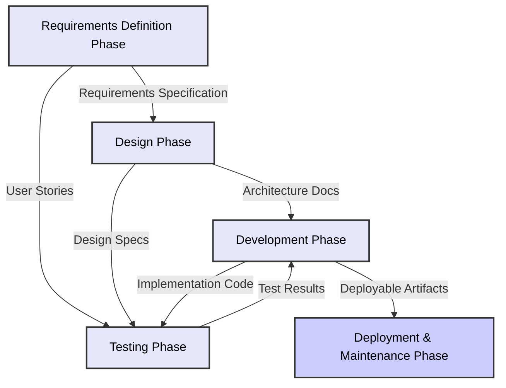

# Prompt-driven Development (PDD) - Detailed Contents

## Table of Contents

1. [Overview](#overview)
2. [Common Structural Elements](#common-structural-elements)
3. [Requirements Definition Phase](4.1.prompt-driven-development-methodology-details-requirements.md)
4. [Design Phase](4.2.prompt-driven-development-methodology-details-design.md)
5. [Development Phase](4.3.prompt-driven-development-methodology-details-development.md)
6. [Testing Phase](4.4.prompt-driven-development-methodology-details-testing.md)
7. [Deployment & Maintenance Phase](4.5.prompt-driven-development-methodology-details-deployment.md)

---

This document describes the detailed contents of each phase of the Prompt-driven Development (PDD) methodology. It covers how to apply PDD at each stage of the software development life cycle, the prompt patterns used, key considerations, and best practices.

## Overview

The detailed contents of PDD are organized by the main phases of the software development life cycle, and each phase is explained in a separate document:

1. [Requirements Definition Phase](4.1.prompt-driven-development-methodology-details-requirements.md)
2. [Design Phase](4.2.prompt-driven-development-methodology-details-design.md)
3. [Development Phase](4.3.prompt-driven-development-methodology-details-development.md)
4. [Testing Phase](4.4.prompt-driven-development-methodology-details-testing.md)
5. [Deployment & Maintenance Phase](4.5.prompt-driven-development-methodology-details-deployment.md)

Each phase focuses on the application of PDD, highlights key differences from traditional methodologies, and provides structured guidance for practical implementation.

## Common Structural Elements

Each phase document includes the following common elements:

1. **Phase Overview**: Purpose, scope, and main activities of the phase.
2. **Key Activities & Tasks**: Concrete activities and tasks to be performed in the phase.
3. **Prompt Patterns & Templates**: Effective prompt patterns and templates for the phase.
4. **Key Deliverables**: Main outputs to be produced in the phase.
5. **Quality Criteria & Checklists**: Criteria and checklists for evaluating deliverables.
6. **Tools & Techniques**: Recommended tools and techniques for effective execution.
7. **Case Studies**: Real-world examples of successful application.
8. **Problem-Solving Guide**: Common issues and solutions.

## Inter-phase Linkage

Each phase can be applied independently, but for maximum effectiveness, the linkage between phases is important. The following diagram shows the flow and linkage of information between phases:

Each phase receives the outputs of the previous phase as input, processes them, and passes the results to the next phase. This continuous flow ensures consistency and quality of AI-generated outputs.

## Key Questions by Phase

For each phase, the team should ask the following key questions to ensure effective application of PDD:

### Requirements Definition Phase
- Are requirements clearly and concretely defined?
- Do AI-generated additional requirements align with business goals?
- Are the perspectives of all stakeholders appropriately reflected?

### Design Phase
- Does the design satisfy the requirements?
- Are AI-suggested architecture patterns suitable for the system?
- Does the design ensure scalability, maintainability, and security?

### Development Phase
- Does AI-generated code conform to the design specifications?
- Does the code meet coding standards and best practices?
- Is collaboration between developers and AI effective?

### Testing Phase
- Do AI-generated tests adequately verify requirements and functionality?
- Is test coverage sufficient?
- Are detected defects effectively tracked and resolved?

### Deployment & Maintenance Phase
- Is the deployment process automated and reliable?
- Is system monitoring properly configured?
- Are maintenance and improvement activities performed efficiently?

## Scope of Application

PDD can be applied to all stages of the software development life cycle and can be selectively applied depending on the project's characteristics and organizational readiness.

### Application Scope by Development Stage

| Stage | Example PDD Applications | Difficulty | Expected Effect |
|---------|------------------------|------------|----------------|
| **Requirements Definition** | - Automated requirements specification - User story structuring - Requirements inconsistency detection | ★★☆☆☆ | High |
| **Design** | - Architecture pattern recommendation - Interface design support - Data model generation | ★★★☆☆ | High |
| **Development** | - Automated code generation - Refactoring suggestions - Code optimization | ★★★★☆ | Very High |
| **Testing** | - Test case generation - Coverage analysis - Bug prediction | ★★★☆☆ | High |
| **Deployment** | - Deployment script generation - Automated infrastructure setup - Rollback planning | ★★☆☆☆ | Medium |
| **Maintenance** | - Code documentation - Legacy code analysis - Upgrade path recommendation | ★★★★★ | High |

### Suitability by Project Type

The suitability of PDD for each project type is as follows:

1. **Web Applications**
   - Suitability: Very High
   - Key Areas: Full-stack development, API design, frontend componentization

2. **Mobile Apps**
   - Suitability: High
   - Key Areas: UI/UX, backend integration, native feature linkage

3. **Data Analysis/ML**
   - Suitability: Very High
   - Key Areas: Data pipeline, modeling, feature engineering

4. **Embedded Systems**
   - Suitability: Medium
   - Key Areas: Design, simulation, interface definition

5. **Enterprise Systems**
   - Suitability: High
   - Key Areas: System integration, migration, workflow automation

### Application by Organizational Readiness

1. **Exploratory Stage**
   - Small pilot projects
   - Developer training and awareness
   - AI tool and infrastructure exploration

2. **Partial Application Stage**
   - Applying PDD to specific development stages (e.g., code generation, testing)
   - Collecting success metrics and feedback
   - Process optimization

3. **Integration Stage**
   - Integrating PDD throughout the development workflow
   - Adjusting methodologies and governance
   - Expanding best practices organization-wide

4. **Innovation Stage**
   - Radical synergy between AI and developers
   - Developing proprietary PDD patterns and cases
   - Continuous improvement and adaptation

## Next Stages

For detailed information on each development stage, refer to the respective stage documents. Each document provides structured guidelines, templates, examples, and checklists for successful PDD application.

- [Requirements Definition Stage](4.1.prompt-driven-development-methodology-details-requirements.md)
- [Design Stage](4.2.prompt-driven-development-methodology-details-design.md)
- [Development Stage](4.3.prompt-driven-development-methodology-details-development.md)
- [Testing Stage](4.4.prompt-driven-development-methodology-details-testing.md)
- [Deployment & Maintenance Stage](4.5.prompt-driven-development-methodology-details-deployment.md)
