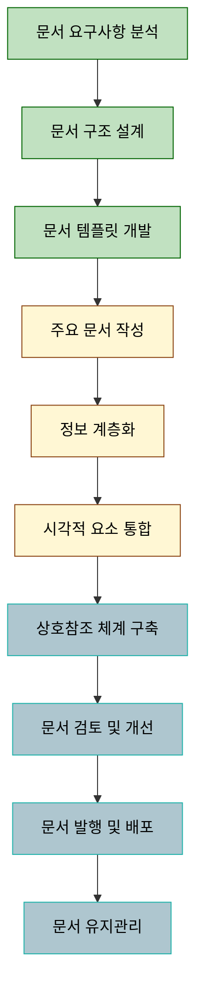
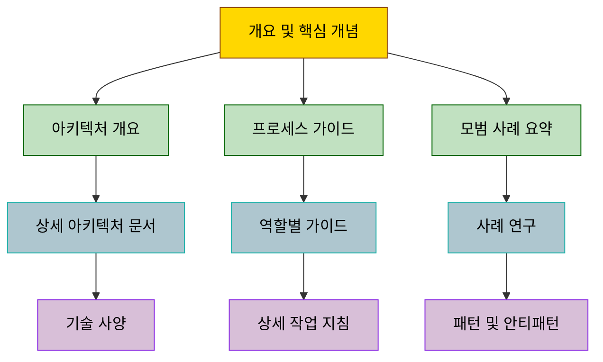
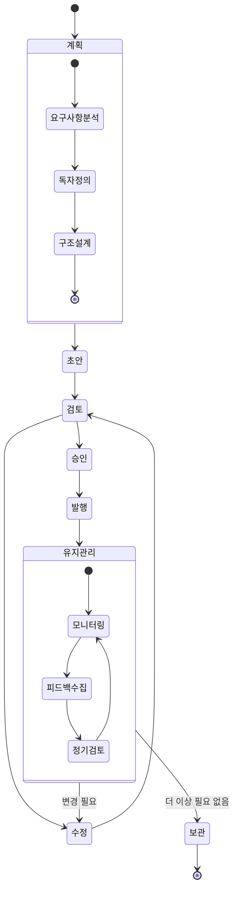

# 프롬프트 기반 개발방법론: 문서 구조화

## 목차

1. [개념 정의](#1-개념-정의)
   1. [문서 구조화의 정의](#11-문서-구조화의-정의)
   2. [문서 구조화의 중요성](#12-문서-구조화의-중요성)
2. [프로세스 설명](#2-프로세스-설명)
   1. [문서 구조화 작업 구성도](#21-문서-구조화-작업-구성도)
   2. [주요 산출물](#22-주요-산출물)
3. [문서 요구사항 분석](#3-문서-요구사항-분석)
4. [문서 구조 설계](#4-문서-구조-설계)
5. [문서 템플릿 개발](#5-문서-템플릿-개발)
6. [주요 문서 작성](#6-주요-문서-작성)
7. [적용 예시](#7-적용-예시)

---

## 1. 개념 정의

### 1.1 문서 구조화의 정의

문서 구조화는 프롬프트 기반 개발방법론(PDD)의 핵심 구성 요소로, 프롬프트, 아키텍처, 코드, 그리고 프로세스에 대한 지식을 효과적으로 조직하고 전달하는 체계적인 접근법입니다.

잘 구조화된 문서는 지식 공유를 촉진하고, 학습 곡선을 완화하며, 프롬프트 기반 시스템의 장기적인 유지 관리와 확장을 지원합니다. 이 문서는 PDD 프로젝트에서 효과적인 문서 구조화를 위한 원칙, 전략 및 모범 사례를 제공합니다.

## 2. 프로세스 설명

### 2.1 문서 구조화 작업 구성도



### 2.2 주요 산출물

| 구분 | Activity | Task | 산출물 | 필수여부 |
|------|----------|------|--------|---------|
| **Documentation** | 문서 요구사항 분석 | 이해관계자 요구사항 식별 | 문서화 요구사항 명세서 | 필수 |
| **Documentation** | 문서 요구사항 분석 | 문서 독자층 분석 | 독자 페르소나 정의 | 권장 |
| **Documentation** | 문서 구조 설계 | 문서 계층 구조 정의 | 문서 구조도 | 필수 |
| **Documentation** | 문서 구조 설계 | 문서 분류 체계 수립 | 문서 분류 체계 | 필수 |
| **Documentation** | 문서 템플릿 개발 | 문서 유형별 템플릿 제작 | 문서 템플릿 세트 | 필수 |
| **Documentation** | 문서 템플릿 개발 | 스타일 가이드 작성 | 문서화 스타일 가이드 | 필수 |
| **Documentation** | 주요 문서 작성 | 프롬프트 문서화 | 프롬프트 라이브러리 | 필수 |
| **Documentation** | 주요 문서 작성 | 아키텍처 문서화 | 아키텍처 문서 | 필수 |
| **Documentation** | 정보 계층화 | 정보 계층 구성 | 계층화된 문서 세트 | 필수 |
| **Documentation** | 정보 계층화 | 접근성 최적화 | 접근성 검증 보고서 | 권장 |
| **Documentation** | 시각적 요소 통합 | 다이어그램 작성 | 다이어그램 라이브러리 | 필수 |
| **Documentation** | 시각적 요소 통합 | 시각화 최적화 | 시각화 가이드라인 | 권장 |
| **Documentation** | 상호참조 체계 구축 | 문서 간 연결 정의 | 문서 상호참조 맵 | 필수 |
| **Documentation** | 상호참조 체계 구축 | 추적성 매트릭스 작성 | 문서 추적성 매트릭스 | 권장 |
| **Documentation** | 문서 검토 및 개선 | 기술적 정확성 검토 | 문서 검토 보고서 | 필수 |
| **Documentation** | 문서 검토 및 개선 | 사용자 피드백 수집 | 피드백 분석 보고서 | 권장 |
| **Documentation** | 문서 발행 및 배포 | 버전 관리 및 발행 | 문서 버전 기록 | 필수 |
| **Documentation** | 문서 발행 및 배포 | 접근 권한 설정 | 문서 접근 정책 | 필수 |
| **Documentation** | 문서 유지관리 | 문서 업데이트 계획 | 문서 유지관리 계획 | 필수 |
| **Documentation** | 문서 유지관리 | 문서 품질 모니터링 | 문서 품질 보고서 | 권장 |

## 3. 문서 요구사항 분석

문서 요구사항 분석은 효과적인 문서화를 위한 첫 번째 단계로, 문서의 목적, 대상 독자, 범위를 명확히 정의하는 과정입니다.

### 역할과 책임

| 역할그룹 | 역할명 | 역할상세 |
|---------|-------|---------|
| **문서화 관리자** | PDD 문서화 책임자 | - 문서화 전략 및 계획 수립<br>- 문서화 표준 및 지침 정의<br>- 문서화 프로세스 감독<br>- 문서 품질 보증 |
| **기술 작성자** | 프롬프트 문서화 전문가 | - 프롬프트 설계 및 사용법 문서화<br>- 기술적 정확성 확보<br>- 사용자 가이드 작성<br>- 문서 업데이트 및 관리 |
| **시각화 전문가** | 다이어그램 및 시각화 담당자 | - 기술적 다이어그램 설계<br>- 복잡한 개념의 시각화<br>- 다이어그램 라이브러리 관리<br>- 시각적 일관성 유지 |
| **지식 아키텍트** | 정보 구조 설계자 | - 문서 구조 및 조직 설계<br>- 정보 계층화 전략 개발<br>- 상호참조 체계 구축<br>- 메타데이터 체계 정의 |
| **품질 검토자** | 문서 품질 검증 담당자 | - 문서 정확성 및 완전성 검토<br>- 가독성 및 사용성 평가<br>- 피드백 수집 및 분석<br>- 개선 권고사항 제공 |
| **사용자 경험 디자이너** | 문서 UX 담당자 | - 문서 사용자 경험 최적화<br>- 사용자 중심 문서 구조 설계<br>- 접근성 및 검색성 개선<br>- 사용자 테스트 진행 |

## 정보 계층화

정보 계층화는 문서의 내용을 구조화하여 다양한 독자층의 필요에 맞게 조직하는 과정입니다. 효과적인 정보 계층화를 통해 독자는 필요한 정보를 적절한 깊이로 쉽게 찾고 이해할 수 있습니다.

### 계층화 원칙

1. **피라미드 구조 적용**
   - 상위 수준에서는 핵심 개념과 요약 정보 제공
   - 하위 수준으로 내려갈수록 상세 정보와 기술적 깊이 증가
   - 독자가 자신의 필요에 따라 적절한 상세 수준 선택 가능

2. **관심사 분리**
   - 개념적, 아키텍처적, 실행적 측면 구분
   - 역할별 필요 정보 분리 (관리자, 개발자, 테스터 등)
   - 독립적으로 이해 가능한 모듈식 문서 단위 구성

3. **점진적 공개**
   - 기본 개념부터 시작하여 복잡한 주제로 점진적 확장
   - "필요 시 알게 되는" 정보 구조 설계
   - 학습 경로를 고려한 지식 구조화

#### 계층 구조 사례

PDD 문서에서 사용할 수 있는 효과적인 정보 계층 구조:



#### 계층별 문서 유형

| 계층 | 문서 유형 | 주요 독자층 | 상세수준 | 목적 |
|-----|---------|------------|---------|-----|
| **L1 - 개요** | 개념 가이드, 간략 소개 | 모든 이해관계자 | 낮음 | 주요 개념 및 가치 전달 |
| **L2 - 프로세스** | 프로세스 가이드, 역할 정의 | 관리자, 팀 리더 | 중간 | 운영 방법 및 구조 설명 |
| **L3 - 적용** | 실무 가이드, 모범 사례 | 실무 수행자 | 중간~높음 | 실제 적용 방법 제공 |
| **L4 - 참조** | API 문서, 프롬프트 라이브러리 | 개발자, 전문가 | 매우 높음 | 상세 기술 정보 제공 |

#### 정보 계층화 모범 사례

1. **일관된 구조 유지**
   - 모든 문서에서 일관된 헤딩 구조 사용
   - 표준화된 섹션 순서 및 구성 유지
   - 예측 가능한 정보 흐름 제공

2. **명확한 네비게이션 제공**
   - 문서 내 목차 및 섹션 링크 제공
   - 계층 간 이동이 쉬운 내비게이션 도구 제공
   - "더 알아보기" 또는 "관련 주제" 섹션 포함

3. **적절한 문서 깊이 설정**
   - 단일 문서의 복잡성 수준 제한
   - 3~4개 이상의 중첩 단계 피하기
   - 필요 시 문서 분할 및 상호 참조

## 5. 문서 템플릿 개발

문서 템플릿 개발은 일관된 문서 형식과 품질을 보장하기 위한 표준화된 틀을 만드는 과정입니다.

### 5.1 시각적 요소 활용

### 다이어그램 유형 및 용도

| 다이어그램 유형 | 주요 용도 | 적용 사례 |
|---------------|---------|---------|
| **흐름도(Flowchart)** | 프로세스 및 의사결정 흐름 시각화 | - PDD 개발 프로세스<br>- 프롬프트 최적화 워크플로<br>- 의사결정 트리 |
| **아키텍처 다이어그램** | 시스템 구조 및 컴포넌트 관계 표현 | - PDD 시스템 아키텍처<br>- 프롬프트-코드 통합 구조<br>- 배포 아키텍처 |
| **시퀀스 다이어그램** | 상호작용 및 시간 순서 시각화 | - 프롬프트 처리 흐름<br>- 사용자-시스템 상호작용<br>- API 호출 순서 |
| **마인드맵** | 개념 간 관계 및 계층 구조 표현 | - 프롬프트 카테고리 맵<br>- 개념 관계도<br>- 지식 구조화 |
| **간트 차트** | 일정 및 타임라인 시각화 | - PDD 프로젝트 일정<br>- 단계별 마일스톤<br>- 릴리스 계획 |
| **매트릭스** | 데이터 비교 및 관계 분석 | - 역할/책임 매트릭스<br>- 프롬프트 성능 비교<br>- 기능/컴포넌트 매핑 |

### 시각적 요소 설계 원칙

1. **목적 중심 설계**
   - 전달하려는 핵심 메시지 명확화
   - 불필요한 시각적 요소 제거
   - 복잡성 수준을 독자에 맞게 조정

2. **일관성 유지**
   - 표준화된 기호 및 색상 체계 사용
   - 유사한 개념에 일관된 시각적 표현 적용
   - 프로젝트 전체에서 일관된 스타일 유지

3. **접근성 고려**
   - 색상 대비 최적화
   - 스크린 리더 호환성 확보
   - 대체 텍스트 및 설명 제공

4. **상호작용성 활용**
   - 확대/축소 가능한 다이어그램
   - 세부 정보 온디맨드 제공
   - 인터랙티브 내비게이션 요소

### Mermaid 다이어그램 활용 지침

마크다운 문서에서 Mermaid를 활용한 다이어그램 생성을 위한 지침:

#### 1. 기본 구문

```markdown
'''mermaid
[다이어그램 유형]
    [다이어그램 내용]
'''
```

#### 2. 주요 다이어그램 유형

- **흐름도**: `flowchart TD` (top-down) 또는 `flowchart LR` (left-right)
- **시퀀스 다이어그램**: `sequenceDiagram`
- **클래스 다이어그램**: `classDiagram`
- **상태 다이어그램**: `stateDiagram`
- **간트 차트**: `gantt`
- **파이 차트**: `pie`

#### 3. 스타일링 예시

```markdown
'''mermaid
flowchart TD
    A[시작] --> B{조건}
    B -->|Yes| C[프로세스 1]
    B -->|No| D[프로세스 2]
    C --> E[종료]
    D --> E
    
    style A fill:#f9f,stroke:#333,stroke-width:2px
    style E fill:#bbf,stroke:#333,stroke-width:2px
'''
```

#### 4. 가독성 향상 팁

- 노드 ID는 의미있게 지정 (A, B 대신 Start, Decision 등)
- 복잡한 다이어그램은 서브그래프로 분리
- 주석을 통해 복잡한 부분 설명
- 다이어그램과 함께 텍스트 설명 제공

### 시각화 모범 사례

1. **목적별 최적 다이어그램 선택**
   - 프로세스 → 흐름도 또는 활동 다이어그램
   - 구조 → 컴포넌트 또는 클래스 다이어그램
   - 시퀀스 → 시퀀스 다이어그램 또는 타임라인

2. **계층적 복잡성 관리**
   - 상위 수준 개요 다이어그램 먼저 제공
   - 필요에 따라 상세 다이어그램으로 확장
   - 복잡한 다이어그램을 논리적 섹션으로 분할

3. **효과적인 레이블링**
   - 명확하고 간결한 레이블 사용
   - 기술 용어에 대한 설명 제공
   - 다이어그램 제목 및 캡션으로 컨텍스트 제공

4. **색상 및 형태 의미적 사용**
   - 의미를 강화하는 방식으로 색상 사용
   - 기능적 그룹에 일관된 색상 체계 적용
   - 형태를 통해 요소 유형 구분 (예: 원=이벤트, 사각형=프로세스)

## 상호참조 체계

상호참조 체계는 문서 간의 관계를 명시적으로 정의하고 연결하여, 관련 정보를 쉽게 탐색하고 전체 시스템을 종합적으로 이해할 수 있게 하는 메커니즘입니다.

### 상호참조 유형

1. **내부 참조**
   - 동일 문서 내 다른 섹션으로의 링크
   - 목차 및 색인을 통한 내비게이션
   - 각주 및 미주를 통한 부가 정보

2. **문서 간 참조**
   - 관련 문서로의 직접 링크
   - "참조" 또는 "관련 문서" 섹션
   - 문서 ID 또는 영구 링크 활용

3. **코드-문서 참조**
   - 문서에서 코드로의 참조
   - 코드 주석에서 문서로의 참조
   - API 문서와 구현 간 연결

4. **프롬프트-결과 참조**
   - 프롬프트와 예상 결과 연결
   - 프롬프트 변형과 응답 변화 매핑
   - 사용 사례와 프롬프트 패턴 연결

### 상호참조 설계 원칙

1. **일관성**
   - 표준화된 참조 형식 및 구문 사용
   - 모든 문서에서 동일한 참조 패턴 유지
   - 명확한 네이밍 및 ID 체계 적용

2. **유지관리성**
   - 자동화된 참조 검증 메커니즘 구현
   - 참조 업데이트 프로세스 정의
   - 깨진 링크 탐지 및 수정 절차

3. **컨텍스트 제공**
   - 참조 이유 및 관련성 설명
   - 참조 대상의 간략한 요약 포함
   - 참조 후 필요한 후속 작업 안내

4. **양방향성**
   - 참조의 양방향 연결 보장
   - 역방향 탐색 가능성 제공
   - 참조 네트워크의 완전성 유지

### 추적성 매트릭스

추적성 매트릭스는 다양한 문서, 요구사항, 설계 요소, 테스트 간의 관계를 체계적으로 매핑하는 도구입니다.

#### 추적성 매트릭스 예시

**요구사항-프롬프트-테스트 추적성 매트릭스**

| 요구사항 ID | 요구사항 설명 | 프롬프트 ID | 프롬프트 설명 | 테스트 ID | 테스트 설명 |
|------------|-------------|------------|------------|----------|------------|
| REQ-001 | 사용자 인증 기능 | PROMPT-101 | 사용자 인증 코드 생성 | TEST-201 | 인증 기능 검증 |
| REQ-002 | 다국어 지원 | PROMPT-102 | 다국어 메시지 생성 | TEST-202 | 언어 전환 테스트 |
| REQ-003 | 성능 요구사항 | PROMPT-103 | 최적화된 코드 생성 | TEST-203 | 성능 벤치마크 |

#### 추적성 유형

| 추적 유형 | 목적 | 적용 예시 |
|----------|-----|----------|
| **요구사항 → 설계** | 모든 요구사항이 설계에 반영되었는지 확인 | 비즈니스 요구사항과 아키텍처 문서 연결 |
| **설계 → 프롬프트** | 설계 요소가 적절한 프롬프트로 구현되었는지 확인 | 아키텍처 결정과 프롬프트 전략 매핑 |
| **프롬프트 → 코드** | 프롬프트가 기대한 코드를 생성하는지 확인 | 프롬프트 의도와 생성된 코드 연결 |
| **코드 → 테스트** | 모든 코드가 적절히 테스트되는지 확인 | 구현 기능과 테스트 케이스 매핑 |
| **요구사항 → 테스트** | 요구사항 충족 여부 검증 | 비즈니스 요구사항과 검증 테스트 연결 |

### 상호참조 구현 방법

1. **마크다운 기반 참조**
   - 하이퍼링크 활용: `[참조 텍스트](참조 URL)`
   - 앵커 태그 활용: 섹션에 ID 부여 및 링크
   - 상대 경로 사용으로 이식성 보장

2. **문서 ID 체계**
   - 고유하고 의미있는 ID 부여 체계 수립
   - 계층적 ID 구조 설계 (예: PDD-REQ-001)
   - ID와 제목 매핑 테이블 유지

3. **자동화 도구 활용**
   - 문서 생성 도구에 상호참조 기능 통합
   - 깨진 링크 자동 탐지 도구 구현
   - 문서 변경 시 참조 영향 분석 자동화

4. **시각적 네비게이션 맵**
   - 문서 관계를 시각화하는 네비게이션 맵 제공
   - 현재 문서의 컨텍스트 표시
   - 관련 문서 클러스터 시각화

## 문서 템플릿 및 표준

효과적인 문서화를 위해서는 표준화된 템플릿과 일관된 스타일이 필수적입니다. 이 섹션에서는 PDD에서 사용할 핵심 문서 템플릿과 표준을 제시합니다.

### 핵심 문서 템플릿

#### 1. 프롬프트 문서 템플릿

```markdown
# 프롬프트 문서: [프롬프트 ID]

## 기본 정보
- **제목**: [프롬프트 제목]
- **버전**: [버전 번호]
- **작성자**: [작성자 이름]
- **작성일**: [날짜]
- **수정일**: [날짜]
- **상태**: [초안/검토 중/승인됨]

## 목적 및 범위
[프롬프트의 주요 목적과 적용 범위에 대한 명확한 설명]

## 프롬프트 구조
[프롬프트 구조와 주요 구성 요소 설명]

## 프롬프트 내용
```
[실제 프롬프트 내용]
```

## 사용 가이드
- **입력 파라미터**: [필요한 입력 변수 및 형식]
- **사용 컨텍스트**: [프롬프트 사용이 적합한 상황]
- **제한사항**: [알려진 한계 및 주의사항]

## 예상 결과
[프롬프트의 예상 응답 패턴과 품질 기준]

## 성능 지표
[정확도, 일관성 등 측정된 성능 지표]

## 버전 이력
| 버전 | 날짜 | 변경 내용 | 작성자 |
|-----|------|----------|-------|
| 0.1 | [날짜] | 초기 초안 | [이름] |

## 관련 문서
- [관련 요구사항 링크]
- [관련 설계 문서 링크]
- [관련 테스트 문서 링크]
```

#### 2. 아키텍처 문서 템플릿

```markdown
# 아키텍처 문서: [아키텍처 ID]

## 기본 정보
- **제목**: [아키텍처 제목]
- **버전**: [버전 번호]
- **작성자**: [작성자 이름]
- **작성일**: [날짜]
- **수정일**: [날짜]
- **상태**: [초안/검토 중/승인됨]

## 개요
[아키텍처의 주요 목적과 범위에 대한 개요]

## 아키텍처 원칙
[설계를 이끈 핵심 원칙 및 결정 사항]

## 아키텍처 다이어그램
```mermaid
[아키텍처 다이어그램]
```

## 컴포넌트 설명
### [컴포넌트 1 이름]
- **목적**: [컴포넌트 목적]
- **책임**: [주요 책임]
- **인터페이스**: [제공/요구 인터페이스]
- **관련 프롬프트**: [관련 프롬프트 ID]

### [컴포넌트 2 이름]
...

## 상호작용 흐름
[주요 상호작용 및 데이터 흐름 설명]

## 기술 스택
[사용된 기술, 프레임워크, 라이브러리]

## 제약 사항
[아키텍처 제약 사항 및 고려사항]

## 품질 속성
[성능, 보안, 확장성 등 아키텍처 품질 요소]

## 버전 이력
| 버전 | 날짜 | 변경 내용 | 작성자 |
|-----|------|----------|-------|
| 0.1 | [날짜] | 초기 초안 | [이름] |

## 관련 문서
- [관련 요구사항 링크]
- [관련 프롬프트 문서 링크]
- [관련 테스트 문서 링크]
```

#### 3. 프로세스 가이드 템플릿

```markdown
# 프로세스 가이드: [프로세스 ID]

## 기본 정보
- **제목**: [프로세스 제목]
- **버전**: [버전 번호]
- **작성자**: [작성자 이름]
- **작성일**: [날짜]
- **수정일**: [날짜]
- **상태**: [초안/검토 중/승인됨]

## 프로세스 목적
[프로세스의 목적과 기대 결과 설명]

## 프로세스 흐름
'''mermaid
flowchart TD
    [프로세스 흐름도]
'''

## 단계별 가이드

### 1. [단계 1 이름]
- **입력**: [필요한 입력 및 전제조건]
- **활동**: [수행해야 할 활동 단계적 설명]
- **출력**: [예상 결과물]
- **담당 역할**: [책임 역할]
- **도구 및 템플릿**: [관련 도구 및 템플릿 링크]

### 2. [단계 2 이름]
...

## 체크리스트
- [ ] [검증 항목 1]
- [ ] [검증 항목 2]
...

## 문제 해결 가이드
| 문제 상황 | 가능한 원인 | 해결 방법 |
|----------|------------|----------|
| [문제 1] | [원인 설명] | [해결 단계] |

## 버전 이력
| 버전 | 날짜 | 변경 내용 | 작성자 |
|-----|------|----------|-------|
| 0.1 | [날짜] | 초기 초안 | [이름] |

## 관련 문서
- [관련 프로세스 링크]
- [관련 템플릿 링크]
- [관련 예시 링크]
```

### 문서화 스타일 가이드

일관된 문서 품질과 가독성을 위한 스타일 가이드:

#### 1. 텍스트 스타일

- **헤딩**: 명확한 계층 구조 사용 (H1 → 문서 제목, H2 → 주요 섹션, H3 → 하위 섹션)
- **단락**: 간결하게 작성, 한 단락에 하나의 주요 아이디어
- **글머리 기호**: 목록화가 가능한 항목은 글머리 기호 사용
- **강조**: 중요 개념은 **굵게** 또는 *기울임꼴* 표시
- **코드 블록**: 코드, 프롬프트, 명령어는 적절한 코드 블록 사용

#### 2. 작성 규칙

- **명확한 언어**: 모호한 표현 대신 명확하고 구체적인 언어 사용
- **능동태**: 가능한 능동태 문장 사용으로 명확성 증대
- **일관된 용어**: 동일한 개념에 일관된 용어 사용
- **약어**: 첫 사용 시 전체 이름과 함께 소개 (예: "프롬프트 기반 개발방법론(PDD)")
- **독자 중심**: 대상 독자의 지식 수준을 고려한 설명 방식

#### 3. 시각적 요소 규칙

- **다이어그램**: 표준 표기법 사용 (UML, BPMN 등)
- **색상**: 일관된 색상 팔레트 사용, 핵심 요소 강조
- **폰트**: 가독성이 높은 폰트 사용, 일관된 크기 체계 유지
- **배치**: 관련 시각적 요소와 텍스트의 근접 배치
- **여백**: 적절한 여백으로 가독성 향상

#### 4. 메타데이터 규칙

- **문서 ID**: 표준화된 ID 체계 사용 (예: PDD-ARCH-001)
- **버전 관리**: 의미적 버전 관리 체계 적용 (예: 1.2.3)
- **날짜 형식**: 표준 날짜 형식 사용 (예: YYYY-MM-DD)
- **작성자 정보**: 이름, 역할, 연락처 표준 형식
- **상태 표시**: 명확한 문서 상태 표시 (초안, 검토 중, 승인됨, 폐기됨)

## 문서 관리 프로세스

효과적인 문서화는 체계적인 관리 프로세스에 의해 지원됩니다. 이 섹션에서는 PDD 문서의 전체 수명주기를 관리하기 위한 프로세스를 설명합니다.

### 문서 수명주기



### 문서 계획 및 생성

1. **문서 요구사항 분석**
   - 문서의 목적 및 범위 정의
   - 주요 이해관계자 식별
   - 필요한 정보 유형 및 깊이 결정

2. **문서 구조 설계**
   - 적절한 템플릿 선택
   - 섹션 및 하위 섹션 계획
   - 필요한 시각적 요소 식별

3. **초안 작성**
   - 템플릿에 따른 초기 콘텐츠 작성
   - 필요한 기술 정보 수집 및 통합
   - 초기 다이어그램 및 시각적 요소 생성

4. **내부 검토 및 피드백**
   - 기술적 정확성 검토
   - 구조 및 흐름 검토
   - 누락된 정보 식별

### 문서 검토 및 승인

1. **공식 검토 프로세스**
   - 검토 담당자 지정
   - 검토 기준 및 체크리스트 제공
   - 검토 일정 및 마감일 설정

2. **피드백 수집 및 통합**
   - 구조화된 피드백 수집 방법 사용
   - 피드백 우선순위 지정
   - 문서 개선을 위한 피드백 통합

3. **승인 워크플로**
   - 필요한 승인자 식별
   - 승인 기준 정의
   - 승인 상태 추적

4. **버전 관리**
   - 주요 변경에 따른 버전 번호 업데이트
   - 변경 로그 유지
   - 이전 버전 보관

### 문서 발행 및 배포

1. **발행 프로세스**
   - 최종 품질 검사
   - 문서 포맷팅 및 스타일 적용
   - 상호참조 및 링크 검증

2. **접근성 설정**
   - 적절한 접근 권한 설정
   - 필요한 보안 조치 적용
   - 검색 가능성 최적화

3. **공지 및 커뮤니케이션**
   - 이해관계자에게 새 문서 알림
   - 주요 변경사항 요약 제공
   - 피드백 채널 안내

### 문서 유지관리

1. **정기적 검토**
   - 정기 검토 주기 설정
   - 현행성 및 정확성 확인
   - 개선 영역 식별

2. **사용자 피드백 모니터링**
   - 지속적인 피드백 수집 메커니즘
   - 피드백 패턴 분석
   - 개선 우선순위 설정

3. **문서 업데이트**
   - 변경 관리 프로세스 적용
   - 모든 관련 문서 동기화
   - 버전 정보 및 변경 로그 유지

4. **폐기 및 보관**
   - 더 이상 유효하지 않은 문서 식별
   - 폐기 또는 보관 결정
   - 참조 및 링크 업데이트

## 문서화 도구 및 시스템

효과적인 PDD 문서화를 지원하기 위한 도구 및 시스템 권장사항:

### 1. 문서 작성 도구

| 도구 유형 | 권장 도구 | 주요 기능 |
|----------|----------|----------|
| **마크다운 에디터** | VS Code, Typora, Obsidian | - 구조화된 문서 작성<br>- 문법 하이라이팅<br>- 실시간 미리보기 |
| **협업 플랫폼** | GitLab/GitHub, Confluence, Notion | - 버전 관리<br>- 협업 편집<br>- 댓글 및 토론 |
| **다이어그램 도구** | Draw.io, Mermaid, PlantUML | - 다양한 다이어그램 유형<br>- 코드 기반 다이어그램<br>- 버전 관리 통합 |
| **API 문서 도구** | Swagger, ReadMe.io, Docusaurus | - API 명세 자동화<br>- 인터랙티브 문서<br>- 코드 예제 통합 |

### 2. 문서 관리 시스템

| 기능 영역 | 핵심 기능 | 구현 고려사항 |
|----------|----------|--------------|
| **저장소 관리** | - 중앙화된 문서 저장<br>- 폴더 구조 및 분류<br>- 검색 기능 | - Git 기반 저장소<br>- 명확한 폴더 구조<br>- 메타데이터 태깅 |
| **버전 관리** | - 변경 이력 추적<br>- 버전 비교<br>- 롤백 기능 | - 의미적 버전 관리<br>- 분기 전략<br>- 자동 변경 로그 |
| **접근 제어** | - 역할 기반 접근 제어<br>- 편집/보기 권한<br>- 감사 추적 | - 최소 권한 원칙<br>- 그룹 기반 권한<br>- 변경 승인 워크플로 |
| **통합 기능** | - 개발 도구 통합<br>- CI/CD 파이프라인 연동<br>- 알림 및 공지 | - API 연동<br>- 웹훅 활용<br>- 알림 채널 다양화 |

### 3. 자동화 도구

| 자동화 영역 | 도구 예시 | 적용 사례 |
|------------|----------|-----------|
| **문서 생성** | - 템플릿 엔진<br>- 코드 기반 문서 생성<br>- AI 보조 작성 | - 표준 문서 템플릿 자동 적용<br>- API 문서 자동 생성<br>- 초안 문서 AI 생성 |
| **품질 검증** | - 마크다운 린터<br>- 스펠링/문법 체커<br>- 링크 검증기 | - 문서 스타일 일관성 검증<br>- 오타 및 문법 오류 검사<br>- 깨진 링크 감지 |
| **배포 자동화** | - 정적 사이트 생성기<br>- 문서 포털 자동화<br>- 알림 시스템 | - PR 기반 문서 자동 배포<br>- 문서 사이트 자동 업데이트<br>- 이해관계자 자동 알림 |
| **사용 분석** | - 문서 열람 분석<br>- 검색 패턴 분석<br>- 피드백 수집 자동화 | - 문서 사용 패턴 파악<br>- 자주 검색되는 주제 식별<br>- 개선 영역 데이터 기반 식별 |

## 결론

문서 구조화는 프롬프트 기반 개발방법론의 지식을 체계화하고 공유하는 핵심 요소입니다. 효과적인 정보 계층화, 시각적 요소 활용, 상호참조 체계를 통해 복잡한 PDD 개념과 프로세스를 명확하게 전달할 수 있습니다.

본 문서에서 제시한 접근법과 모범 사례를 적용함으로써, PDD 팀은 다음과 같은 이점을 얻을 수 있습니다:

1. **지식 공유 촉진**: 구조화된 문서를 통해 팀 내 지식 전파 효율화
2. **학습 곡선 완화**: 잘 조직된 정보로 새로운 팀원의 적응 시간 단축
3. **일관성 향상**: 표준화된 문서 템플릿과 스타일로 일관된 품질 유지
4. **추적성 확보**: 체계적인 상호참조로 요구사항부터 구현까지 추적 가능
5. **유지관리 효율화**: 명확한 문서 관리 프로세스로 지속적 개선 지원

PDD 문서화는 단순한 기록 작업이 아닌, 방법론의 성공적인 적용과 발전을 위한 전략적 활동으로 접근해야 합니다. 체계적인 문서화를 통해 프롬프트 기반 개발의 가치를 극대화하고, 지속적인 혁신과 품질 향상을 이룰 수 있습니다.

## 참고 자료

1. Microsoft (2025), "Document structure for AI driven development methodology"
2. Google (2024), "Technical Documentation Best Practices for AI Systems"
3. IBM (2025), "Information Architecture for AI Development Documentation"
4. Oracle (2025), "Why Version Control Is Critical for AI Agents: A Strategic Imperative for Enterprise Security"
5. Adobe Workfront (2025), "Unified document approvals overview: Version control in the approval process"
6. Taming the AI IDEs (2025), "A Structured Approach to AI-Assisted Documentation"
