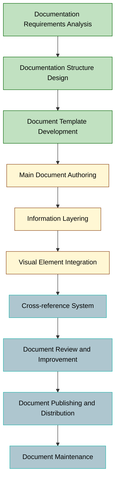
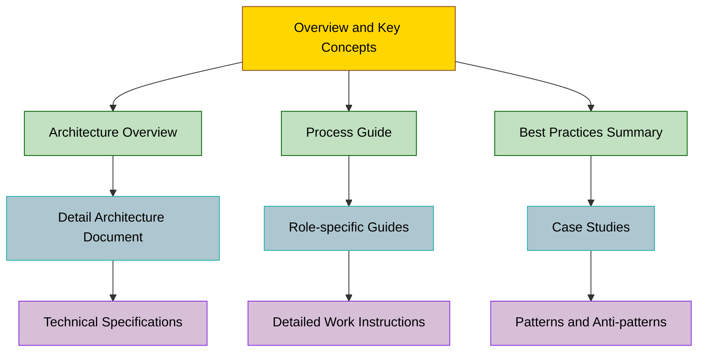
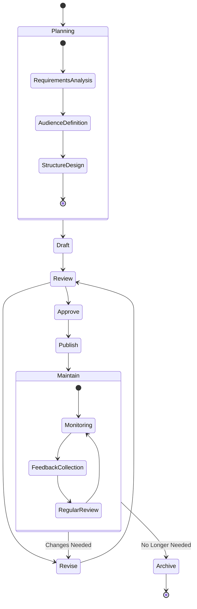

# Prompt-driven Development Methodology: Documentation Structuring

## Table of Contents

1. [Concept Definition](#1-concept-definition)
   2. [Importance of Documentation Structuring](#12-importance-of-documentation-structuring)
2. [Process Description](#2-process-description)
   2. [Key Deliverables](#22-key-deliverables)
3. [Documentation Requirements Analysis](#3-documentation-requirements-analysis)
4. [Documentation Structure Design](#4-documentation-structure-design)
5. [Document Template Development](#5-document-template-development)
6. [Main Document Authoring](#6-main-document-authoring)
7. [Application Example](#7-application-example)

---

## 1. Concept Definition

### 1.1 Definition of Documentation Structuring

Documentation structuring is a core component of the Prompt-driven Development Methodology (PDD), providing a systematic approach to organizing and delivering knowledge about prompts, architecture, code, and processes.

Well-structured documentation facilitates knowledge sharing, reduces the learning curve, and supports the long-term maintenance and scalability of prompt-driven systems. This document presents principles, strategies, and best practices for effective documentation structuring in PDD projects.

## 2. Process Description

### 2.1 Documentation Structuring Workflow Diagram



### 2.2 Key Deliverables

| Category | Activity | Task | Deliverable | Required |
|----------|----------|------|------------|----------|
| **Documentation** | Documentation Requirements Analysis | Identify Stakeholder Requirements | Documentation Requirements Specification | Required |
| **Documentation** | Documentation Requirements Analysis | Analyze Audience | Reader Persona Definition | Recommended |
| **Documentation** | Documentation Structure Design | Define Document Hierarchy | Documentation Structure Diagram | Required |
| **Documentation** | Documentation Structure Design | Establish Document Classification System | Document Classification System | Required |
| **Documentation** | Document Template Development | Create Templates by Document Type | Document Template Set | Required |
| **Documentation** | Document Template Development | Write Style Guide | Documentation Style Guide | Required |
| **Documentation** | Main Document Authoring | Prompt Documentation | Prompt Library | Required |
| **Documentation** | Main Document Authoring | Architecture Documentation | Architecture Document | Required |
| **Documentation** | Information Layering | Organize Information Layers | Layered Document Set | Required |
| **Documentation** | Information Layering | Optimize Accessibility | Accessibility Verification Report | Recommended |
| **Documentation** | Visual Element Integration | Create Diagrams | Diagram Library | Required |
| **Documentation** | Visual Element Integration | Optimize Visualization | Visualization Guidelines | Recommended |
| **Documentation** | Cross-reference System | Define Document Links | Document Cross-reference Map | Required |
| **Documentation** | Cross-reference System | Create Traceability Matrix | Document Traceability Matrix | Recommended |
| **Documentation** | Document Review and Improvement | Review Technical Accuracy | Document Review Report | Required |
| **Documentation** | Document Review and Improvement | Collect User Feedback | Feedback Analysis Report | Recommended |
| **Documentation** | Document Publishing and Distribution | Version Control and Publishing | Document Version Record | Required |
| **Documentation** | Document Publishing and Distribution | Set Access Permissions | Document Access Policy | Required |
| **Documentation** | Document Maintenance | Plan Document Updates | Document Maintenance Plan | Required |
| **Documentation** | Document Maintenance | Monitor Document Quality | Document Quality Report | Recommended |

## 3. Documentation Requirements Analysis

Documentation requirements analysis is the first step for effective documentation, clearly defining the purpose, target audience, and scope of the documents.

### Roles and Responsibilities

| Role Group | Role Name | Role Details |
|------------|-----------|--------------|
| **Documentation Manager** | PDD Documentation Lead | - Establish documentation strategy and plan<br>- Define documentation standards and guidelines<br>- Oversee documentation process<br>- Ensure documentation quality |
| **Technical Writer** | Prompt Documentation Specialist | - Document prompt design and usage<br>- Ensure technical accuracy<br>- Write user guides<br>- Update and manage documents |
| **Visualization Expert** | Diagram and Visualization Specialist | - Design technical diagrams<br>- Visualize complex concepts<br>- Manage diagram library<br>- Maintain visual consistency |
| **Knowledge Architect** | Information Structure Designer | - Design document structure and organization<br>- Develop information layering strategies<br>- Build cross-reference systems<br>- Define metadata schemes |
| **Quality Reviewer** | Document Quality Assurance | - Review document accuracy and completeness<br>- Evaluate readability and usability<br>- Collect and analyze feedback<br>- Provide improvement recommendations |
| **User Experience Designer** | Document UX Specialist | - Optimize document user experience<br>- Design user-centered document structures<br>- Improve accessibility and searchability<br>- Conduct user testing |

## Information Layering

Information layering organizes document content to meet the needs of various audiences. Effective information layering allows readers to easily find and understand the information they need at the appropriate depth.

### Layering Principles

1. **Apply Pyramid Structure**
   - Provide key concepts and summary information at a high level
   - Increase detail and technical depth as you move to lower levels
   - Allow readers to choose the appropriate level of detail based on their needs

2. **Separation of Concerns**
   - Distinguish between conceptual, architectural, and operational aspects
   - Separate information based on role-specific needs (e.g., admin, developer, tester)
   - Create modular document units that can be understood independently

3. **Progressive Disclosure**
   - Start with basic concepts and gradually expand to more complex topics
   - Design information structure as "learn on a need-to-know basis"
   - Structure knowledge with consideration for the learning path

#### Example of Layered Structure

An effective information hierarchy for PDD documentation:



#### Document Types by Layer

| Layer | Document Type | Main Audience | Level of Detail | Purpose |
|-------|--------------|--------------|----------------|---------|
| **L1 - Overview** | Concept Guide, Brief Introduction | All Stakeholders | Low | Convey key concepts and value |
| **L2 - Process** | Process Guide, Role Definition | Managers, Team Leaders | Medium | Explain operation methods and structure |
| **L3 - Application** | Practical Guide, Best Practices | Practitioners | Medium-High | Provide practical application methods |
| **L4 - Reference** | API Docs, Prompt Library | Developers, Experts | Very High | Provide detailed technical information |

#### Best Practices for Information Layering

1. **Maintain Consistent Structure**
   - Use a consistent heading structure across all documents
   - Maintain a standardized section order and composition
   - Provide a predictable flow of information

2. **Provide Clear Navigation**
   - Include tables of contents and section links within documents
   - Provide navigation tools that make it easy to move between layers
   - Include "Learn More" or "Related Topics" sections

3. **Set Appropriate Document Depth**
   - Limit the complexity level of a single document
   - Avoid more than 3-4 levels of nesting
   - Split documents and use cross-references as needed

## 5. Document Template Development

Document template development is the process of creating standardized formats to ensure consistent document style and quality.

### 5.1 Use of Visual Elements

### Diagram Types and Uses

| Diagram Type | Main Use | Example Application |
|--------------|---------|---------------------|
| **Flowchart** | Visualize process and decision flow | - PDD development process<br>- Prompt optimization workflow<br>- Decision tree |
| **Architecture Diagram** | Show system structure and component relationships | - PDD system architecture<br>- Prompt-code integration structure<br>- Deployment architecture |
| **Sequence Diagram** | Visualize interactions and time order | - Prompt processing flow<br>- User-system interaction<br>- API call sequence |
| **Mind Map** | Show relationships and hierarchy among concepts | - Prompt category map<br>- Concept relationship diagram<br>- Knowledge structuring |
| **Gantt Chart** | Visualize schedule and timeline | - PDD project schedule<br>- Milestones by phase<br>- Release plan |
| **Matrix** | Compare data and analyze relationships | - Role/responsibility matrix<br>- Prompt performance comparison<br>- Function/component mapping |

### Visual Element Design Principles

1. **Purpose-driven Design**
   - Clarify the key message to be conveyed
   - Eliminate unnecessary visual elements
   - Adjust complexity level to the audience

2. **Maintain Consistency**
   - Use standardized symbols and color schemes
   - Apply consistent visual representation to similar concepts
   - Maintain a consistent style across the project

3. **Consider Accessibility**
   - Optimize color contrast
   - Ensure screen reader compatibility
   - Provide alternative text and descriptions

4. **Utilize Interactivity**
   - Include zoomable diagrams
   - Provide on-demand detailed information
   - Incorporate interactive navigation elements

### Mermaid Diagram Usage Guidelines

Guidelines for creating diagrams with Mermaid in Markdown documents:

#### 1. Basic Syntax

```markdown
'''mermaid
[Diagram Type]
    [Diagram Content]
'''
```

#### 2. Main Diagram Types

- **Flowchart**: `flowchart TD` (top-down) or `flowchart LR` (left-right)
- **Sequence Diagram**: `sequenceDiagram`
- **Class Diagram**: `classDiagram`
- **State Diagram**: `stateDiagram`
- **Gantt Chart**: `gantt`
- **Pie Chart**: `pie`

#### 3. Styling Example

```markdown
'''mermaid
flowchart TD
    A[Start] --> B{Condition}
    B -->|Yes| C[Process 1]
    B -->|No| D[Process 2]
    C --> E[End]
    D --> E
    
    style A fill:#f9f,stroke:#333,stroke-width:2px
    style E fill:#bbf,stroke:#333,stroke-width:2px
'''
```

#### 4. Readability Tips

- Assign meaningful node IDs (use Start, Decision, etc. instead of A, B)
- Split complex diagrams into subgraphs
- Explain complex parts with comments
- Provide text explanations alongside diagrams

### Visualization Best Practices

1. **Choose the Best Diagram for the Purpose**
   - Process → Flowchart or Activity Diagram
   - Structure → Component or Class Diagram
   - Sequence → Sequence Diagram or Timeline

2. **Manage Hierarchical Complexity**
   - Provide high-level overview diagrams first
   - Expand to detailed diagrams as needed
   - Divide complex diagrams into logical sections

3. **Effective Labeling**
   - Use clear and concise labels
   - Provide explanations for technical terms
   - Provide context with diagram titles and captions

4. **Use Color and Shape Semantically**
   - Use color to reinforce meaning
   - Apply consistent color schemes to functional groups
   - Distinguish element types by shape (e.g., circles for events, squares for processes)

## Cross-reference System

A cross-reference system explicitly defines and links relationships between documents, making it easy to navigate related information and understand the overall system.

### Types of Cross-references

1. **Internal References**
   - Links to other sections within the same document
   - Navigation through tables of contents and indexes
   - Additional information through footnotes and endnotes

2. **Inter-document References**
   - Direct links to related documents
   - "References" or "Related Documents" sections
   - Use of document IDs or permanent links

3. **Code-Document References**
   - References from documents to code
   - References from code comments to documents
   - Connections between API documentation and implementation

4. **Prompt-Result References**
   - Linking prompts to expected results
   - Mapping prompt variations to response changes
   - Connecting use cases and prompt patterns

### Cross-reference Design Principles

1. **Consistency**
   - Use standardized reference formats and syntax
   - Maintain the same reference pattern across all documents
   - Apply clear naming and ID schemes

2. **Maintainability**
   - Implement automated reference verification mechanisms
   - Define a process for updating references
   - Detect and fix broken links

3. **Provide Context**
   - Explain the reason and relevance of references
   - Include a brief summary of the referenced item
   - Guide on necessary follow-up actions after reference

4. **Bidirectionality**
   - Ensure two-way links for references
   - Provide reverse navigation capability
   - Maintain completeness of the reference network

### Traceability Matrix

A traceability matrix systematically maps relationships among documents, requirements, design elements, and tests.

#### Example Traceability Matrix

**Requirements-Prompt-Test Traceability Matrix**

| Requirement ID | Requirement Description | Prompt ID | Prompt Description | Test ID | Test Description |
|---------------|------------------------|-----------|-------------------|---------|-----------------|
| REQ-001 | User authentication feature | PROMPT-101 | Generate user authentication code | TEST-201 | Verify authentication feature |
| REQ-002 | Multilingual support | PROMPT-102 | Generate multilingual messages | TEST-202 | Test language switching |
| REQ-003 | Performance requirements | PROMPT-103 | Generate optimized code | TEST-203 | Performance benchmark |

#### Traceability Types

| Traceability Type | Purpose | Example Application |
|------------------|---------|--------------------|
| **Requirements → Design** | Ensure all requirements are reflected in the design | Link business requirements to architecture documents |
| **Design → Prompt** | Ensure design elements are implemented with appropriate prompts | Map architectural decisions to prompt strategies |
| **Prompt → Code** | Ensure prompts generate the expected code | Connect prompt intentions to generated code |
| **Code → Test** | Ensure all code is properly tested | Map implemented features to test cases |
| **Requirements → Test** | Validate requirements fulfillment | Connect business requirements to verification tests |

### Cross-reference Implementation Methods

1. **Markdown-based References**
   - Use hyperlinks: `[Reference Text](Reference URL)`
   - Use anchor tags: assign IDs to sections and link to them
   - Use relative paths to ensure portability

2. **Document ID System**
   - Establish a system for assigning unique and meaningful IDs
   - Design a hierarchical ID structure (e.g., PDD-REQ-001)
   - Maintain a mapping table between IDs and titles

3. **Automation Tools**
   - Integrate cross-referencing features into document generation tools
   - Implement automated detection of broken links
   - Automate impact analysis of document changes on references

4. **Visual Navigation Map**
   - Provide a navigation map that visualizes document relationships
   - Show the context of the current document
   - Visualize clusters of related documents

## Document Templates and Standards

Standardized templates and consistent styles are essential for effective documentation. This section presents the core document templates and standards to be used in PDD.

### Core Document Templates

#### 1. Prompt Document Template

```markdown
# Prompt Document: [Prompt ID]

## Basic Information
- **Title**: [Prompt Title]
- **Version**: [Version Number]
- **Author**: [Author Name]
- **Date Created**: [Date]
- **Date Modified**: [Date]
- **Status**: [Draft/Under Review/Approved]

## Purpose and Scope
[Clear description of the main purpose and application scope of the prompt]

## Prompt Structure
[Description of the prompt structure and main components]

## Prompt Content
```
[Actual prompt content]
```

## Usage Guide
- **Input Parameters**: [Required input variables and formats]
- **Usage Context**: [Situations where the prompt is appropriate]
- **Limitations**: [Known limitations and precautions]

## Expected Results
[Expected response patterns and quality criteria for the prompt]

## Performance Metrics
[Measured performance metrics such as accuracy, consistency]

## Version History
| Version | Date | Changes | Author |
|---------|------|---------|--------|
| 0.1 | [Date] | Initial draft | [Name] |

## Related Documents
- [Link to related requirements]
- [Link to related design documents]
- [Link to related test documents]
```

#### 2. Architecture Document Template

```markdown
# Architecture Document: [Architecture ID]

## Basic Information
- **Title**: [Architecture Title]
- **Version**: [Version Number]
- **Author**: [Author Name]
- **Date Created**: [Date]
- **Date Modified**: [Date]
- **Status**: [Draft/Under Review/Approved]

## Overview
[Overview of the main purpose and scope of the architecture]

## Architecture Principles
[Key principles and decisions that guided the design]

## Architecture Diagram
```mermaid
[Architecture Diagram]
```

## Component Descriptions
### [Component 1 Name]
- **Purpose**: [Purpose of the component]
- **Responsibilities**: [Main responsibilities]
- **Interfaces**: [Provided and required interfaces]
- **Related Prompts**: [Related prompt IDs]

### [Component 2 Name]
...

## Interaction Flow
[Description of key interactions and data flows]

## Technology Stack
[Technologies, frameworks, and libraries used]

## Constraints
[Architectural constraints and considerations]

## Quality Attributes
[Performance, security, scalability, and other architectural quality factors]

## Version History
| Version | Date | Changes | Author |
|---------|------|---------|--------|
| 0.1 | [Date] | Initial draft | [Name] |

## Related Documents
- [Link to related requirements]
- [Link to related prompt documents]
- [Link to related test documents]
```

#### 3. Process Guide Template

```markdown
# Process Guide: [Process ID]

## Basic Information
- **Title**: [Process Title]
- **Version**: [Version Number]
- **Author**: [Author Name]
- **Date Created**: [Date]
- **Date Modified**: [Date]
- **Status**: [Draft/Under Review/Approved]

## Process Purpose
[Description of the purpose and expected outcomes of the process]

## Process Flow
'''mermaid
flowchart TD
    [Process Flowchart]
'''

## Step-by-Step Guide

### 1. [Step 1 Name]
- **Inputs**: [Required inputs and preconditions]
- **Activities**: [Step-by-step description of activities to be performed]
- **Outputs**: [Expected deliverables]
- **Responsible Roles**: [Responsible roles]
- **Tools and Templates**: [Related tools and template links]

### 2. [Step 2 Name]
...

## Checklist
- [ ] [Verification item 1]
- [ ] [Verification item 2]
...

## Troubleshooting Guide
| Problem Situation | Possible Causes | Solutions |
|------------------|----------------|----------|
| [Problem 1] | [Cause description] | [Solution steps] |

## Version History
| Version | Date | Changes | Author |
|---------|------|---------|--------|
| 0.1 | [Date] | Initial draft | [Name] |

## Related Documents
- [Link to related process]
- [Link to related template]
- [Link to related example]
```

### Documenting Style Guide

A style guide for consistent document quality and readability:

#### 1. Text Style

- **Headings**: Use a clear hierarchical structure (H1 → Document Title, H2 → Main Section, H3 → Subsection)
- **Paragraphs**: Write concisely, one main idea per paragraph
- **Bullet Points**: Use bullet points for listable items
- **Emphasis**: Highlight important concepts in **bold** or *italics*
- **Code Blocks**: Use appropriate code blocks for code, prompts, commands

#### 2. Writing Rules

- **Clear Language**: Use clear and specific language, avoid ambiguous expressions
- **Active Voice**: Prefer active voice sentences for clarity
- **Consistent Terminology**: Use consistent terminology for the same concept
- **Acronyms**: Introduce full names with acronyms (e.g., "Prompt-driven Development Methodology (PDD)")
- **Reader-centered**: Write with consideration of the reader's knowledge level

#### 3. Visual Element Rules

- **Diagrams**: Use standard notations (UML, BPMN, etc.)
- **Color**: Use a consistent color palette, emphasize key elements
- **Font**: Use readable fonts, maintain a consistent size scheme
- **Layout**: Place related visual elements and text close together
- **Whitespace**: Use appropriate whitespace to enhance readability

#### 4. Metadata Rules

- **Document ID**: Use a standardized ID system (e.g., PDD-ARCH-001)
- **Version Control**: Apply a semantic versioning system (e.g., 1.2.3)
- **Date Format**: Use a standard date format (e.g., YYYY-MM-DD)
- **Author Information**: Include name, role, and contact in a standard format
- **Status Indication**: Clearly indicate the document status (Draft, Under Review, Approved, Obsolete)

## Document Management Process

Effective documentation is supported by a systematic management process. This section describes the process for managing PDD documents throughout their lifecycle.

### Document Lifecycle



### Document Planning and Creation

1. **Document Requirements Analysis**
   - Define the purpose and scope of the document
   - Identify key stakeholders
   - Determine the types and depth of information needed

2. **Document Structure Design**
   - Select appropriate templates
   - Plan sections and subsections
   - Identify necessary visual elements

3. **Drafting**
   - Write initial content following the template
   - Gather and integrate necessary technical information
   - Create initial diagrams and visual elements

4. **Internal Review and Feedback**
   - Review for technical accuracy
   - Review structure and flow
   - Identify any missing information

### Document Review and Approval

1. **Formal Review Process**
   - Assign reviewers
   - Provide review criteria and checklist
   - Set review schedule and deadlines

2. **Feedback Collection and Integration**
   - Use a structured method for collecting feedback
   - Prioritize feedback
   - Integrate feedback to improve the document

3. **Approval Workflow**
   - Identify necessary approvers
   - Define approval criteria
   - Track approval status

4. **Version Control**
   - Update version number with major changes
   - Maintain a change log
   - Archive previous versions

### Document Publishing and Distribution

1. **Publishing Process**
   - Perform final quality check
   - Format and style the document
   - Validate cross-references and links

2. **Access Settings**
   - Set appropriate access permissions
   - Apply necessary security measures
   - Optimize for searchability

3. **Notification and Communication**
   - Notify stakeholders of new document
   - Provide summary of key changes
   - Guide on how to provide feedback

### Document Maintenance

1. **Regular Review**
   - Set a regular review cycle
   - Check for currency and accuracy
   - Identify areas for improvement

2. **User Feedback Monitoring**
   - Continuously collect feedback
   - Analyze feedback patterns
   - Prioritize improvements based on data

3. **Document Updates**
   - Apply change management processes
   - Synchronize all related documents
   - Maintain version information and change log

4. **Archiving and Disposal**
   - Identify documents that are no longer valid
   - Decide on archiving or disposal
   - Update references and links

## Documentation Tools and Systems

Recommended tools and systems for effective PDD documentation:

### 1. Document Creation Tools

| Tool Type | Recommended Tools | Key Features |
|-----------|------------------|--------------|
| **Markdown Editor** | VS Code, Typora, Obsidian | - Structured document authoring<br>- Syntax highlighting<br>- Real-time preview |
| **Collaboration Platforms** | GitLab/GitHub, Confluence, Notion | - Version control<br>- Collaborative editing<br>- Comments and discussions |
| **Diagram Tools** | Draw.io, Mermaid, PlantUML | - Variety of diagram types<br>- Code-based diagrams<br>- Integration with version control |
| **API Documentation Tools** | Swagger, ReadMe.io, Docusaurus | - Automated API specification<br>- Interactive documentation<br>- Integration of code examples |

### 2. Document Management Systems

| Function Area | Core Functions | Implementation Considerations |
|---------------|----------------|------------------------------|
| **Repository Management** | - Centralized document storage<br>- Folder structure and classification<br>- Search functionality | - Git-based repositories<br>- Clear folder structures<br>- Metadata tagging |
| **Version Control** | - Change history tracking<br>- Version comparison<br>- Rollback functionality | - Semantic versioning<br>- Branching strategies<br>- Automated change logs |
| **Access Control** | - Role-based access control<br>- Edit/view permissions<br>- Audit trails | - Least privilege principle<br>- Group-based permissions<br>- Change approval workflows |
| **Integration Features** | - Integration with development tools<br>- CI/CD pipeline integration<br>- Notification and announcement | - API integration<br>- Webhook utilization<br>- Diversified notification channels |

### 3. Automation Tools

| Automation Area | Example Tools | Application Scenarios |
|----------------|----------------|-----------------------|
| **Document Generation** | - Template engines<br>- Code-based document generation<br>- AI-assisted drafting | - Automatic application of standard document templates<br>- Automated API documentation generation<br>- AI-generated draft documents |
| **Quality Assurance** | - Markdown linter<br>- Spelling/grammar checker<br>- Link checker | - Consistency checks for document style<br>- Detection of typos and grammatical errors<br>- Detection of broken links |
| **Deployment Automation** | - Static site generators<br>- Document portal automation<br>- Notification systems | - Automatic deployment of documents based on PRs<br>- Automatic updates of document sites<br>- Automated notifications to stakeholders |
| **Usage Analytics** | - Document view analytics<br>- Search pattern analysis<br>- Automated feedback collection | - Analysis of document usage patterns<br>- Identification of frequently searched topics<br>- Data-driven identification of improvement areas |

## Conclusion

Documentation structuring is a key element in systematizing and sharing knowledge within the prompt-driven development methodology. By effectively layering information, utilizing visual elements, and implementing a robust cross-referencing system, complex PDD concepts and processes can be clearly communicated.

Applying the approaches and best practices presented in this document enables the PDD team to achieve benefits such as:

1. **Facilitated Knowledge Sharing**: Efficient dissemination of knowledge within the team through structured documents
2. **Reduced Learning Curve**: Shortened adaptation time for new team members due to well-organized information
3. **Enhanced Consistency**: Consistent quality maintenance through standardized document templates and styles
4. **Secured Traceability**: Ability to trace requirements through to implementation via systematic cross-referencing
5. **Streamlined Maintenance**: Ongoing improvement supported by a clear document management process

Documenting in PDD is not merely a record-keeping task but a strategic activity essential for the successful application and evolution of the methodology. Systematic documentation enables the maximization of the value derived from prompt-driven development, fostering continuous innovation and quality enhancement.

## References

1. Microsoft (2025), "Document structure for AI driven development methodology"
2. Google (2024), "Technical Documentation Best Practices for AI Systems"
3. IBM (2025), "Information Architecture for AI Development Documentation"
4. Oracle (2025), "Why Version Control Is Critical for AI Agents: A Strategic Imperative for Enterprise Security"
5. Adobe Workfront (2025), "Unified document approvals overview: Version control in the approval process"
6. Taming the AI IDEs (2025), "A Structured Approach to AI-Assisted Documentation"
