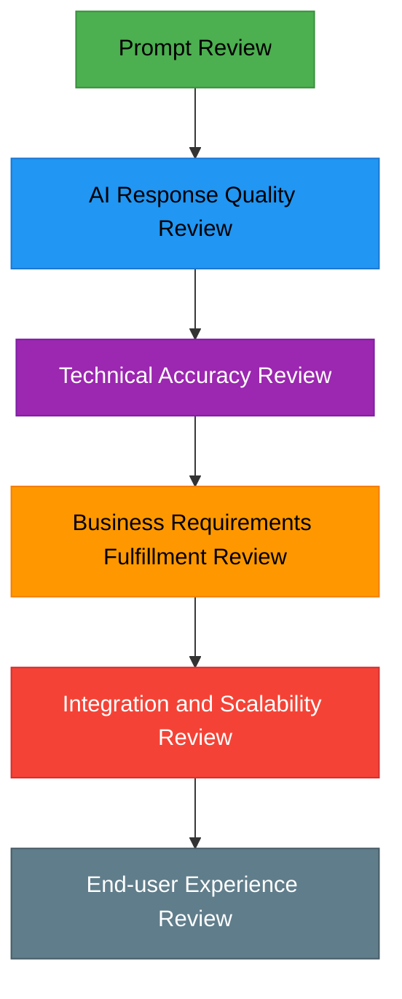
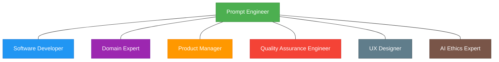
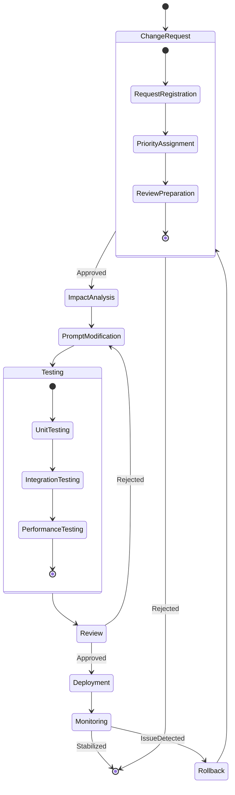

# Prompt-driven Development Methodology (PDD) - Review and Feedback

## Table of Contents

1. [Systematic Review Process](#systematic-review-process)
   1. [Multi-layered Review Structure](#1-multi-layered-review-structure)
   2. [Prompt Review Checklist](#2-prompt-review-checklist)
   3. [AI Response Review Framework](#3-ai-response-review-framework)
   4. [Integration with Automated Review Tools](#4-integration-with-automated-review-tools)
2. [Integrating Diverse Perspectives](#integrating-diverse-perspectives)
   1. [Review Focus by Perspective](#1-review-focus-by-perspective)
   2. [Multidisciplinary Review Team Composition](#2-multidisciplinary-review-team-composition)
   3. [Utilizing Review Workshops](#3-utilizing-review-workshops)
3. [Change Management Process](#change-management-process)
   1. [Prompt Version Control System](#1-prompt-version-control-system)
   2. [Prompt Change Tracking Metadata](#2-prompt-change-tracking-metadata)
   3. [Prompt Change Workflow](#3-prompt-change-workflow)
   4. [Feedback Integration Framework](#4-feedback-integration-framework)
4. [Best Practices for Review and Feedback](#best-practices-for-review-and-feedback)
   1. [Tips for Improving Review Efficiency](#1-tips-for-improving-review-efficiency)
   2. [Optimizing Feedback Collection](#2-optimizing-feedback-collection)
   3. [Effective Feedback Implementation Strategies](#3-effective-feedback-implementation-strategies)
5. [Conclusion](#conclusion)

---

## Systematic Review Process

The review process in Prompt-driven Development Methodology (PDD) has unique characteristics compared to traditional software development reviews. This reflects the specificity of PDD, where collaboration with AI models and prompt quality directly impact deliverables.

### 1. Multi-layered Review Structure

PDD recommends the following multi-layered review structure:

### 2. Prompt Review Checklist

Checklist for effective prompt review:

| Review Area | Checklist Item | Importance |
|-------------|---------------|------------|
| Clarity | Does the prompt clearly convey its intent? | High |
| Specificity | Does it include sufficient details? | High |
| Structure | Is the information logically structured? | Medium |
| Constraints | Are technical/business constraints specified? | High |
| Examples | Are examples of expected results included? | Medium |
| Error Handling | Are guidelines for possible errors provided? | Medium |
| Parameterization | Are reusable parts parameterized? | Low |
| Scalability | Can it be extended to similar situations? | Medium |
| Ethical Considerations | Are there any biases or ethical issues? | High |

### 3. AI Response Review Framework

Framework for evaluating the quality of AI-generated outputs:

1. **Accuracy Assessment**: Technical accuracy of generated code or documents
2. **Consistency Assessment**: Internal consistency and alignment with existing systems
3. **Completeness Assessment**: Fulfillment of requirements
4. **Efficiency Assessment**: Resource usage and performance optimization
5. **Maintainability Assessment**: Code readability and documentation level
6. **Security Assessment**: Adherence to security best practices
7. **Scalability Assessment**: Ability to accommodate future requirements

### 4. Integration with Automated Review Tools

PDD recommends integrating the following automated review tools:

- **Static Code Analysis Tools**: AI-based code review tools like GitHub Copilot or Amazon CodeGuru
- **Prompt Quality Evaluation Tools**: Prompt testing and evaluation tools such as Microsoft Prompt Flow
- **CI/CD Pipeline Integration**: Integrate automated review processes into CI/CD pipelines

## Integrating Diverse Perspectives

In PDD, integrating the perspectives of various stakeholders is crucial to ensure that generated outputs meet diverse requirements in a balanced manner.

### 1. Review Focus by Perspective

| Perspective | Main Review Points | Recommended Review Method |
|-------------|-------------------|--------------------------|
| Technical | Code quality, architecture suitability, compliance with technical standards | Code review, architecture review session |
| Business | Fulfillment of business requirements, ROI, market competitiveness | Business value validation, competitive analysis |
| User | Usability, accessibility, user experience | User testing, feedback session |
| Operations | Ease of deployment, monitoring, maintainability | Operations review, performance testing |
| Security/Compliance | Security risks, regulatory compliance, data protection | Security review, compliance check |
| AI Ethics | Bias, transparency, model reliability | Ethical review, bias audit |

### 2. Multidisciplinary Review Team Composition

Effective PDD review requires a multidisciplinary team:

### 3. Utilizing Review Workshops

Workshop format for effective multi-perspective review in PDD:

1. **Prompt Explanation Session**: Prompt engineer explains intent and structure
2. **AI Response Demo**: Demonstrate generated outputs
3. **Collect Multi-perspective Feedback**: Gather strengths and improvement points from each perspective
4. **Prioritization Session**: Decide feedback priorities
5. **Improvement Planning**: Define plans to improve prompts and outputs

## Change Management Process

Systematic change management is essential in PDD to accommodate the evolution of prompts and AI models.

### 1. Prompt Version Control System

### 2. Prompt Change Tracking Metadata

Metadata to include for each prompt change:

| Metadata | Description | Example |
|----------|-------------|---------|
| Version ID | Unique identifier | PDD-PROMPT-V1.2.5 |
| Change Date | Date of change | 2025-05-15 |
| Author | Person making the change | John Doe |
| Change Type | Major/minor change type | minor-enhancement |
| Reason for Change | Explanation of change | Added constraint for performance optimization |
| Affected Outputs | Scope of impact | Code generation module, test script |
| Validation Status | Whether change is validated | validated |
| Approver | Change approver | Jane Smith |
| Rollback Plan | Rollback plan in case of issues | Immediate rollback to V1.2.4 |

### 3. Prompt Change Workflow

Prompt change workflow in a PDD environment:

### 4. Feedback Integration Framework

Framework for effectively integrating collected feedback:

1. **Feedback Classification**: Classify as technical/business/user experience, etc.
2. **Impact Assessment**: Assess potential impact of each feedback
3. **Prioritization**: Assign priorities based on importance and urgency
4. **Action Plan**: Develop concrete improvement plans
5. **Validation Plan**: Define methods to verify improvement effects
6. **Knowledge Management**: Add feedback and improvements to knowledge base

## Best Practices for Review and Feedback

### 1. Tips for Improving Review Efficiency

- **Use Prompt Templates**: Ensure review consistency with standardized prompt templates
- **Visualize Review Sessions**: Improve understanding by visualizing outputs during review
- **Stepwise Review**: Review from core elements to details in stages
- **Automate Reviews**: Automate repetitive review elements
- **Comparison-based Review**: Focus on differences from previous versions

### 2. Optimizing Feedback Collection

- **Structured Feedback Templates**: Use templates for consistent feedback collection
- **Anonymous Feedback Channels**: Provide anonymous channels for honest feedback
- **Real-time Feedback Tools**: Use collaboration tools for real-time feedback
- **Feedback Visualization**: Visualize patterns and trends in collected feedback
- **Shorten Feedback Loop**: Minimize time from feedback to improvement

### 3. Effective Feedback Implementation Strategies

- **Clarify Areas for Improvement**: Define specific areas for improvement based on feedback
- **Test-driven Improvement**: Establish tests to verify effects of feedback implementation
- **Incremental Improvement**: Prefer incremental improvement over large-scale changes
- **A/B Testing**: Conduct A/B tests for major changes
- **Measure Improvement Effects**: Use objective metrics to measure improvement effects

## Conclusion

The review and feedback process in PDD is distinct from that of traditional development methodologies. Multi-faceted review of prompt quality, AI model responses, and integrated deliverables is essential. An effective review and feedback system is a key factor for successful adoption and continuous improvement of PDD.

Organizations can tailor the frameworks and processes presented in this document to their own situations and requirements. The important thing is to maximize the potential of PDD through a systematic and consistent review process.
