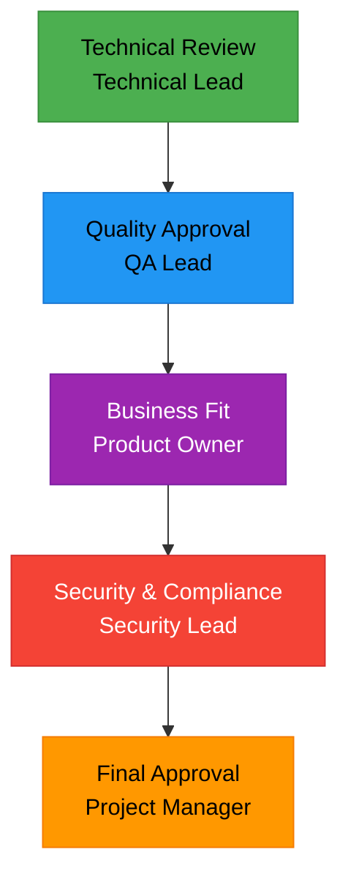
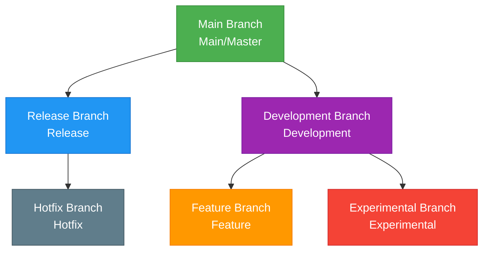
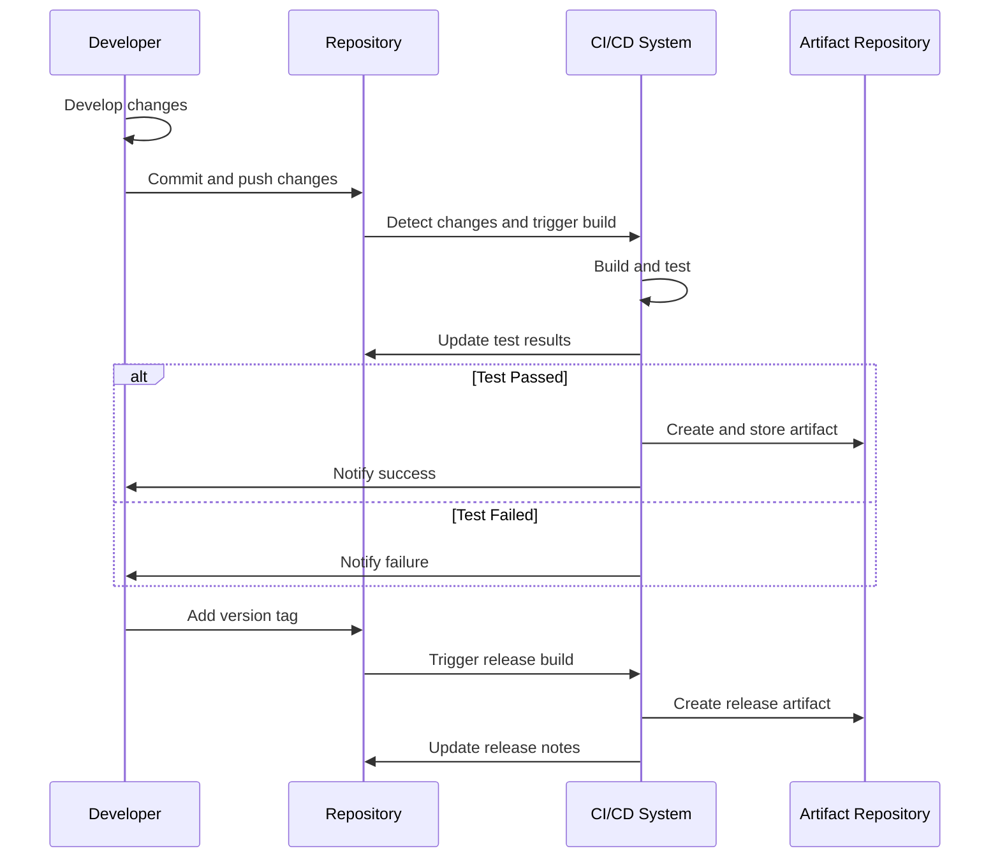
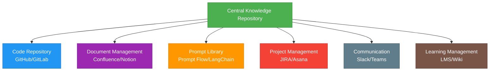

# Prompt-driven Development Methodology (PDD) - Finalization

**Document Number**: MTD-011  
**Version**: 1.0.0  
**Date**: 2025-05-26  
**Author**: Methodology Team  
**Status**: Approved

## Table of Contents

1. [Approval Process](#approval-process)
   4. [Approval Workflow Automation](#4-approval-workflow-automation)
2. [Version Control System](#version-control-system)
   5. [Version Control Workflow](#5-version-control-workflow)
3. [Distribution and Accessibility](#distribution-and-accessibility)
   5. [Document and Knowledge Maintenance](#5-document-and-knowledge-maintenance)
4. [Finalization Best Practices](#finalization-best-practices)
5. [Conclusion](#conclusion)

---

The finalization of documentation in Prompt-driven Development Methodology (PDD) is a crucial step to ensure consistency and quality throughout the software development lifecycle. This stage defines the processes for final approval of deliverables, version control, and ensuring that project stakeholders have effective access to the information they need.

## Approval Process

The approval process in PDD is similar to that of general software development, but includes special considerations for prompts and AI-generated outputs.

### 1. Approval Stages and Responsible Parties

Stepwise approach for PDD deliverable approval:



### 2. Approval Criteria Matrix

| Approval Area | Key Criteria | Fulfillment Criteria | Approval Authority |
|--------------|-------------|---------------------|-------------------|
| Technical Accuracy | Code quality, architecture suitability | Pass code review, comply with architecture guidelines | Technical Lead |
| Functional Completeness | Requirement fulfillment | All functional requirements met, pass test cases | QA Lead |
| Business Value | Alignment with business goals | Achieve key performance indicators (KPIs) | Product Owner |
| Security & Compliance | Security standards, regulatory compliance | Pass security checks, meet regulatory requirements | Security Lead |
| User Experience | Usability, accessibility | Pass user testing, meet accessibility standards | UX Lead |
| Operational Readiness | Deployment and support readiness | Complete operations checklist, prepare support docs | Operations Lead |
| Overall Project | Comprehensive evaluation of all areas | Obtain all individual approvals | Project Manager |

### 3. Approval Document Template

Template structure for effective PDD approval:

```
# PDD Deliverable Approval Document

## 1. Deliverable Information
- Project Name: [Project Name]
- Deliverable ID: [ID]
- Version: [Version Number]
- Author: [Author Name]
- Date: [YYYY-MM-DD]

## 2. Deliverable Overview
[Brief description of the purpose and scope of the deliverable]

## 3. Approval History
| Approval Stage | Approver | Date | Status | Notes |
|---------------|---------|------|--------|-------|
| Technical Review | [Name] | [Date] | [Approved/Rejected] | [Comments] |
| Quality Approval | [Name] | [Date] | [Approved/Rejected] | [Comments] |
| Business Fit | [Name] | [Date] | [Approved/Rejected] | [Comments] |
| Security & Compliance | [Name] | [Date] | [Approved/Rejected] | [Comments] |
| Final Approval | [Name] | [Date] | [Approved/Rejected] | [Comments] |

## 4. Fulfillment of Approval Criteria
| Approval Area | Fulfilled | Evidence & References |
|--------------|-----------|----------------------|
| Technical Accuracy | [Yes/No] | [Description & Links] |
| Functional Completeness | [Yes/No] | [Description & Links] |
| Business Value | [Yes/No] | [Description & Links] |
| Security & Compliance | [Yes/No] | [Description & Links] |
| User Experience | [Yes/No] | [Description & Links] |
| Operational Readiness | [Yes/No] | [Description & Links] |

## 5. Conditional Approval Items
[Conditions and deadlines for conditional approvals, if any]

## 6. Attachments
[Links to related documents and evidence]

## 7. Final Approval
The above deliverable is confirmed to have met all approval criteria and is hereby finally approved.

[Final Approver Signature]
[Date]
```

### 4. Approval Workflow Automation

Recommended tools and approaches for automating the PDD approval process:

- **GitHub/GitLab Approval Workflow**: Pull Request-based approval process
- **JIRA Integration**: Link approval stages with project management tools
- **Digital Signature Integration**: Use tools like DocuSign for official approvals
- **Automated Notifications**: Automatic notifications for approval requests and status changes
- **Approval Dashboard**: Real-time monitoring of overall project approval status

## Version Control System

Effective version control in PDD is essential for ensuring traceability between prompts and generated outputs, and for clearly managing change history.

### 1. Version Control Principles

Key version control principles for PDD:

1. **Semantic Versioning**: Use major, minor, and patch versioning
2. **Prompt-Output Linkage**: Track which prompt version generated each output
3. **Change History Documentation**: Maintain detailed records of all changes
4. **Rollback Capability**: Ensure the ability to revert to previous versions at any time
5. **Branching Strategy**: Establish branches for features, releases, hotfixes, etc.

### 2. Version Control Structure



### 3. Version Metadata Structure

Metadata to include for each version:

| Metadata Item | Description | Example |
|---------------|-------------|---------|
| Version ID | Semantic version number | v2.3.5 |
| Release Date | Date of version release | 2025-05-21 |
| Author/Owner | Person responsible for the version | John Doe |
| Change Summary | Summary of major changes | Improved user authentication module |
| Detailed Change List | List of all changes | - Optimized login process<br>- Patched security vulnerabilities<br>- Improved UI |
| Previous Version | Previous version on which this is based | v2.3.4 |
| Related Issues/Requests | Related issues or requests | ISSUE-752, REQ-123 |
| Impact Scope | Areas affected by the change | User authentication, access control |
| AI Model Used | AI model used to generate outputs | GPT-4, Claude 3 |
| Prompt Version | Prompt version used | prompt-auth-v1.3 |

### 4. Version Control Tools and Integration

Recommended tools and integration methods for PDD:

- **Git-based Version Control**: Use platforms like GitHub, GitLab, Bitbucket
- **Prompt Version Control Tools**: Use specialized tools like LangChain, Prompt Flow
- **CI/CD Pipeline Integration**: Integrate with Jenkins, GitHub Actions, etc.
- **Document Version Control**: Integrate with Confluence, Notion, etc.
- **Artifact Repository Integration**: Manage models, code, documents, and other deliverables in a unified repository

### 5. Version Control Workflow



## Distribution and Accessibility

Effective distribution and accessibility of finalized PDD deliverables are crucial for successful implementation and continuous improvement of the methodology.

### 1. Distribution Strategies

Strategies for effective distribution of PDD deliverables:

1. **Phased Deployment**: Deploy in stages—development → testing → staging → production
2. **Canary Deployment**: Apply to a subset of users/environments first to minimize risk
3. **Blue-Green Deployment**: Alternate between two environments to minimize downtime
4. **Feature Flags**: Control activation/deactivation of specific features
5. **Rollback Plan**: Prepare plans for quick rollback in case of issues

### 2. Deliverable Accessibility Matrix

| Role | Prompt | Code | Document | Configuration | Deployment | Monitoring |
|------|--------|------|----------|--------------|-----------|------------|
| Project Manager | Read | Read | Read/Write | Read | Read | Read |
| Product Owner | Read/Write | Read | Read/Write | Read | Read | Read |
| Technical Lead | Read/Write | Read/Write | Read/Write | Read/Write | Read/Write | Read/Write |
| Developer | Read/Write | Read/Write | Read | Read/Write | Read | Read |
| QA Engineer | Read | Read | Read | Read | Read | Read |
| Operations Team | Read | Read | Read | Read/Write | Read/Write | Read/Write |
| Security Team | Read | Read | Read | Read | Read | Read |
| End User | None | None | Limited Read | None | None | None |

### 3. Knowledge Sharing Platform

Recommended platform configuration for effective sharing of PDD deliverables:



### 4. Onboarding and Knowledge Dissemination

Effective onboarding and knowledge dissemination strategies for PDD:

1. **Progressive Learning Path**: Stepwise learning from beginner to advanced
2. **Interactive Tutorials**: Hands-on, interactive learning materials
3. **Mentoring Program**: Mentoring system with experienced team members
4. **Community of Practice**: Community for knowledge sharing and collaboration
5. **Regular Knowledge Sharing Sessions**: Sessions to share latest trends and learnings

### 5. Document and Knowledge Maintenance

Continuous document and knowledge management strategies:

1. **Regular Review Cycle**: Periodic review and update of all documents
2. **Content Ownership**: Assign clear owners for each document and knowledge area
3. **Feedback Loop**: System for collecting and reflecting user feedback
4. **Usage Analysis**: Analyze usage patterns of documents and knowledge base
5. **Archiving Policy**: Policy for archiving or disposing of outdated content

## Finalization Best Practices

Best practices for finalizing PDD deliverables:

1. **Completeness Checklist**: Final check to ensure all required elements are included
2. **Consistency Verification**: Verify consistency across all deliverables
3. **Legal Review**: Review for intellectual property, licensing, and regulatory compliance
4. **Stakeholder Final Approval**: Explicit approval from key stakeholders
5. **Reference Architecture**: Document successful PDD application cases as references
6. **Release Communication Plan**: Tailored communication plan for each stakeholder group
7. **Feedback Channel Establishment**: Set up channels for continuous improvement feedback

## Conclusion

The finalization stage of the PDD methodology is critical in integrating and formalizing the efforts of all previous stages. By implementing a systematic approval process, rigorous version control, and effective distribution and accessibility strategies, the successful execution and ongoing enhancement of PDD can be ensured.

Each organization can adjust and apply the frameworks and methodologies presented in this document according to its size and characteristics. The key is to establish clear processes and accountability systems to maximize the value of PDD.
