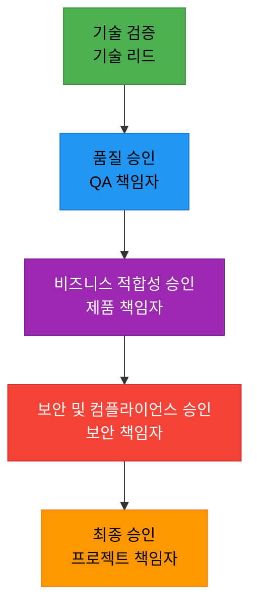
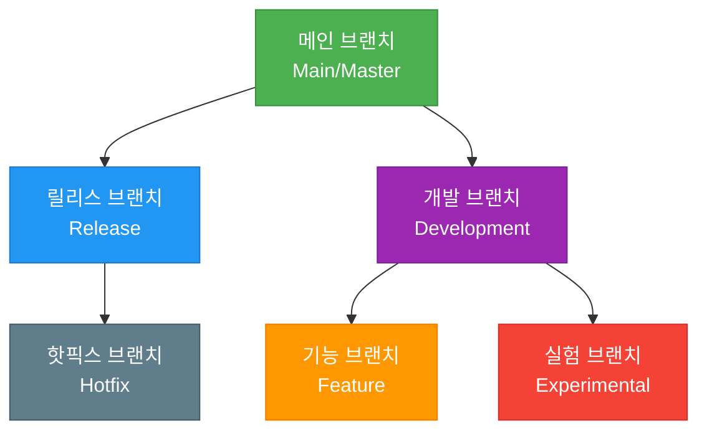
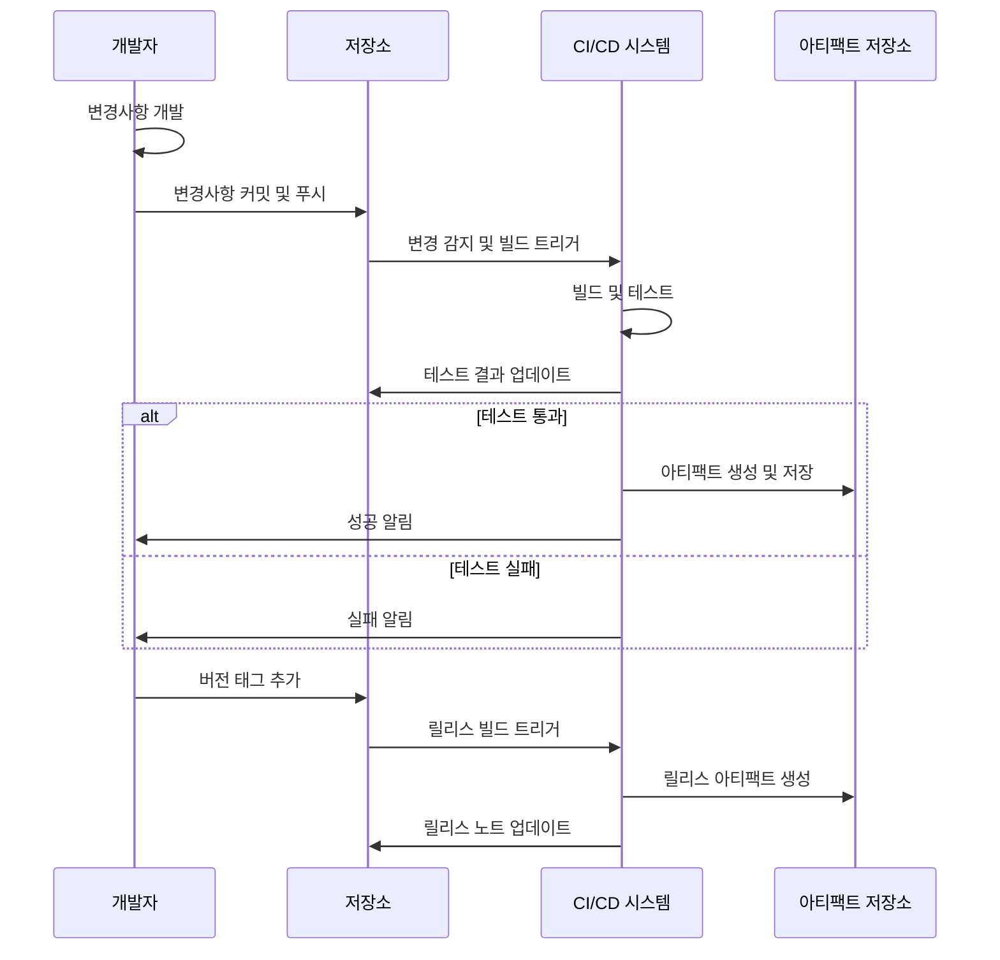
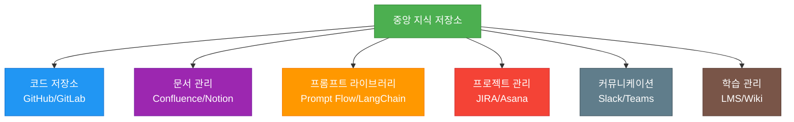

# 프롬프트 기반 개발방법론(PDD) - 최종본 확정

**문서 번호**: MTD-011  
**버전**: 1.0.0  
**작성일**: 2025-05-26  
**작성자**: 방법론 팀  
**상태**: 승인됨

## 목차

1. [승인 프로세스](#승인-프로세스)
   1. [승인 단계 및 책임자](#1-승인-단계-및-책임자)
   2. [승인 기준 매트릭스](#2-승인-기준-매트릭스)
   3. [승인 문서 템플릿](#3-승인-문서-템플릿)
   4. [승인 워크플로우 자동화](#4-승인-워크플로우-자동화)
2. [버전 관리 체계](#버전-관리-체계)
   1. [버전 관리 원칙](#1-버전-관리-원칙)
   2. [버전 관리 구조](#2-버전-관리-구조)
   3. [버전 메타데이터 구조](#3-버전-메타데이터-구조)
   4. [버전 관리 도구 및 통합](#4-버전-관리-도구-및-통합)
   5. [버전 관리 워크플로우](#5-버전-관리-워크플로우)
3. [배포 및 접근성](#배포-및-접근성)
   1. [배포 전략](#1-배포-전략)
   2. [산출물 접근성 매트릭스](#2-산출물-접근성-매트릭스)
   3. [지식 공유 플랫폼](#3-지식-공유-플랫폼)
   4. [온보딩 및 지식 전파](#4-온보딩-및-지식-전파)
   5. [문서 및 지식 유지 관리](#5-문서-및-지식-유지-관리)
4. [최종 확정 베스트 프랙티스](#최종-확정-베스트-프랙티스)
5. [결론](#결론)

---

프롬프트 기반 개발방법론(PDD)의 최종 단계인 문서 확정은 개발 생명주기 전체의 일관성과 품질을 보장하는 중요한 단계입니다. 이 단계에서는 산출물의 최종 승인, 버전 관리, 그리고 프로젝트 이해관계자들이 필요한 정보에 효과적으로 접근할 수 있도록 보장하는 프로세스를 정의합니다.

## 승인 프로세스

PDD에서의 승인 프로세스는 일반적인 소프트웨어 개발 승인 프로세스와 유사하지만, 프롬프트와 AI 생성 결과물에 대한 특별한 고려사항이 포함됩니다.

### 1. 승인 단계 및 책임자

PDD 산출물 승인을 위한 단계적 접근:



### 2. 승인 기준 매트릭스

| 승인 영역 | 주요 기준 | 충족 기준 | 승인 권한 |
|----------|----------|----------|----------|
| 기술적 정확성 | 코드 품질, 아키텍처 적합성 | 코드 리뷰 통과, 아키텍처 지침 준수 | 기술 리드 |
| 기능 완전성 | 요구사항 충족도 | 모든 기능 요구사항 충족, 테스트 케이스 통과 | QA 책임자 |
| 비즈니스 가치 | 비즈니스 목표 부합도 | 핵심 성과 지표(KPI) 달성 | 제품 책임자 |
| 보안 및 규정 준수 | 보안 기준, 규제 준수 | 보안 점검 통과, 규제 요구사항 충족 | 보안 책임자 |
| 사용자 경험 | 사용성, 접근성 | 사용자 테스트 통과, 접근성 기준 충족 | UX 책임자 |
| 운영 준비도 | 배포 및 지원 준비 | 운영 체크리스트 완료, 지원 문서 준비 | 운영 책임자 |
| 전체 프로젝트 | 모든 영역의 종합적 평가 | 모든 개별 승인 획득 | 프로젝트 책임자 |

### 3. 승인 문서 템플릿

효과적인 PDD 승인을 위한 문서 템플릿 구조:

```
# PDD 산출물 승인 문서

## 1. 산출물 정보
- 프로젝트명: [프로젝트명]
- 산출물 식별자: [식별자]
- 버전: [버전번호]
- 작성자: [작성자명]
- 작성일: [YYYY-MM-DD]

## 2. 산출물 개요
[산출물의 목적과 범위에 대한 간략한 설명]

## 3. 승인 이력
| 승인 단계 | 승인자 | 승인일 | 승인 상태 | 비고 |
|----------|-------|-------|----------|------|
| 기술 검증 | [이름] | [날짜] | [승인/반려] | [의견] |
| 품질 승인 | [이름] | [날짜] | [승인/반려] | [의견] |
| 비즈니스 적합성 | [이름] | [날짜] | [승인/반려] | [의견] |
| 보안 및 컴플라이언스 | [이름] | [날짜] | [승인/반려] | [의견] |
| 최종 승인 | [이름] | [날짜] | [승인/반려] | [의견] |

## 4. 승인 기준 충족 여부
| 승인 영역 | 충족 여부 | 근거 및 증빙 |
|----------|----------|-------------|
| 기술적 정확성 | [예/아니오] | [설명 및 링크] |
| 기능 완전성 | [예/아니오] | [설명 및 링크] |
| 비즈니스 가치 | [예/아니오] | [설명 및 링크] |
| 보안 및 규정 준수 | [예/아니오] | [설명 및 링크] |
| 사용자 경험 | [예/아니오] | [설명 및 링크] |
| 운영 준비도 | [예/아니오] | [설명 및 링크] |

## 5. 조건부 승인 사항
[조건부 승인의 경우, 충족해야 할 조건 및 기한]

## 6. 첨부 문서
[관련 문서 및 증빙 자료 링크]

## 7. 최종 승인
위 산출물은 모든 승인 기준을 충족하여 최종 승인됨을 확인합니다.

[최종 승인자 서명]
[날짜]
```

### 4. 승인 워크플로우 자동화

PDD 승인 프로세스 자동화를 위한 권장 도구 및 접근 방식:

- **GitHub/GitLab 승인 워크플로우**: Pull Request 기반 승인 프로세스
- **JIRA와의 통합**: 승인 단계와 프로젝트 관리 도구 연동
- **디지털 서명 통합**: DocuSign 등의 도구를 활용한 공식 승인 프로세스
- **자동화된 알림**: 승인 요청 및 상태 변경에 대한 자동 알림
- **승인 대시보드**: 프로젝트 전체 승인 상태 실시간 모니터링

## 버전 관리 체계

PDD에서의 효과적인 버전 관리는 프롬프트와 생성된 결과물 간의 추적성을 보장하고, 변경 이력을 명확히 관리하기 위해 필수적입니다.

### 1. 버전 관리 원칙

PDD에서 적용해야 할 주요 버전 관리 원칙:

1. **의미적 버전 관리(Semantic Versioning)**: 주 버전(Major), 부 버전(Minor), 패치(Patch) 체계 적용
2. **프롬프트-결과물 연결성**: 각 결과물이 어떤 프롬프트 버전에서 생성되었는지 추적
3. **변경 이력 문서화**: 모든 변경사항에 대한 상세 기록 유지
4. **롤백 가능성**: 언제든 이전 버전으로 롤백할 수 있는 체계 확보
5. **분기(Branch) 전략**: 기능, 릴리스, 핫픽스 등 목적별 분기 전략 수립

### 2. 버전 관리 구조



### 3. 버전 메타데이터 구조

각 버전에 포함되어야 할 메타데이터:

| 메타데이터 항목 | 설명 | 예시 |
|--------------|------|------|
| 버전 식별자 | 의미적 버전 번호 | v2.3.5 |
| 릴리스 날짜 | 버전 릴리스 일자 | 2025-05-21 |
| 작성자/책임자 | 버전 작성 담당자 | 홍길동 |
| 변경 요약 | 주요 변경사항 요약 | 사용자 인증 모듈 개선 |
| 상세 변경 목록 | 모든 변경사항 목록 | - 로그인 프로세스 최적화<br>- 보안 취약점 패치<br>- UI 개선 |
| 이전 버전 | 기반이 된 이전 버전 | v2.3.4 |
| 관련 이슈/요청 | 연관된 이슈 또는 요청 | ISSUE-752, REQ-123 |
| 영향 범위 | 변경의 영향을 받는 영역 | 사용자 인증, 접근 제어 |
| 사용된 AI 모델 | 결과물 생성에 사용된 AI 모델 | GPT-4, Claude 3 |
| 프롬프트 버전 | 사용된 프롬프트 버전 | prompt-auth-v1.3 |

### 4. 버전 관리 도구 및 통합

PDD에 적합한 버전 관리 도구 및 통합 방식:

- **Git 기반 버전 관리**: GitHub, GitLab, Bitbucket 등의 플랫폼 활용
- **프롬프트 버전 관리 도구**: LangChain, Prompt Flow 등 전문 도구 활용
- **CI/CD 파이프라인 통합**: Jenkins, GitHub Actions 등과 연동
- **문서 버전 관리**: Confluence, Notion 등과의 연동
- **산출물 저장소 통합**: 모델, 코드, 문서 등 다양한 산출물의 통합 관리

### 5. 버전 관리 워크플로우



## 배포 및 접근성

최종 확정된 PDD 산출물에 대한 효과적인 배포와 접근성 보장은 방법론의 성공적인 구현과 지속적인 개선을 위해 중요합니다.

### 1. 배포 전략

PDD 산출물의 효과적인 배포를 위한 전략:

1. **단계적 배포**: 개발 → 테스트 → 스테이징 → 프로덕션의 단계적 배포
2. **카나리 배포**: 일부 사용자/환경에 먼저 적용하여 위험 최소화
3. **블루-그린 배포**: 두 환경을 번갈아가며 사용하여 다운타임 최소화
4. **특성 플래그(Feature Flag)**: 특정 기능의 활성화/비활성화 제어
5. **롤백 계획**: 문제 발생시 신속한 롤백을 위한 계획 마련

### 2. 산출물 접근성 매트릭스

| 역할 | 프롬프트 | 코드 | 문서 | 구성 | 배포 | 모니터링 |
|-----|----------|-----|------|-----|------|----------|
| 프로젝트 관리자 | 읽기 | 읽기 | 읽기/쓰기 | 읽기 | 읽기 | 읽기 |
| 제품 책임자 | 읽기/쓰기 | 읽기 | 읽기/쓰기 | 읽기 | 읽기 | 읽기 |
| 기술 리드 | 읽기/쓰기 | 읽기/쓰기 | 읽기/쓰기 | 읽기/쓰기 | 읽기/쓰기 | 읽기/쓰기 |
| 개발자 | 읽기/쓰기 | 읽기/쓰기 | 읽기 | 읽기/쓰기 | 읽기 | 읽기 |
| QA 엔지니어 | 읽기 | 읽기 | 읽기 | 읽기 | 읽기 | 읽기 |
| 운영 팀 | 읽기 | 읽기 | 읽기 | 읽기/쓰기 | 읽기/쓰기 | 읽기/쓰기 |
| 보안 팀 | 읽기 | 읽기 | 읽기 | 읽기 | 읽기 | 읽기 |
| 최종 사용자 | 없음 | 없음 | 제한적 읽기 | 없음 | 없음 | 없음 |

### 3. 지식 공유 플랫폼

PDD 산출물의 효과적인 공유를 위한 플랫폼 구성:



### 4. 온보딩 및 지식 전파

PDD 방법론의 효과적인 온보딩 및 지식 전파 방안:

1. **점진적 학습 경로**: 초급→중급→고급 수준의 단계적 학습 경로
2. **인터랙티브 튜토리얼**: 실습 기반의 인터랙티브 학습 자료
3. **멘토링 프로그램**: 경험 있는 팀원과의 멘토링 체계
4. **커뮤니티 오브 프랙티스**: 지식 공유와 협업을 위한 커뮤니티
5. **정기 지식 공유 세션**: 최신 트렌드와 학습 내용 공유 세션

### 5. 문서 및 지식 유지 관리

지속적인 문서 및 지식 관리 방안:

1. **정기 검토 주기**: 모든 문서의 정기적 검토 및 업데이트
2. **콘텐츠 소유권**: 각 문서 및 지식 영역의 명확한 책임자 지정
3. **피드백 루프**: 사용자 피드백 수집 및 반영 체계
4. **사용 분석**: 문서 및 지식베이스 사용 패턴 분석
5. **아카이빙 정책**: 오래된 콘텐츠의 아카이빙 또는 폐기 정책

## 최종 확정 베스트 프랙티스

PDD 산출물의 최종 확정을 위한 베스트 프랙티스:

1. **완전성 체크리스트**: 모든 필수 요소가 포함되었는지 최종 확인
2. **일관성 검증**: 모든 산출물 간의 일관성 검증
3. **법적 검토**: 지적 재산권, 라이선스, 규제 준수 등 법적 검토
4. **이해관계자 최종 승인**: 핵심 이해관계자의 명시적 승인
5. **레퍼런스 아키텍처화**: 성공적인 PDD 적용 사례의 레퍼런스화
6. **출시 커뮤니케이션 계획**: 이해관계자별 맞춤형 출시 소통 방안
7. **피드백 채널 구축**: 지속적 개선을 위한 피드백 수집 채널

## 결론

PDD 방법론의 최종본 확정 단계는 모든 이전 단계의 노력을 통합하고 공식화하는 중요한 과정입니다. 체계적인 승인 프로세스, 엄격한 버전 관리, 그리고 효과적인 배포 및 접근성 전략을 통해 PDD의 성공적인 구현과 지속적인 개선을 보장할 수 있습니다.

각 조직은 자신의 규모와 특성에 맞게 본 문서에서 제시한 프레임워크와 방법론을 조정하여 적용할 수 있습니다. 중요한 것은 명확한 프로세스와 책임 체계를 수립하여 PDD의 가치를 최대화하는 것입니다.
