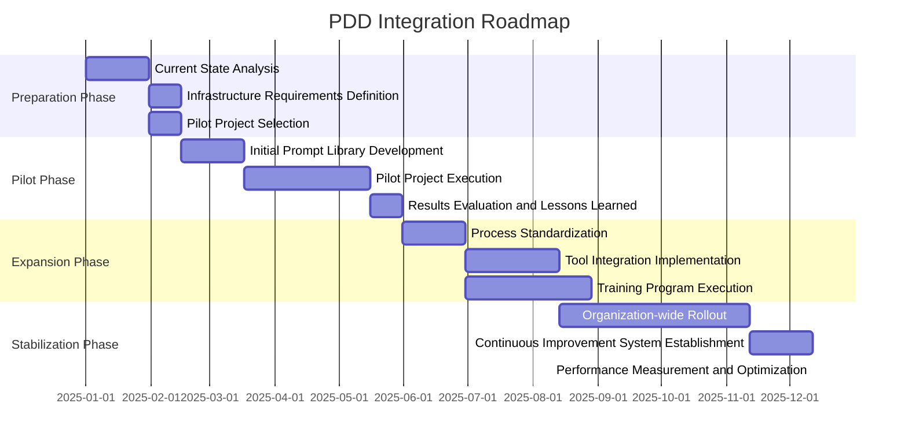
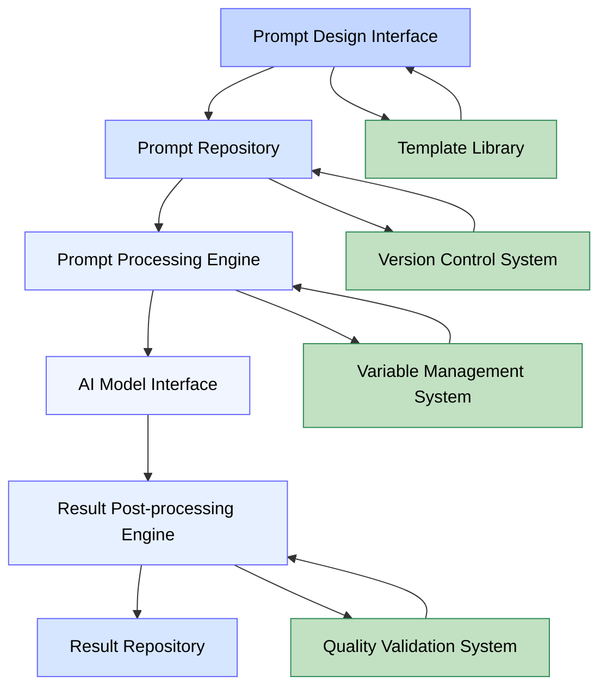
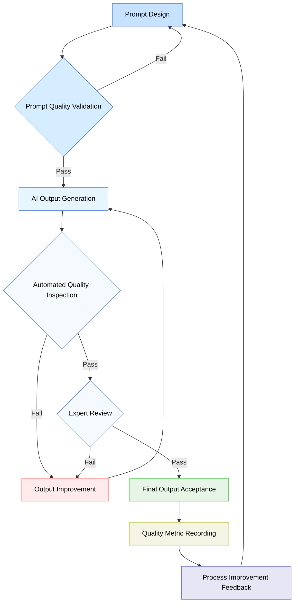
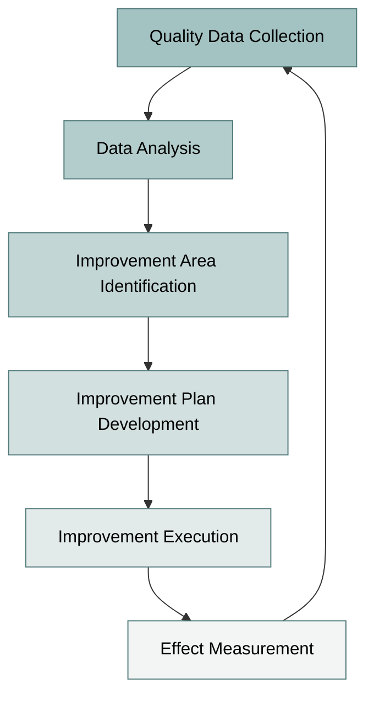
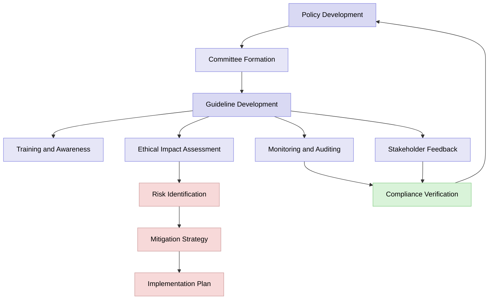

# Prompt-driven Development Methodology (PDD) - Additional Considerations

## Table of Contents

1. [Integration Framework](#integration-framework)
   4. [Example Integration Roadmap](#4-example-integration-roadmap)
2. [Technical Infrastructure Requirements](#technical-infrastructure-requirements)
   4. [Developer Workflow Support Tools](#4-developer-workflow-support-tools)
3. [Quality Management and Measurement](#quality-management-and-measurement)
   4. [Continuous Improvement System](#4-continuous-improvement-system)
4. [Ethical Considerations](#ethical-considerations)
   5. [Transparency and Explainability](#5-transparency-and-explainability)
5. [Conclusion](#conclusion)

---

To successfully implement Prompt-driven Development Methodology (PDD), it is necessary to consider various factors beyond the basic steps and processes. This document covers how to integrate PDD with existing development environments, build the required infrastructure, manage quality, and address ethical aspects.

## Integration Framework

PDD delivers the most value when integrated with existing development methodologies and organizational cultures, rather than being used in isolation. This section discusses how to integrate PDD with various development methodologies and organizational cultures.

### 1. Integration with Existing Development Methodologies

Approaches for integrating PDD with major development methodologies:

| Methodology | Integration Point | Integration Method | Expected Effect |
|-------------|------------------|-------------------|----------------|
| **Agile** | Sprint planning, backlog refinement | • Convert backlog items into prompts<br>• Integrate AI outputs into sprint demos<br>• Include prompt improvement in retrospectives | • Faster development<br>• Prompt optimization through iterative feedback |
| **Scrum** | Daily scrum, sprint review | • Include prompt design in sprint planning<br>• Add AI output validation to Definition of Done | • Clear responsibility assignment<br>• Stepwise validation and feedback |
| **Kanban** | Workflow stages, WIP limits | • Integrate prompt design and validation into workflow<br>• Visualize AI generation-validation cycles | • Early bottleneck identification<br>• Visualized work flow |
| **DevOps** | CI/CD pipeline, infrastructure automation | • Integrate prompt version control into CI/CD<br>• Integrate AI output automated testing | • Continuous prompt improvement<br>• Improved deployment reliability |
| **Waterfall** | Stage reviews and approvals | • Generate AI-supported deliverables at each stage<br>• Strengthen stage-wise validation processes | • Improved documentation quality<br>• Support for complex requirements analysis |

### 2. Integrated Architecture Framework

Architecture framework for integrating PDD with existing development environments:

```mermaid
graph TD
    A[Development Process Layer] --- B[Tool Integration Layer]
    B --- C[AI Service Layer]
    C --- D[Infrastructure Layer]
    
    subgraph "Development Process Layer"
        A1[Requirements Management]
        A2[Design]
        A3[Development]
        A4[Test]
        A5[Deployment]
    end
    
    subgraph "Tool Integration Layer"
        B1[Project Management Tools]
        B2[Code Repositories]
        B3[CI/CD Pipeline]
        B4[Test Automation]
        B5[Monitoring]
    end
    
    subgraph "AI Service Layer"
        C1[Prompt Management]
        C2[AI Model Access]
        C3[Result Validation]
        C4[Version Control]
    end
    
    subgraph "Infrastructure Layer"
        D1[Compute Resources]
        D2[Security]
        D3[Scalability]
        D4[Monitoring]
    end
    
    style A fill:#4d94ff,color:#000000,stroke:#002b80
    style B fill:#66ccff,color:#000000,stroke:#004d99
    style C fill:#99ccff,color:#000000,stroke:#006600
    style D fill:#cce6ff,color:#000000,stroke:#800000
    
    style "Development Process Layer" fill:#e6f2ff,stroke:#004d99,color:#000000
    style "Tool Integration Layer" fill:#e6f9ff,stroke:#004d99,color:#000000
    style "AI Service Layer" fill:#e6ffee,stroke:#006600,color:#000000
    style "Infrastructure Layer" fill:#ffe6e6,stroke:#800000,color:#000000
```

### 3. Organizational Culture Integration Strategies

Considerations for organizational culture when adopting PDD:

1. **Gradual Adoption**: Start with pilot projects and expand gradually
2. **Training and Capability Development**: Programs to develop prompt engineering skills
3. **Sharing Success Stories**: Share early success stories to increase acceptance
4. **Set Clear Expectations**: Set realistic expectations for AI's role and limitations
5. **Redefine Collaboration Models**: Define new collaboration models between AI tools and human developers

### 4. Example Integration Roadmap



## Technical Infrastructure Requirements

Appropriate technical infrastructure is required to effectively support PDD. This section covers the core technical infrastructure requirements for implementing PDD.

### 1. Infrastructure Architecture Components

Core infrastructure components for PDD:

| Component | Purpose | Key Functions | Recommended Tools/Platforms |
|-----------|---------|--------------|----------------------------|
| **AI Model Access Layer** | Manage access to AI model APIs | • Manage model calls<br>• Monitor token usage<br>• Response caching | • Azure OpenAI Service<br>• AWS Bedrock<br>• Hugging Face |
| **Prompt Management System** | Create and manage prompts | • Store and version prompts<br>• Manage templates<br>• Handle variables | • LangChain<br>• Microsoft Prompt Flow<br>• Custom solutions |
| **Artifact Repository** | Manage AI-generated outputs | • Store code/docs<br>• Version control<br>• Manage metadata | • GitHub/GitLab<br>• Azure DevOps<br>• Atlassian Suite |
| **Workflow Engine** | Automate PDD processes | • Automate workflows<br>• Notifications and approvals<br>• Track status | • GitHub Actions<br>• Jenkins<br>• Azure Logic Apps |
| **Analytics & Monitoring** | Monitor performance and usage | • Usage analytics<br>• Quality metrics<br>• Performance monitoring | • Grafana<br>• Azure Monitor<br>• AWS CloudWatch |
| **Security & Access Control** | Secure data and resources | • Authentication and authorization<br>• Data encryption<br>• Audit trails | • Azure AD<br>• AWS IAM<br>• HashiCorp Vault |

### 2. Infrastructure Scalability Considerations

Key considerations for PDD infrastructure scalability:

1. **Elastic Resource Allocation**: Automatically scale resources based on usage
2. **Multi-model Support**: Ability to use multiple AI models simultaneously
3. **Distributed Architecture**: Regional distribution and fault tolerance
4. **Multi-tenancy**: Independent work environments for multiple teams/projects
5. **API-centric Design**: Flexible integration between systems via APIs

### 3. Prompt Management Architecture

Architecture for effective prompt management:



### 4. Developer Workflow Support Tools

Developer experience tool requirements for PDD:

1. **IDE Plugins**: Integrate PDD toolchain with IDEs like VSCode, IntelliJ
2. **Context-aware Prompt Authoring Support**: Suggest prompts based on current work context
3. **AI Output Validation Tools**: Automatically analyze quality, security, and performance of generated code
4. **Interactive Debugging Tools**: Conversational tools for troubleshooting AI-generated code
5. **Code/Document Generation History**: Track and manage history of AI-generated items

## Quality Management and Measurement

In PDD environments, traditional software quality management methods must be extended to ensure the quality of AI-generated outputs.

### 1. Quality Metric Framework

Key quality metrics to measure in PDD:

| Category | Metric | Description | Measurement Method |
|----------|--------|-------------|-------------------|
| **Prompt Quality** | Prompt Clarity | Clarity of intent in prompts | Expert evaluation, A/B testing |
| | Prompt Reproducibility | Consistency of results from same prompt | Result variability analysis |
| | Prompt Efficiency | Quality per token usage | Token usage/quality ratio |
| **Code Quality** | Functional Accuracy | Degree of requirement fulfillment | Test case pass rate |
| | Code Quality | Compliance with code standards | Static analysis tools |
| | Performance Efficiency | Resource usage efficiency | Performance benchmarks |
| | Maintainability | Ease of code understanding and modification | Complexity analysis, review |
| **Document Quality** | Accuracy | Factual accuracy of content | Expert validation |
| | Completeness | Inclusion of necessary information | Checklist evaluation |
| | Comprehensibility | Ease of understanding for target audience | User feedback |
| **Process Efficiency** | Development Speed | Improvement in development productivity | Compare task completion times |
| | Rework Reduction | Decrease in need for rework | Frequency of revision requests |
| | Automation Level | Degree of manual task replacement | Proportion of automated tasks |

### 2. Quality Assurance Workflow

Quality assurance workflow in PDD environments:



### 3. Automated Quality Testing

Automated testing methods for validating PDD outputs:

1. **Prompt Unit Testing**: Validate expected results for standard prompts
2. **Integration Testing**: Verify consistency among multiple prompts/outputs
3. **A/B Testing**: Compare result quality of different prompt variations
4. **Regression Testing**: Ensure result quality is maintained after prompt/model changes
5. **Load Testing**: Test performance and stability in large-scale usage environments

### 4. Continuous Improvement System

Continuous improvement system based on quality measurement results:



## Ethical Considerations

Since PDD leverages AI technology, various ethical issues such as bias, copyright, and privacy must be considered.

### 1. Bias Management Framework

Framework for managing bias in AI-generated outputs:

| Stage | Activity | Tool/Method | Responsible |
|-------|----------|-------------|-------------|
| **Prevention** | Consider bias in prompt design | Prompt checklist, diversity guidelines | Prompt Engineer |
| | Include diverse perspectives | Diversity review panel | Product Owner |
| **Detection** | Analyze output bias | Automated bias detection tools | QA Engineer |
| | Test with diverse scenarios | Bias test cases | Test Engineer |
| **Mitigation** | Revise prompts | Prompt redesign guidelines | Prompt Engineer |
| | Filter/modify outputs | Post-processing guidelines | Developer |
| **Monitoring** | Ongoing bias monitoring | Monitoring dashboard | QA Team |
| | Collect user feedback | Feedback system | UX Team |

### 2. Data Privacy Guidelines

Guidelines for data privacy in PDD environments:

1. **Data Minimization Principle**: Collect/use only the minimum necessary personal data
2. **Anonymization and Pseudonymization**: Properly handle personally identifiable information
3. **Consent-based Approach**: Use personal data based on explicit consent
4. **Purpose Limitation**: Use data only for specified purposes
5. **Retention Limitation**: Delete data after the necessary period
6. **Access Control**: Grant access rights only to those who need them
7. **Encryption**: Properly encrypt sensitive information
8. **Transparency**: Clearly disclose data processing methods

### 3. Copyright and Intellectual Property Management

Management of intellectual property issues for AI-generated content:

| Issue | Management Approach | Technical Support | Legal Considerations |
|-------|---------------------|------------------|---------------------|
| **Training Data Copyright** | Use of legally licensed data | Data provenance tracking system | Copyright law, fair use principles |
| **Generated Content Ownership** | Clear ownership policy | Metadata tagging | Contractual clauses, deliverable definitions |
| **Third-party IP Infringement** | Similarity checks and citation verification | Plagiarism detection tools | Infringement liability, indemnification clauses |
| **Open Source Compliance** | Adhere to license requirements | License verification tools | Open source license obligations |
| **Invention Patentability** | Patent policy for AI-assisted inventions | Innovation tracking system | Patent law, inventor definition |

### 4. AI Ethics and Governance Framework

AI ethics governance structure in PDD environments:



### 5. Transparency and Explainability

Ensuring transparency and explainability of AI outputs:

1. **Process Transparency**: Public disclosure of the entire PDD process
2. **Decision Explanation**: Mechanism to explain the rationale behind AI decisions
3. **Source Tracing**: Trace the sources and influences on outputs
4. **Limitations Disclosure**: Clearly state the limitations and constraints of AI-generated outputs
5. **Human Review**: Procedures for human review of critical decisions
6. **Documentation**: Thorough documentation of design decisions and assumptions
7. **Feedback Channels**: Provide channels for stakeholders to give feedback
