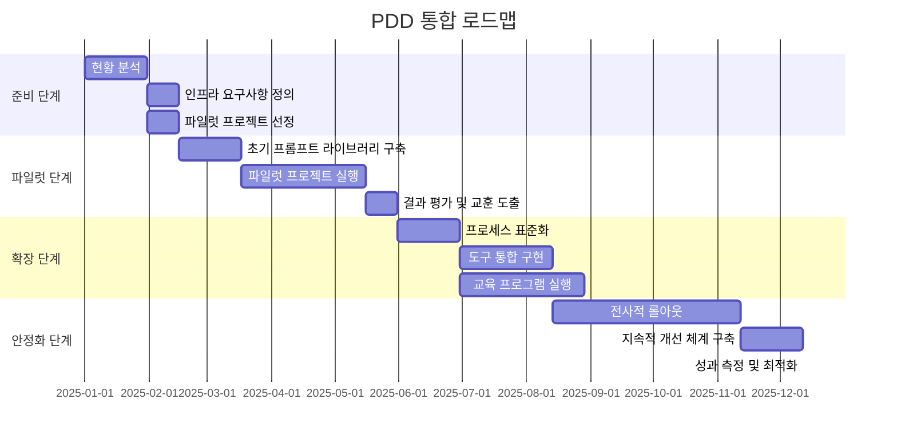
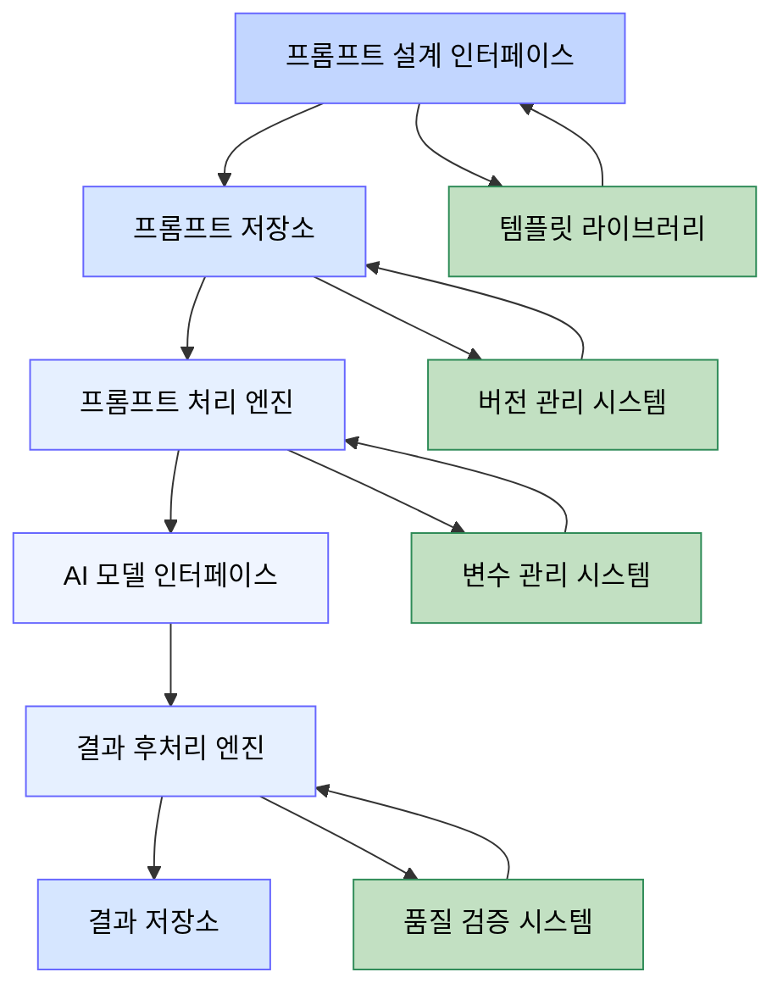
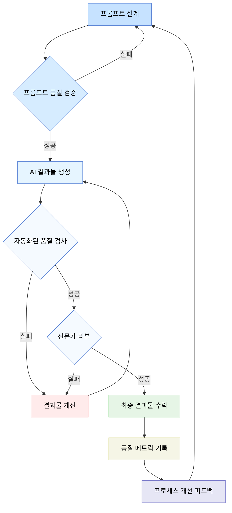
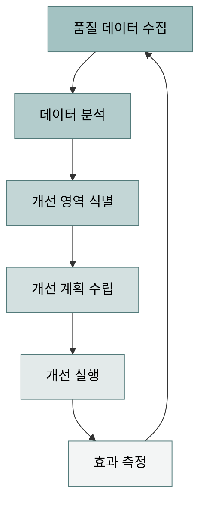
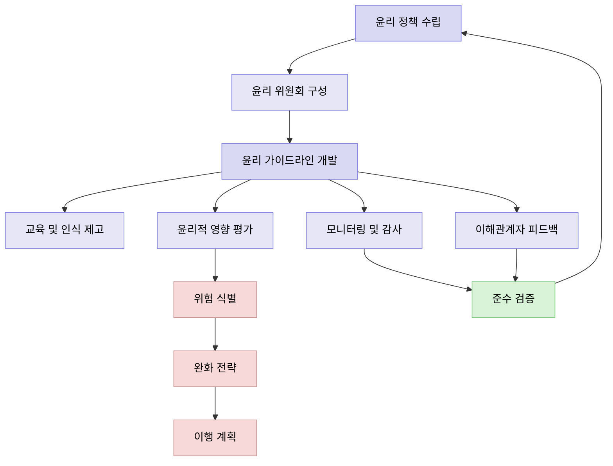

# 프롬프트 기반 개발방법론(PDD) - 추가 고려사항

**문서 번호**: MTD-012  
**버전**: 1.0.0  
**작성일**: 2025-05-26  
**작성자**: 방법론 팀  
**상태**: 승인됨

## 목차

1. [통합 프레임워크](#통합-프레임워크)
   1. [기존 개발 방법론과의 통합](#1-기존-개발-방법론과의-통합)
   2. [통합 아키텍처 프레임워크](#2-통합-아키텍처-프레임워크)
   3. [조직 문화 통합 전략](#3-조직-문화-통합-전략)
   4. [통합 로드맵 예시](#4-통합-로드맵-예시)
2. [기술 인프라 요구사항](#기술-인프라-요구사항)
   1. [인프라 아키텍처 구성요소](#1-인프라-아키텍처-구성요소)
   2. [인프라 확장성 고려사항](#2-인프라-확장성-고려사항)
   3. [프롬프트 관리 아키텍처](#3-프롬프트-관리-아키텍처)
   4. [개발자 워크플로우 지원 도구](#4-개발자-워크플로우-지원-도구)
3. [품질 관리 및 측정](#품질-관리-및-측정)
   1. [품질 지표 프레임워크](#1-품질-지표-프레임워크)
   2. [품질 보증 워크플로우](#2-품질-보증-워크플로우)
   3. [자동화된 품질 테스트](#3-자동화된-품질-테스트)
   4. [지속적 개선 체계](#4-지속적-개선-체계)
4. [윤리적 고려사항](#윤리적-고려사항)
   1. [편향성 관리 프레임워크](#1-편향성-관리-프레임워크)
   2. [데이터 개인정보 보호 가이드라인](#2-데이터-개인정보-보호-가이드라인)
   3. [저작권 및 지식재산권 관리](#3-저작권-및-지식재산권-관리)
   4. [AI 윤리 및 거버넌스 체계](#4-ai-윤리-및-거버넌스-체계)
   5. [투명성 및 설명 가능성](#5-투명성-및-설명-가능성)
5. [결론](#결론)

---

프롬프트 기반 개발방법론(PDD)을 성공적으로 구현하기 위해서는 기본적인 단계와 프로세스를 넘어 다양한 고려사항이 필요합니다. 이 문서는 PDD를 조직의 기존 개발 환경과 통합하고, 필요한 인프라를 구축하며, 품질을 관리하고, 윤리적 측면을 고려하는 방법을 다룹니다.

## 통합 프레임워크

PDD는 독립적인 방법론이라기보다는 기존의 개발 방법론과 통합되어 활용될 때 최대의 가치를 발휘합니다. 이 섹션에서는 PDD를 다양한 개발 방법론 및 조직 문화와 통합하는 방법을 다룹니다.

### 1. 기존 개발 방법론과의 통합

주요 개발 방법론과 PDD의 통합 접근법:

| 개발 방법론 | 통합 지점 | 통합 방법 | 기대 효과 |
|-------------|------------------|---------------------------------------------------------------------|-----------------------------|
| **애자일(Agile)** | 스프린트 계획, 백로그 구체화 | • 백로그 아이템을 프롬프트로 변환<br>• AI 결과물을 스프린트 데모에 통합<br>• 프롬프트 개선을 회고에 포함 | • 개발 속도 향상<br>• 반복적 피드백을 통한 프롬프트 최적화 |
| **스크럼(Scrum)** | 일일 스크럼, 스프린트 리뷰 | • 프롬프트 설계를 스프린트 계획에 포함<br>• AI 결과물 검증을 Definition of Done에 추가 | • 명확한 책임 할당<br>• 단계적 검증 및 피드백 |
| **칸반(Kanban)** | 워크플로우 단계, WIP 제한 | • 프롬프트 설계 및 검증을 워크플로우에 통합<br>• AI 생성-검증 사이클을 시각화 | • 병목 현상 조기 식별<br>• 작업 흐름 시각화 |
| **DevOps** | CI/CD 파이프라인, 인프라 자동화 | • 프롬프트 버전 관리를 CI/CD에 통합<br>• AI 결과물 자동 테스트 통합 | • 지속적 프롬프트 개선<br>• 배포 신뢰성 향상 |
| **워터폴(Waterfall)** | 단계별 검토 및 승인 | • 각 단계에서 AI 지원 산출물 생성<br>• 단계별 검증 프로세스 강화 | • 문서화 품질 향상<br>• 복잡한 요구사항 분석 지원 |

### 2. 통합 아키텍처 프레임워크

PDD를 기존 개발 환경과 통합하기 위한 아키텍처 프레임워크:

```mermaid
graph TD
    A[개발 프로세스 레이어] --- B[도구 통합 레이어]
    B --- C[AI 서비스 레이어]
    C --- D[인프라 레이어]
    
    subgraph "개발 프로세스 레이어"
        A1[요구사항 관리]
        A2[설계]
        A3[개발]
        A4[테스트]
        A5[배포]
    end
    
    subgraph "도구 통합 레이어"
        B1[프로젝트 관리 도구]
        B2[코드 저장소]
        B3[CI/CD 파이프라인]
        B4[테스트 자동화]
        B5[모니터링]
    end
    
    subgraph "AI 서비스 레이어"
        C1[프롬프트 관리]
        C2[AI 모델 접근]
        C3[결과 검증]
        C4[버전 관리]
    end
    
    subgraph "인프라 레이어"
        D1[계산 리소스]
        D2[보안]
        D3[확장성]
        D4[모니터링]
    end
    
    style A fill:#4d94ff,color:#000000,stroke:#002b80
    style B fill:#66ccff,color:#000000,stroke:#004d99
    style C fill:#99ccff,color:#000000,stroke:#006600
    style D fill:#cce6ff,color:#000000,stroke:#800000
    
    style "개발 프로세스 레이어" fill:#e6f2ff,stroke:#004d99,color:#000000
    style "도구 통합 레이어" fill:#e6f9ff,stroke:#004d99,color:#000000
    style "AI 서비스 레이어" fill:#e6ffee,stroke:#006600,color:#000000
    style "인프라 레이어" fill:#ffe6e6,stroke:#800000,color:#000000
```

### 3. 조직 문화 통합 전략

PDD 도입 시 조직 문화 측면의 고려사항:

1. **점진적 도입**: 파일럿 프로젝트부터 시작하여 점진적 확대
2. **교육 및 역량 개발**: 프롬프트 엔지니어링 역량 개발 프로그램
3. **성공 사례 공유**: 초기 성공 사례를 조직 내 공유하여 수용성 향상
4. **명확한 기대치 설정**: AI의 역할과 한계에 대한 현실적 기대치 설정
5. **협업 모델 재정의**: AI 도구와 인간 개발자 간의 새로운 협업 모델 정의

### 4. 통합 로드맵 예시



## 기술 인프라 요구사항

PDD를 효과적으로 지원하기 위해서는 적절한 기술 인프라가 필요합니다. 이 섹션에서는 PDD 구현을 위한 핵심 기술 인프라 요구사항을 다룹니다.

### 1. 인프라 아키텍처 구성요소

PDD를 위한 핵심 인프라 구성요소:

| 구성요소 | 목적 | 주요 기능 | 권장 도구/플랫폼 |
|---------|-----|---------|----------------|
| **AI 모델 접근 계층** | AI 모델 API 접근 관리 | • 모델 호출 관리<br>• 토큰 사용량 모니터링<br>• 응답 캐싱 | • Azure OpenAI Service<br>• AWS Bedrock<br>• Hugging Face |
| **프롬프트 관리 시스템** | 프롬프트 생성 및 관리 | • 프롬프트 저장 및 버전 관리<br>• 템플릿 관리<br>• 변수 처리 | • LangChain<br>• Microsoft Prompt Flow<br>• Custom solutions |
| **결과물 저장소** | AI 생성 결과물 관리 | • 코드/문서 저장<br>• 버전 관리<br>• 메타데이터 관리 | • GitHub/GitLab<br>• Azure DevOps<br>• Atlassian Suite |
| **워크플로우 엔진** | PDD 프로세스 자동화 | • 작업 흐름 자동화<br>• 알림 및 승인<br>• 상태 추적 | • GitHub Actions<br>• Jenkins<br>• Azure Logic Apps |
| **분석 및 모니터링** | 성능 및 사용량 모니터링 | • 사용량 분석<br>• 품질 메트릭<br>• 성능 모니터링 | • Grafana<br>• Azure Monitor<br>• AWS CloudWatch |
| **보안 및 접근 제어** | 데이터 및 자원 보안 | • 인증 및 권한 관리<br>• 데이터 암호화<br>• 감사 추적 | • Azure AD<br>• AWS IAM<br>• HashiCorp Vault |

### 2. 인프라 확장성 고려사항

PDD 인프라의 확장성을 위한 주요 고려사항:

1. **탄력적 리소스 할당**: 사용량에 따른 리소스 자동 확장
2. **멀티 모델 지원**: 다양한 AI 모델 동시 활용 가능성
3. **분산 아키텍처**: 지역적 분산 및 장애 대응
4. **멀티테넌시**: 여러 팀/프로젝트의 독립적 작업 환경
5. **API 중심 설계**: 시스템 간 유연한 통합을 위한 API 설계

### 3. 프롬프트 관리 아키텍처

효과적인 프롬프트 관리를 위한 아키텍처:



### 4. 개발자 워크플로우 지원 도구

PDD 개발자 경험을 위한 도구 요구사항:

1. **통합 개발 환경 플러그인**: VSCode, IntelliJ 등의 IDE와 PDD 툴체인 통합
2. **컨텍스트 인식 프롬프트 작성 지원**: 현재 작업 컨텍스트를 인식한 프롬프트 제안
3. **AI 결과물 검증 도구**: 생성된 코드의 품질, 보안, 성능 자동 분석
4. **대화형 디버깅 도구**: AI 생성 코드의 문제 해결을 위한 대화형 도구
5. **코드/문서 생성 기록**: AI 생성 항목의 이력 추적 및 관리

## 품질 관리 및 측정

PDD 환경에서는 전통적인 소프트웨어 품질 관리 방법론을 확장하여, AI 생성 결과물의 품질을 보장하기 위한 추가적인 기법이 필요합니다.

### 1. 품질 지표 프레임워크

PDD에서 측정해야 할 핵심 품질 지표:

| 범주 | 지표 | 설명 | 측정 방법 |
|-----|------|------|----------|
| **프롬프트 품질** | 프롬프트 명확성 | 프롬프트의 의도 전달 명확성 | 전문가 평가, A/B 테스트 |
| | 프롬프트 재현성 | 동일 프롬프트로 일관된 결과 생성 | 결과 변동성 분석 |
| | 프롬프트 효율성 | 토큰 사용 대비 결과 품질 | 토큰 사용량/품질 비율 |
| **코드 품질** | 기능 정확성 | 요구사항 충족 정도 | 테스트 케이스 통과율 |
| | 코드 품질 | 코드 표준 준수 여부 | 정적 분석 도구 |
| | 성능 효율성 | 리소스 사용 효율성 | 성능 벤치마크 |
| | 유지보수성 | 코드 이해 및 수정 용이성 | 복잡도 분석, 리뷰 |
| **문서 품질** | 정확성 | 내용의 사실적 정확성 | 전문가 검증 |
| | 완전성 | 필요 정보의 포함 정도 | 체크리스트 평가 |
| | 이해도 | 대상 독자의 이해 용이성 | 사용자 피드백 |
| **프로세스 효율성** | 개발 속도 | 개발 생산성 향상 정도 | 작업 완료 시간 비교 |
| | 반복 감소 | 재작업 필요성 감소 | 수정 요청 빈도 |
| | 자동화 수준 | 수동 작업 대체 정도 | 자동화된 작업 비율 |

### 2. 품질 보증 워크플로우

PDD 환경에서의 품질 보증 워크플로우:



### 3. 자동화된 품질 테스트

PDD 결과물 검증을 위한 자동화된 테스트 방법:

1. **프롬프트 단위 테스트**: 기준 프롬프트에 대한 예상 결과 검증
2. **통합 테스트**: 여러 프롬프트/결과물 간의 일관성 검증
3. **A/B 테스트**: 다양한 프롬프트 변형의 결과 품질 비교
4. **회귀 테스트**: 프롬프트/모델 변경 후 결과 품질 유지 검증
5. **부하 테스트**: 대규모 사용 환경에서의 성능 및 안정성 검증

### 4. 지속적 개선 체계

품질 측정 결과를 기반으로 한 지속적 개선 체계:



## 윤리적 고려사항

PDD는 AI 기술을 활용하기 때문에, 편향성, 저작권, 개인정보 보호 등 다양한 윤리적 이슈를 고려해야 합니다.

### 1. 편향성 관리 프레임워크

AI 생성 결과물의 편향성 관리를 위한 프레임워크:

| 단계 | 활동 | 도구/방법 | 책임자 |
|-----|------|----------|-------|
| **예방** | 프롬프트 설계 시 편향성 고려 | 프롬프트 체크리스트, 다양성 가이드라인 | 프롬프트 엔지니어 |
| | 다양한 관점 포함 | 다양성 검토 패널 | 제품 책임자 |
| **감지** | 결과물 편향성 분석 | 자동화된 편향성 감지 도구 | QA 엔지니어 |
| | 다양한 시나리오 테스트 | 편향성 테스트 케이스 | 테스트 엔지니어 |
| **완화** | 프롬프트 수정 | 프롬프트 재설계 지침 | 프롬프트 엔지니어 |
| | 결과물 필터링/수정 | 사후 처리 가이드라인 | 개발자 |
| **모니터링** | 지속적 편향성 모니터링 | 모니터링 대시보드 | 품질 보증 팀 |
| | 사용자 피드백 수집 | 피드백 시스템 | 사용자 경험 팀 |

### 2. 데이터 개인정보 보호 가이드라인

PDD 환경에서의 개인정보 보호를 위한 가이드라인:

1. **최소 데이터 원칙**: 필요한 최소한의 개인정보만 수집/사용
2. **익명화 및 가명화**: 개인식별정보의 적절한 처리
3. **동의 기반 접근**: 명시적 동의 기반의 개인정보 사용
4. **목적 제한**: 명시된 목적에 맞는 데이터 사용
5. **보존 제한**: 필요 기간 이후 데이터 삭제 원칙
6. **접근 제어**: 필요한 사람에게만 접근 권한 부여
7. **암호화**: 민감 정보의 적절한 암호화
8. **투명성**: 데이터 처리 방식의 투명한 공개

### 3. 저작권 및 지식재산권 관리

AI 생성 콘텐츠의 지식재산권 관리 방안:

| 이슈 | 관리 방안 | 기술적 지원 | 법적 고려사항 |
|-----|----------|------------|-------------|
| **훈련 데이터 저작권** | 합법적 라이선스의 데이터 사용 | 데이터 출처 추적 시스템 | 저작권법, 공정 사용 원칙 |
| **생성 콘텐츠 소유권** | 명확한 소유권 정책 수립 | 메타데이터 태깅 | 계약 조항, 작업 산출물 정의 |
| **제3자 IP 침해** | 유사성 검사 및 인용 확인 | 표절 감지 도구 | 침해 책임, 면책 조항 |
| **오픈소스 준수** | 라이선스 요구사항 준수 | 라이선스 확인 도구 | 오픈소스 라이선스 의무 |
| **발명 특허성** | AI 보조 발명의 특허 정책 | 혁신 추적 시스템 | 특허법, 발명자 정의 |

### 4. AI 윤리 및 거버넌스 체계

PDD 환경에서의 AI 윤리 거버넌스 구조:



### 5. 투명성 및 설명 가능성

AI 결과물의 투명성과 설명 가능성 확보 방안:

1. **프로세스 투명성**: PDD 방법론의 전체 프로세스 공개
2. **결정 설명**: AI 결정의 근거를 설명할 수 있는 메커니즘
3. **출처 추적**: 결과물의 출처와 영향을 받은 소스 추적
4. **한계 명시**: AI 생성 결과물의 한계와 제약 명시
5. **인간 검토**: 중요 결정에 대한 인간의 검토 절차
6. **문서화**: 설계 결정과 가정에 대한 철저한 문서화
7. **피드백 채널**: 이해관계자가 의견을 제시할 수 있는 채널 제공

## 결론

PDD를 조직에 도입하는 것은 단순한 도구나 기술 도입 이상의 전략적 결정입니다. 기존 개발 방법론과의 통합, 필요한 기술 인프라 구축, 체계적인 품질 관리, 그리고 윤리적 측면의 고려가 종합적으로 이루어져야 합니다.

이러한 추가 고려사항을 통해 조직은 PDD의 잠재력을 최대한 활용하면서도 발생 가능한 위험과 문제를 효과적으로 관리할 수 있습니다. PDD는 계속 발전하는 영역이므로, 조직은 최신 동향을 지속적으로 모니터링하고 접근 방식을 적응시켜 나가야 합니다.

조직의 규모, 도메인, 기존 프로세스에 따라 이 문서에서 제시한 프레임워크와 방법을 조정하여 적용하는 것이 중요합니다. 궁극적으로 PDD의 성공적인 구현은 기술적 측면뿐만 아니라 조직 문화, 프로세스, 그리고 사람의 요소를 모두 고려한 총체적 접근을 통해 실현될 수 있습니다.
